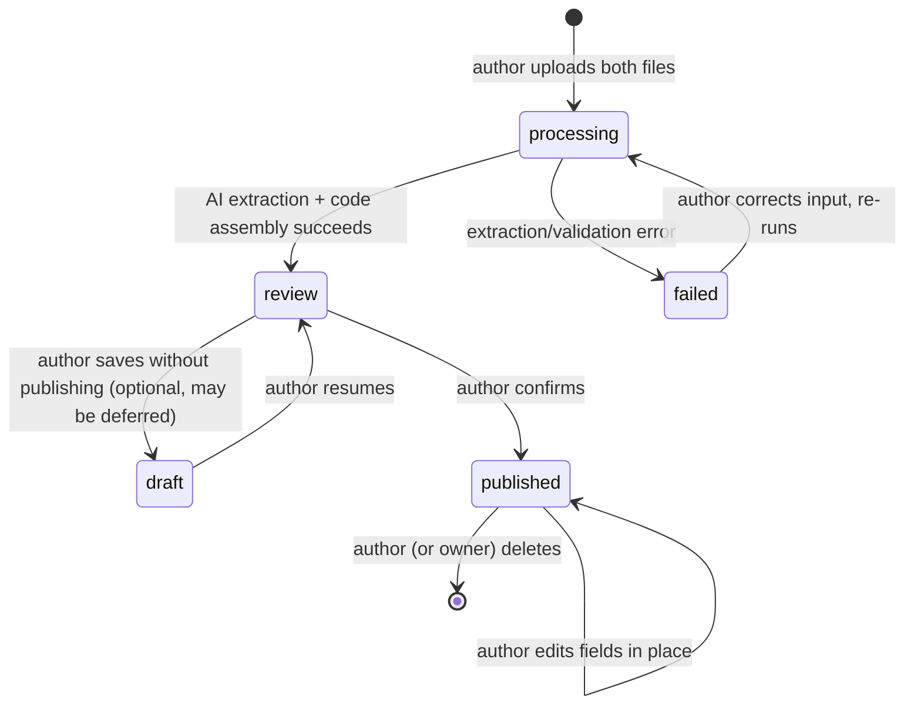

# ADR-0001 UGC Content Lifecycle, RLS Enforcement, and Security Hardening

## Status

Proposed — 2026-07-15. **Revised for the v2.0 redesign.** Supersedes the v1.1 decision (single-admin pre-moderation with a `pending_review` queue, a role-preservation trigger, and a per-user pending cap). Under v2.0 there is **no admin role and no approval queue**: publication is gated by the author's mandatory review, and the site owner removes bad content directly. This ADR now owns the simplified lifecycle, the RLS confinement of non-published content (including images in Storage), and the two remaining security fixes.

- PRD: `docs/prd/ugc-exam-upload-prd.md` (v2.0) — R8 (publish/edit/delete, no admin), R9 (My exams), R11 (safe render), R12 (RLS confinement), R13 (reports), R14 (backfill).
- Sibling ADRs: ADR-0002 (rendering/sanitization + safe images), ADR-0003 (author name), ADR-0004 (AI extraction + assembly).

## Context

MS-MOLAR is a Next.js (App Router) + Supabase (Postgres + RLS + Auth + Storage) exam-practice site. Every exam is currently developer-seeded. `SOURCE/supabase/schema.sql` is applied by hand in the Supabase SQL Editor as a **single idempotent file** — there is no migration framework.

v2.0 lets any logged-in user upload an exam (two files → AI extraction → code assembly → author review → publish). This introduces untrusted writers **and untrusted uploaded files/images**, and requires a publication lifecycle the schema does not yet model. Two pre-existing RLS facts matter, but the v2.0 redesign changes which of them are load-bearing:

1. **No publication gate.** `exams` and `questions` both use `for select ... using (true)` (`schema.sql:151`, `schema.sql:156`). Any authenticated user can read every exam and question row. Once non-published UGC content exists (a `processing`/`review`/`draft`/`failed` exam), this leaks it to the whole userbase (violates PRD AC-024). **This fix is still required.**
2. **Role self-escalation.** `profiles_update_own` has no `with check`, so a user can set `role='admin'` on their own row. In v1.1 this was critical because `role='admin'` was the moderation authority. **In v2.0 there is no admin role and no code reads `role` for authorization**, so self-escalation grants nothing. We still add `with check (id = auth.uid())` for basic write-scoping hygiene, but the v1.1 role-preservation trigger (and its `auth.uid() is null` / `is_admin()` exemptions) is **no longer needed and is dropped**.
3. **No lifecycle model.** There is no `status`, `author_id`, per-question `question_type`/`image_url`/essay-answer, no reports table, no Storage bucket for images.

All server-side rules must be **enforced at the database (and Storage) layer**, not merely in the UI, and be expressible in the one idempotent `schema.sql` (plus Storage-bucket policies).

## Decision

Model the lifecycle on the existing `exams`/`questions` tables plus one new `exam_reports` table, add per-question columns for the new content, add a Storage bucket for images with RLS, and enforce every rule at the database/Storage layer using **RLS policies + CHECK constraints** — **without any admin role, admin RLS branch, `is_admin()` helper, cap trigger, or role trigger.** Backfill seeded exams to `published` in the same idempotent file.

### Decision Details

| Item | Content |
|------|---------|
| **Decision** | Extend `exams` with a `status` lifecycle (`processing`/`review`/`draft`/`published`/`failed`), authorship, and timestamps; extend `questions` with `question_type`, `image_url`, and an essay-answer column; add an `exam_reports` table; add an image Storage bucket; enforce visibility, ownership, one-report-per-user, and non-published confinement entirely at the DB/Storage layer; backfill seeded exams to `published`. No admin anything. |
| **Why now** | UGC turns the dormant `questions` `using(true)` leak into an active vulnerability and requires a publication state and image storage the schema cannot express; all must land with the feature, in the single idempotent file. |
| **Why this** | DB/Storage-layer enforcement is the only gate that survives a direct Supabase-client bypass. Removing admin removes an entire class of surface (queue, role trigger, admin policies) — smaller, faster, and matching the product decision to author-gate publication. |
| **Known unknowns** | Whether `draft` is built in MVP or deferred; the exact owner-delete mechanism (direct DB vs. a minimal owner route vs. service-role); Storage path layout — Design Doc scope. |
| **Kill criteria** | If the RLS verification suite (PRD metric 1) cannot demonstrate zero non-published leakage for anonymous + non-author authenticated clients — across `exams`, `questions`, and the image bucket — this enforcement model is invalid and must be reworked before launch. |

### Data model additions (principle-level; exact DDL in Design Doc)

On `public.exams`:

- `status text not null default 'processing'` with `check (status in ('processing','review','draft','published','failed'))`.
- `author_id uuid references auth.users(id)` — `null` for seeded exams (the discriminator between seeded and UGC; drives byline omission per UI Spec).
- `author_display_name text` — denormalized author name (ADR-0003).
- `reviewed_at timestamptz` — set when the author publishes (so time-to-publish is computable if wanted). `created_at` (already present) is the upload timestamp.
- Optional retention of the uploaded source files' Storage paths (question file, answer file) so the author can re-run extraction; the raw AI output is not persisted as source of truth (ADR-0004).

On `public.questions` (new columns, nullable/defaulted so seeded rows are unaffected):

- `question_type text not null default 'mcq'` with `check (question_type in ('mcq','essay'))`.
- `image_url text` — Storage URL of the cropped stem figure, or `null`. Stem-only, one per question.
- an essay-answer column (e.g. `essay_answer text`) — the model answer for `question_type='essay'`, else `null`. MCQ answers remain in the existing `correct_answer` (A–D).

New table `public.exam_reports`:

- `id uuid pk`, `exam_id text references exams(id) on delete cascade`, `reporter_id uuid references auth.users(id)`, `reporter_display_name text` (ADR-0003), `reason text not null` (non-empty CHECK), `created_at timestamptz`, and `unique (exam_id, reporter_id)` — the one-report-per-user-per-exam enforcement (AC-026).

New **Storage buckets** (RLS-governed):

- an **images bucket** for cropped published figures — objects for published exams are world-readable (so the catalog/player can show them); objects for non-published exams are readable only by the author.
- a **private uploads bucket** for the original question/answer files — author-only, never public.

`questions` gains a lifecycle discriminator only via `question_type`; publication visibility is still derived from the referencing exam's `status`, keeping a single source of truth for publication state.

### Enforcement placement

- **Visibility (AC-024).** Replace the two `using (true)` select policies:
  - `exams` select: visible when `status='published'` **or** `author_id = auth.uid()`.
  - `questions` select: visible when the question id belongs to at least one `published` exam, **or** to an exam owned by `auth.uid()`. Because `exams.question_ids` is `text[]`, the predicate is `exists (... where questions.id = any(e.question_ids) and <exam visible>)`.
  - No admin branch (there is no admin).
- **Author writes.** `exams`/`questions` insert/update/delete allowed for the owning author (`author_id = auth.uid()` on the exam; question writes gated by ownership of the referencing exam). Published exams remain author-editable at the field level (PRD R8) and author-deletable — no publication lock.
- **Owner removal.** The site owner removes bad published content out-of-band (direct SQL / service-role, which bypasses RLS) — Design Doc picks the exact mechanism. No product-level admin surface is built.
- **Reports (AC-025/026).** `exam_reports` insert allowed for any authenticated user against a `published` exam, `with check (reporter_id = auth.uid())`; duplicate blocked by the unique constraint. **Select** allowed only when `reporter_id = auth.uid()` (a user can read their own report rows — needed for the "you reported this exam" UI). The owner reads all reports out-of-band (service-role / direct DB), consistent with owner removal. No non-owner can read another user's reports. Reporting has no side effects (never changes status).
- **Image Storage RLS.** Read policy on the images bucket: allow public read for objects whose owning exam is `published`; allow the author to read their own non-published objects. Write policy: only the author (server action running as the user, or a server insert keyed to the author) may write into their exam's path. The private uploads bucket is author-only for both read and write. Exact path-to-exam mapping is Design Doc scope.
- **Role hygiene (formerly AC-027).** Add `with check (id = auth.uid())` to `profiles_update_own` so a user cannot write another user's profile row. **Do not** add the v1.1 role-preservation trigger — no code reads `role` for authorization in v2.0, so it protects nothing and adds surface. (If a future feature reintroduces a privileged role, restore the trigger then.)

### Backfill (R14, AC-027)

In the same idempotent file, after the column is added: `update public.exams set status='published' where author_id is null and status is distinct from 'published';`. Seeded exams (identified by `author_id is null`) become `published` so the catalog never goes empty. Idempotent: re-running is a no-op once rows are `published`. Seeded questions get `question_type='mcq'` and `image_url=null` by their column defaults — no data change to existing rows.

## Rationale

### Options Considered — moderation model

1. **Keep single-admin pre-moderation (v1.1).** Cons: **rejected by product owner for v2.0** — wants a fast, admin-free flow. Pre-moderation added a queue, a role, a role-preservation trigger, and admin RLS branches; all removed here.
2. **Author-gated publication with mandatory review + owner removal + reporting (Selected).** Pros: no admin surface; smaller schema; matches the product decision; the mandatory author review (ADR-0004) and reporting provide the quality controls. Cons: unreviewed-by-a-second-party content can publish — accepted at pre-launch scale, with owner removal and reports as backstops.

### Options Considered — enforcement layer

1. **App-layer only.** Cons: **rejected** — clients talk to Supabase directly; any rule not in the DB/Storage layer is bypassable. Fails AC-024 by construction.
2. **RLS policies + CHECK constraints + Storage policies, no triggers, no helper functions (Selected).** Pros: every rule enforced in the DB/Storage and survives a direct-client bypass; no `is_admin()` recursion concern (no admin); no cap/role triggers (both were admin-era needs). Cons: image visibility now spans two systems (Postgres RLS + Storage RLS) that must be verified together.

### Options Considered — non-published read fix

1. **Add `status` to `questions`.** Cons: **rejected** — duplicates publication state onto two tables that can desync.
2. **A `published_questions` view.** Cons: **rejected** — the player queries `questions` directly; a view would require rewriting the read path.
3. **Derive question visibility from the referencing exam's status via RLS predicate (Selected).** Pros: single source of truth; existing player query unchanged. Cons: the predicate scans `question_ids` arrays; acceptable at pre-launch scale.

## Consequences

### Positive

- Non-published content — exams, questions, and their images — is unreadable by non-author and anonymous clients at the DB/Storage layer (AC-024); the RLS suite can prove it (PRD metric 1).
- Dropping admin removes the queue, the `is_admin()` helper, the cap trigger, the role-preservation trigger, and every admin RLS branch — a materially smaller, faster-to-verify schema.
- Seeded and UGC exams share one `exams` table and one read path; the catalog/player code changes minimally (select policies tighten; a new `image_url` render path is added per ADR-0002).

### Negative

- Two enforcement systems (Postgres RLS + Storage RLS) must both be covered by the verification suite; an image-bucket misconfiguration could leak a non-published figure even if the `questions` row is confined.
- No second-party moderation before publish; the author review + owner removal + reports are the only quality controls (accepted trade-off).

### Neutral

- Existing attempt/result tables are untouched; attempts already taken are unaffected by later lifecycle events.
- `questions.topic` stays `not null`; how UGC fills it (default = subject) is ADR-0004.
- Essay questions are stored (`question_type='essay'` + `essay_answer`) but not graded; their player/scoring interaction is deferred (PRD Undetermined Items).

## Architecture Impact

- **Changes**: `public.exams` (new columns + status constraint), `public.questions` (new columns + tightened select policy), `public.user_profiles` (update policy gains `with check`), `SOURCE/app/(layer2)/queries.ts` (reads now filtered by policy; `listExams`/`getExam`/`getExamForPlayer` select `status`/`author_id`/`author_display_name` and `question_type`/`image_url`/`essay_answer` where needed).
- **New**: `public.exam_reports` + policies; image + private-uploads Storage buckets + policies; new server actions and author read queries (Design Doc).
- **Removed vs v1.1**: `is_admin()`, admin RLS branches, the pending-cap trigger, the role-preservation trigger, the review-queue/report-admin read path.
- **Constraints added**: publication is a hard RLS gate; one report per user per exam; non-published images confined in Storage.
- **Lifecycle** (authoritative; supersedes any prose elsewhere):

## Implementation Guidance

- Enforce every server-side rule in the DB/Storage layer; treat server actions as ergonomics over DB-enforced invariants, not as the gate.
- Keep publication state single-sourced on `exams.status`; derive question and image visibility, never duplicate it.
- Do **not** add an admin role, `is_admin()`, a cap trigger, or a role trigger. Add only `with check (id = auth.uid())` to `profiles_update_own`.
- Verify the image bucket policies together with the table policies — a confined `questions` row with a world-readable image is still a leak.
- Every policy, constraint, and the backfill must be idempotent (`drop ... if exists` / `add column if not exists` / `is distinct from`), consistent with the existing file's conventions.
- Extend `SOURCE/supabase/test-rls.ts` with non-published-content and non-published-image cases and the report-visibility case; this suite is the acceptance mechanism for PRD metric 1 and must run against the deployed DB after every schema change.

## Related Information

- PRD `docs/prd/ugc-exam-upload-prd.md` (R8–R14, Security NFR, Success metrics 1/2/4/5).
- ADR-0002 (published-content rendering + safe images), ADR-0003 (author name), ADR-0004 (AI extraction + assembly + topic default).
- Existing schema and gaps: `SOURCE/supabase/schema.sql:141-157` (the two `using(true)` policies and the missing `with check`).
