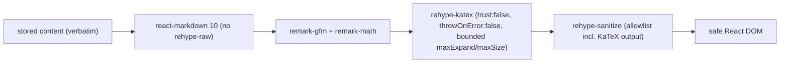

# ADR-0002 Published-Content Rendering and Sanitization

## Status

Proposed — 2026-07-15. **Revised for the v2.0 redesign.** The prior decision stands for text: the published view renders **sanitized markdown + KaTeX for all exams**, seeded and UGC, through the existing `RichText` path — no plain-text branch for UGC. v2.0 adds **question images**: UGC content now carries a per-question figure (`questions.image_url`), rendered as a dedicated `` whose source is allowlisted to the site's own Storage origin. This ADR extends the render boundary to cover that image path and drops the (now-removed) admin surface.

- PRD: `docs/prd/ugc-exam-upload-prd.md` (v2.0) — R11 (safe rendering of extracted text + images), Security NFR (extracted content is untrusted; text never as executable markup; images only from own storage).
- UI Spec: `docs/ui-spec/ugc-exam-upload-ui-spec.md` (v2.0) — author review renders the cropped image (to verify cropping) plus plain-text stem/choices.
- Sibling ADRs: ADR-0001 (lifecycle/RLS + image Storage bucket), ADR-0004 (AI extraction + assembly; `image_url` is a structured field, not markdown).

## Context

The exam player renders question stems and answer choices through one shared component, `RichText` (`SOURCE/components/shared/RichText.tsx`), used by `QuestionRenderer.tsx`, `AnswerChoice.tsx`, and the result-detail page. Its pipeline is:

```
react-markdown@10  →  remark-gfm  +  remark-math  →  rehype-katex  →  React DOM
```

Seeded exam content (`SOURCE/lib/fake-data/exams.ts`) is markdown with `$…$` / `$$…$$` LaTeX; the player already renders it richly.

Until now every author was a developer, so `RichText` fed only trusted input. This feature routes **untrusted UGC** through the same published path. The product owner locked a single rendering path (no UGC-only plain-text branch) so that seeded and UGC exams render identically and UGC authors keep math support. The security burden therefore moves entirely into the shared render path.

Verified current-behavior facts (evidence at design time):

- `RichText` does **not** include `rehype-raw` (`RichText.tsx:9-13`). react-markdown is secure-by-default: raw HTML in the markdown source is **not** parsed into DOM — it is treated as text. Adding `rehype-raw` is what would open XSS; it is absent, and this ADR forbids adding it. (Confirmed by react-markdown security docs — see References.)
- react-markdown@10's default `urlTransform` sanitizes link/image URLs (strips `javascript:` and other dangerous protocols) unless overridden. This ADR forbids overriding `urlTransform` with anything weaker.
- `rehype-katex` passes options to KaTeX, whose `trust` defaults to **false** (so `\href`, `\includegraphics`, `\htmlClass`, `\htmlData` are disabled) and whose `maxExpand` defaults to 1000. KaTeX nonetheless has recent advisories affecting untrusted input even with these defaults: `maxExpand` bypass via `\edef` (GHSA-64fm-8hw2-v72w) and Unicode sub/superscripts (GHSA-cvr6-37gx-v8wc), and `\htmlData` XSS (CVE-2025-23207). This means KaTeX defaults alone are **not** a sufficient boundary for untrusted math.

So the baseline is substantially safe by default, but not sufficient for untrusted input, and it is one config change (`rehype-raw`, an overridden `urlTransform`, or `trust:true`) away from being exploitable. The decision must make the safety explicit and defended, not incidental.

## Decision

Keep the single shared `RichText` render path for all exams, and harden it at **render time** as a defense-in-depth stack. Store author content verbatim; sanitize only when rendering to the browser.

### Decision Details

| Item | Content |
|------|---------|
| **Decision** | Render all exam content (seeded + UGC) through one hardened `RichText`: raw HTML disabled, an explicit `rehype-sanitize` allowlist, and KaTeX pinned to a safe configuration (`trust:false`, `throwOnError:false`, bounded `maxExpand`/`maxSize`). Sanitize on render, never mutate stored content. |
| **Why now** | UGC is the first untrusted input to reach `RichText`; the safety that was incidental (trusted authors) must become an enforced, tested property before publication is possible. |
| **Why this** | One choke point covers seeded + UGC uniformly; render-time sanitization keeps stored `raw_text` verbatim for edit-and-reparse (ADR-0001 / UI Spec D6) and lets the policy be re-tightened later without reprocessing rows. |
| **Known unknowns** | The exact `rehype-sanitize` schema and its ordering relative to `rehype-katex` (sanitize-then-katex vs. katex-then-sanitize-with-katex-allowlist); the precise `maxExpand`/`maxSize` values. Resolved in the Design Doc against the fixture suite. |
| **Kill criteria** | If the XSS/injection fixture suite cannot demonstrate that no fixture produces executable HTML/JS in the DOM **and** the seeded-content regression fixtures cannot demonstrate unchanged seeded rendering, this single-path approach is invalid and a UGC-only plain-text branch must be reconsidered. |

### Sanitization layer (principle-level; exact schema in Design Doc)

1. **Never enable `rehype-raw`.** Raw HTML stays unparsed. This is the primary XSS defense and a standing constraint on `RichText`.
2. **Add `rehype-sanitize` as defense-in-depth**, ordered with `rehype-katex` so that untrusted HTML is stripped while KaTeX's generated markup (its spans/MathML/classes) survives. The Design Doc picks the concrete ordering + schema; the invariant is: after the pipeline runs, the only elements/attributes in the output are those on an explicit allowlist.
3. **Allowed markdown subset**: GFM inline and basic block constructs already used by seeded content — emphasis, inline/fenced code, lists, headings, tables, blockquotes, and math — plus links **only** with default-sanitized URLs. Disallowed: raw HTML, `<script>`/`<iframe>`/`<style>`, event-handler (`on*`) attributes, and non-safe URL protocols.
4. **KaTeX pinned to a safe config**: `trust:false` (no `\href`/`\includegraphics`/`\htmlData`), `throwOnError:false` (a malformed formula renders as visible error text, not a thrown exception that breaks the page), and bounded `maxExpand`/`maxSize` to blunt macro-expansion/`\rule` DoS. KaTeX is kept patched; the `\edef`/Unicode `maxExpand` advisories are backstopped by `rehype-sanitize` on KaTeX's output.
5. **Keep `urlTransform` at its secure default** — never widen it.

### Question images (structured field, origin-allowlisted)

Question figures are **not** markdown. Each question carries a structured `questions.image_url` (ADR-0001/0004), rendered by the question component as a dedicated `` — separate from the `RichText` text pipeline. The safety rules for it are:

1. **Origin allowlist.** Before rendering, the `image_url` is validated against a fixed allowlist of the site's **own Supabase Storage origin(s)**. Any URL not on the allowlist renders **no image** (fail closed) — this is PRD AC-023. Do not route figure URLs through user-editable markdown.
2. **No markdown image channel for UGC figures.** UGC images arrive only via the structured field; the `RichText` pipeline is not the image mechanism. Markdown image syntax that happens to appear in a stem stays subject to react-markdown's default `urlTransform` (protocol-sanitized) and the `rehype-sanitize` allowlist, but is not how UGC figures are delivered.
3. **`alt` text.** Every rendered figure has non-empty `alt` (at minimum a stable "Figure for Câu N"); a richer author-supplied/AI-proposed alt is a Design Doc option.
4. **Storage confinement backstop.** Origin-allowlisting is a render-side control; the Storage-bucket RLS (ADR-0001) is the data-side control that keeps a non-published figure unreadable in the first place. Both must hold.

### Where sanitization runs — on render

Sanitization runs at render time in `RichText`, not on write. Stored content (`questions.content`, `choices`, and the author `raw_text`) is kept verbatim.

### XSS / injection fixture-suite requirement (mandate for Design Doc + tests)

The Design Doc MUST specify, and the implementation MUST include, a fixture suite exercising `RichText` (and the parser output that feeds it) with at least these vectors, each asserting that the rendered DOM contains **no** `<script>`, no `on*` handler attribute, no `javascript:`/`data:` (non-image) URL, and that rendering does not throw:

- `<script>alert(1)</script>` and `` in a stem and in a choice.
- `<iframe>`, `<style>`, `<svg onload=...>`, and event-handler attributes.
- `[link](javascript:alert(1))` and ``; HTML-entity-smuggled protocols.
- KaTeX `\href{javascript:alert(1)}{x}`, `\includegraphics`, `\htmlData{...}` (must be inert under `trust:false`).
- Macro-expansion / DoS: `\edef` loops, deeply nested `\def`/`\newcommand`, oversized `\rule` (must be bounded, must not hang).
- Markdown link-title and reference-definition injection.

Plus **seeded-content regression fixtures**: snapshot the current rendered output of representative seeded stems/choices (math + markdown) and assert it is unchanged after hardening.

Plus **image-origin fixtures** (for the figure `` path, separate from `RichText`): a figure `image_url` on the storage origin renders an ``; an `image_url` on any other origin (or a `javascript:`/`data:` URL) renders **no** image element; every rendered figure has non-empty `alt`.

### Author review rendering (v2.0)

There is no admin review surface in v2.0 (admin removed, ADR-0001). The **author review** is the only pre-publication surface. It renders:

- **stem and choice text as plain text** (`white-space: pre-wrap`, no markdown/HTML/LaTeX) — trivially safe, and sufficient for the author to confirm the extracted structure and the marked correct answer;
- **the cropped figure as a rendered ``** (origin-allowlisted, as above) — because the whole point of the review is to let the author verify that the image was cropped correctly and attached to the right question, so the figure **must** be visible here.

So the review is not WYSIWYG with the published view for *text* (published renders hardened `RichText`; review renders plain text), but it **is** faithful for *images* (same origin-allowlisted ``). A **fast-follow addendum** may render the review text through the same hardened `RichText` for true WYSIWYG, but only after the fixture suite has proven the sanitization layer. Until then the plain-text-text / rendered-image split stands; the divergence is documented, not a bug.

## Rationale

### Options Considered — where sanitization runs

1. **Sanitize on write** (store sanitized markdown/HTML): Pros: render path stays naive. Cons: **rejected** — corrupts the verbatim `raw_text` round-trip required for edit-and-reparse (ADR-0001, UI Spec D6); bakes today's policy into stored rows so it cannot be re-tightened without reprocessing; does not protect already-stored seeded content; sanitizing at the wrong boundary (write) leaves the render boundary (where content becomes DOM) unguarded if content ever arrives by another path.
2. **UGC-only plain-text branch, RichText for seeded**: Pros: UGC is trivially safe. Cons: **rejected** — the product owner locked a single path; two branches double the maintenance surface, invite divergence (a fix applied to one path only), and strip math from UGC authors (a real capability loss for a math-exam site).
3. **Render-time hardening of the single shared `RichText` (Selected)**: Pros: one choke point secures seeded + UGC identically; verbatim storage preserved; policy re-tightenable centrally; the trust boundary (content → DOM) is exactly where the defense sits. Cons: all content, including trusted seeded content, pays the sanitization cost and carries regression risk — bounded by the mandated seeded-content regression fixtures.

### Options Considered — the sanitization mechanism

1. **KaTeX `trust:false` defaults only, no `rehype-sanitize`**: Cons: **rejected** — react-markdown's default safety plus KaTeX defaults are strong but the recent KaTeX advisories (GHSA-64fm-8hw2-v72w, GHSA-cvr6-37gx-v8wc, CVE-2025-23207) show defaults alone are not a sufficient boundary for untrusted math; no defense-in-depth if a future edit weakens one layer.
2. **DOMPurify on the rendered HTML string**: Cons: **rejected** — would require rendering to an HTML string and re-parsing, fighting react-markdown's React-element output and losing the component model; redundant with `rehype-sanitize`, which operates in the same unified pipeline.
3. **`rehype-sanitize` allowlist within the unified pipeline + pinned KaTeX config, raw HTML never enabled (Selected)**: Pros: layered (secure-by-default parser + explicit allowlist + constrained math engine); stays inside the existing pipeline; allowlist is auditable and testable. Cons: schema must be tuned to let KaTeX output through — the reason ordering/schema is delegated to the Design Doc and gated by the fixture suite.

## Consequences

### Positive

- A single, auditable, tested render path is safe against HTML/script injection and constrains KaTeX DoS/XSS, satisfying the PRD Security NFR while keeping the product-locked single path and preserving math for UGC.
- Stored content stays verbatim, so edit-and-reparse (ADR-0001) is lossless and the sanitization policy can be tightened later without data migration.

### Negative

- Seeded content now flows through added sanitization and pinned KaTeX options — a regression risk on existing math/markdown rendering, mitigated (not eliminated) by mandatory regression fixtures.
- The author/admin preview is not WYSIWYG with the published view in MVP (accepted divergence); authors verify structure, not final typography.
- Ongoing dependency-hygiene obligation: KaTeX/react-markdown must be kept patched, since untrusted input elevates the impact of their advisories.

### Neutral

- No new runtime dependency beyond `rehype-sanitize` (a unified plugin in the same family already in use).
- `RichText`'s public props are unchanged; hardening is internal to the component.

## Architecture Impact

- **Changes**: `SOURCE/components/shared/RichText.tsx` (internal pipeline hardened; props unchanged), affecting every consumer transitively (`QuestionRenderer.tsx`, `AnswerChoice.tsx`, result-detail page) with no call-site changes.
- **New dependency**: `rehype-sanitize` (unified/rehype ecosystem).
- **Constraint added**: `RichText` must never enable `rehype-raw`, never widen `urlTransform`, and never set KaTeX `trust:true`; the figure `` `src` must always be validated against the Storage-origin allowlist (fail closed) — these are standing invariants guarded by the fixture suite.
- **New render path**: a question-figure `` component (origin-allowlisted) used by the player, the exam detail, and the author review — separate from `RichText`.
- **Pipeline** (target):



## Implementation Guidance

- Treat all rendered content as untrusted at the render boundary, regardless of origin (seeded or UGC) — one path, one policy.
- Prefer allowlist over denylist in the sanitize schema; add elements only with a named reason.
- Keep the safe KaTeX config centralized in `RichText`; do not let call sites pass through KaTeX options.
- Gate the sanitization layer on the XSS fixture suite **and** the seeded regression fixtures before UGC publication is enabled; both are acceptance conditions.
- Keep KaTeX and react-markdown patched; note the advisories above in the dependency-update checklist.

## Related Information

- PRD `docs/prd/ugc-exam-upload-prd.md` (R11 safe rendering, Security NFR, Success metric on no key/leak).
- UI Spec `docs/ui-spec/ugc-exam-upload-ui-spec.md` (author review: plain-text text + rendered image).
- ADR-0001 (image Storage bucket + RLS that this render path is backstopped by; verbatim storage of assembled content that render-time sanitization preserves), ADR-0004 (AI extraction produces the `image_url` structured field that feeds the `` path).
- Code: `SOURCE/components/shared/RichText.tsx`, `SOURCE/app/(layer2)/_components/QuestionRenderer.tsx`, `SOURCE/app/(layer2)/_components/AnswerChoice.tsx`.
- References (behavioral evidence for the security claims):
  - react-markdown security & `rehype-raw`/`rehype-sanitize` guidance — https://www.npmjs.com/package/react-markdown and https://github.com/remarkjs/react-markdown
  - rehype-katex / KaTeX security & options — https://katex.org/docs/security and https://katex.org/docs/options.html
  - KaTeX advisories — https://github.com/KaTeX/KaTeX/security/advisories/GHSA-64fm-8hw2-v72w , https://github.com/KaTeX/KaTeX/security/advisories/GHSA-cvr6-37gx-v8wc , CVE-2025-23207 (https://www.sentinelone.com/vulnerability-database/cve-2025-23207/)
