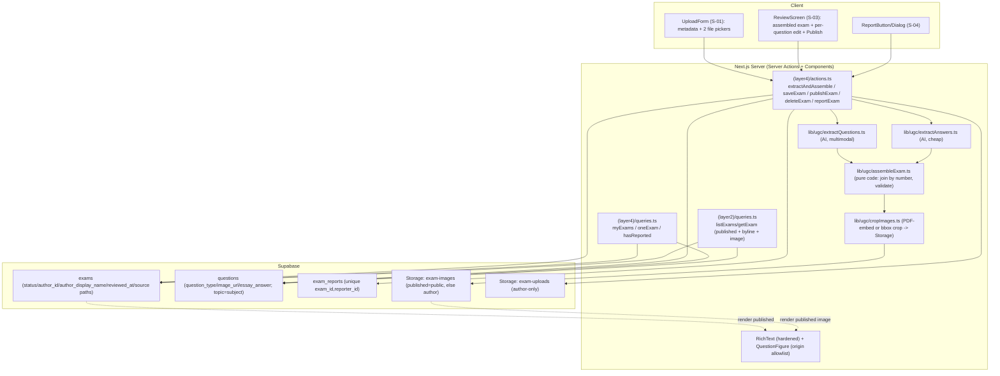

# UGC Exam Upload — Design Document (AI-assisted)

| | |
|---|---|
| **Version** | 2.1 (v2.0 implemented; v2.1 amendment — see §v2.1 Amendment) |
| **Date** | 2026-07-17 (v2.0: 2026-07-15) |
| **Status** | Draft — major redesign. Supersedes v1.1 (plain-text paste + deterministic parser + single-admin moderation). Aligns to PRD v2.0, UI Spec v2.0, and the revised ADRs: **two-file upload → server-side AI extraction → code assembly → mandatory author review → author-gated publish**, with question images and **no admin**. |
| **PRD** | `docs/prd/ugc-exam-upload-prd.md` (v2.0) |
| **UI Spec** | `docs/ui-spec/ugc-exam-upload-ui-spec.md` (v2.0) |
| **ADRs** | ADR-0001 (lifecycle + RLS, admin removed, image Storage), ADR-0002 (render + safe images), ADR-0003 (author name), ADR-0004 (AI extraction + assembly) |

## Overview

This Design Doc turns the v2.0 ADRs into implementable detail: the idempotent `schema.sql` additions (lifecycle without admin, tightened RLS, new question columns, Storage buckets + policies, backfill), the two server-side AI extraction contracts, the pure-code assembly + image-crop step, the hardened `RichText` render pipeline plus the origin-allowlisted image path, the server actions and read queries, resolved input limits, the test strategy, and full AC traceability.

### What changed from v1.1 (for a reviewer holding the old design)

- **Removed**: `is_admin()`, all admin RLS branches, the pending-cap trigger, the role-preservation trigger, the transition-guard trigger's admin logic, and the `parseExam` isomorphic parser + its client preview.
- **Added**: `questions.question_type`/`image_url`/`essay_answer`; two Storage buckets (`exam-images`, `exam-uploads`) with RLS; two server-side AI extractors (question file, answer file); a pure-code assembly + image-crop step; an origin-allowlisted `QuestionFigure` render path.
- **Simplified**: lifecycle (`processing`/`review`/`draft`/`published`/`failed`, all author-owned); publish is author-gated by the mandatory review; delete replaces withdraw; published exams are field-editable (no lock).
- **Kept**: the hardened `RichText` sanitization pipeline (ADR-0002) and denormalized author name (ADR-0003).

## Design Summary (Meta)

```yaml
design_type: "extension"          # extends exams/questions schema, RichText, catalog reads; adds Storage + AI
risk_level: "high"                # DB+Storage security gate; a missed RLS/Storage predicate leaks non-published content; a wrong answer key ships bad data
complexity_level: "high"
complexity_rationale: >
  (1) AC-019/AC-024 require rules enforced at the DB and Storage layers (RLS on tables + on storage.objects),
      not the app, because clients call Supabase directly; (2) ADR-0002 routes untrusted content through a
      hardened RichText path plus an origin-allowlisted image path, with mandated XSS + image-origin fixtures;
      (3) ADR-0004 mandates two server-side AI extractions feeding a code-only assembly whose output — not the
      raw AI response — is persisted, with a mandatory author review; AI is non-deterministic, so the human
      review and the answer-file authority are load-bearing correctness controls.
main_constraints:
  - "Single idempotent schema.sql applied by hand in the Supabase SQL Editor — no migration framework."
  - "AI calls are server-side only; the API key is never bundled client-side."
  - "DB + Storage enforcement mandatory; UI hiding is never the guard."
  - "Answers come from the answer file, never AI reasoning; assembly joins by question number."
  - "Works well under stable conditions (well-formed files, working API); must fail loudly, not silently."
biggest_risks:
  - "A missed read path (table OR image bucket) leaks non-published content (PRD metric 1 = zero leaks)."
  - "AI misreads a question/answer/image and the author doesn't catch it (mitigated by mandatory review + answer-file authority + fixtures)."
  - "Image cropped or mapped to the wrong question (mitigated by single-call question+image extraction, PDF-embedded preference, review)."
unknowns:
  - "Exact AI prompt/response schema, model IDs, timeouts, bounding-box coordinate convention — resolved in this doc's contracts and tuned during implementation."
  - "PDF-embedded-image extraction vs. bounding-box crop heuristic; Storage path layout — set here at principle level, finalized in implementation."
```

## Background and Context

### Prerequisite ADRs

- **ADR-0001** (revised): lifecycle columns, `exam_reports`, replaced select policies, author write policies, image Storage bucket + policies, backfill. **No** `is_admin()`, cap trigger, or role trigger.
- **ADR-0002** (revised): hardened `RichText` for text; question figures rendered as an origin-allowlisted `` (structured `image_url`, not markdown); XSS + seeded-regression + image-origin fixtures.
- **ADR-0003** (revised): denormalized `author_display_name`; `reporter_display_name` read by the owner out-of-band; owner-only `profiles_select_own` unchanged.
- **ADR-0004** (replaces the parser ADR): two server-side AI extractions (question file → structure + image boxes; answer file → answer map) + pure-code assembly (join by number, crop images, `topic=subject`, validate); persist only the assembled, author-confirmed result; mandatory author review.

### External Resources Used

| Resource | Feature-specific identifier | Notes |
|----------|-----------------------------|-------|
| Database Schema Source | `SOURCE/supabase/schema.sql` — new `exams`/`questions` columns, `exam_reports`, replaced select policies, author write policies, backfill; Storage bucket policies | Applied manually in the SQL Editor; idempotent |
| Object storage | Supabase Storage buckets `exam-images` (cropped figures), `exam-uploads` (original files) | RLS on `storage.objects`; images public-read only for published exams |
| AI provider | **Gemini API (Google), server-side only** *(v2.1 — swapped from Claude 2026-07-17, ADR-0006)*. Question extractor: `gemini-3.5-flash` (multimodal, image+PDF). Answer extractor: `gemini-3.1-flash-lite` (cheap). | Via `@google/genai`; key (`GEMINI_API_KEY`) in server env only; structured output via `responseJsonSchema`. Model ids re-verified against `client.models.list()` on change. |
| Schema Change Process | RLS verification via `SOURCE/supabase/test-rls.ts` (`cd SOURCE && npx tsx supabase/test-rls.ts`) | Extended with UGC + Storage cases; acceptance mechanism for PRD metric 1 |
| Authentication Method | `@supabase/ssr` session cookie; server client `SOURCE/lib/supabase/server.ts` | New Server Actions/Components obtain the client via `createClient()` |
| Design System | `RichText`, `ExamCard`, `SiteHeader`, `HomeSidebar`, `HeaderProfile`, `LeaveExamDialog`, `TopicBreakdown` | Extend per UI Spec reuse map |
| Mock Environment | `SOURCE/lib/fake-data/exams.ts` (seeded content shape/topics for regression fixtures) | Source of seeded regression snapshots (ADR-0002) |

### Agreement Checklist

#### Scope
- [x] Extend `public.exams` with lifecycle/authorship/reviewed-at/denormalized-name/source-file columns + a status CHECK.
- [x] Extend `public.questions` with `question_type`, `image_url`, `essay_answer` (nullable/defaulted; seeded rows unaffected).
- [x] Add `public.exam_reports` with `unique(exam_id, reporter_id)` and a non-empty reason CHECK.
- [x] Replace `exams`/`questions` SELECT policies (published-or-author, **no admin**); add author write policies; add `with check` to `profiles_update_own`; backfill seeded → published.
- [x] Add two Storage buckets (`exam-images`, `exam-uploads`) with `storage.objects` RLS.
- [x] Harden `RichText` (ADR-0002) + add the `QuestionFigure` origin-allowlist path; add XSS + regression + image-origin fixtures.
- [x] Add server-side AI extractors (`SOURCE/lib/ugc/extractQuestions.ts`, `extractAnswers.ts`) + a pure-code assembler (`assembleExam.ts`) + image cropper (`cropImages.ts`).
- [x] Add `(layer4)` routes S-01…S-03; add Server Actions + read queries.
- [x] Extend catalog reads (`listExams`/`getExam`) to filter `status='published'` and carry `author_display_name` + question `image_url`/`question_type`.
- [x] Extend navbar (`SiteHeader`, `HomeSidebar`) — Import→Upload, **no admin item** — and profile dropdown (My exams).

#### Non-Scope (Explicitly not changing)
- [ ] `computeScore` / `TopicBreakdown` — `topic` default is data (ADR-0004); no change. (Essay/player interaction is a deferred product decision — see Open Items.)
- [ ] The attempt/result tables and their RLS — untouched.
- [ ] `profiles_select_own` (owner-only) — unchanged; only `profiles_update_own` gains `with check`.
- [ ] Any admin role, queue, or moderation — **removed**, not built.
- [ ] `RichText` public props — hardening is internal.
- [ ] Anonymous catalog access — unchanged; new policies remain `to authenticated`.

#### Constraints
- Parallel operation: **No** — single local Supabase project; schema applied once, verified, then app deploys.
- Backward compatibility: **Required** — seeded exams and existing player/catalog/attempt flows keep working; guaranteed by backfill + `status='published'` filter + AC-027 count check + column defaults on `questions`.
- Performance measurement: **Not a CI gate** (extraction latency is inherent to the AI round-trip; the requirement is a visible progress state, not a hard bound). Catalog filtering stays at the policy/query layer.

#### Applicable Standards
- Idempotent DDL (`drop … if exists` / `add column if not exists` / `is distinct from`) — `schema.sql` convention.
- `SECURITY DEFINER` functions set `search_path` explicitly — only if any are added (v2.0 adds none for authorization; `handle_new_user` remains).
- Snake_case DB ↔ camelCase TS mappers in query modules — `SOURCE/app/(layer2)/queries.ts` convention.
- Server Actions: `"use server"`, `createClient()`, `throw` on infra error, discriminated return (`{error?}`) on user error — existing convention.
- **AI key never client-bundled**: the extractor modules import `@anthropic-ai/sdk` and read the key from server env; they must never be imported into a client component. A build-time check asserts the key is not in the client bundle (PRD metric 6).
- Vietnamese comments where the surrounding file already uses them.

#### Quality Assurance Mechanisms
- ESLint / Prettier / `tsc` strict — adopted, project-wide.
- RLS verification harness `SOURCE/supabase/test-rls.ts` — extended with UGC + Storage cases; acceptance for PRD metric 1.
- Vitest + jsdom + @testing-library/react — parser/assembly fixtures + RichText XSS/regression/image fixtures (**new dev dependency**, Work Plan installs).
- axe a11y audit — new surfaces at QA phase.

### Problem to Solve

Introduce a moderated-free publication lifecycle for untrusted user uploads (files → AI-extracted content → author-reviewed exam) while (a) confining all non-published content — exams, questions, and images — at the DB and Storage layers; (b) keeping the shared render path safe for untrusted text and rendering figures only from the site's own storage; (c) ensuring the answer key comes from the author's answer file, not AI reasoning; and (d) preserving existing seeded catalog/player/attempt behavior — all expressible in one idempotent `schema.sql` plus Storage policies.

### Current Challenges

- `exams`/`questions` both use `for select … using (true)` (`schema.sql:150-157`) — any authenticated user reads every row; once non-published UGC exists it leaks.
- `profiles_update_own` has no `with check` — a user can write another row (role escalation is now harmless since no code reads `role`, but the write-scoping gap is still worth closing).
- No `status`/`author_id`/`reviewed_at` on `exams`; no `question_type`/`image_url`/`essay_answer` on `questions`; no reports table; no Storage buckets.
- `RichText` has fed only trusted developer input; UGC is the first untrusted input, and figures are a new render surface.

### Requirements

Traceable to PRD v2.0 R1–R15 / AC-001–AC-029 (see AC Traceability Matrix). NFRs: extraction is server-side with a visible progress state; every server rule DB/Storage-enforced; no data loss in authoring; only the assembled author-confirmed result persisted; images only from own storage; safe text render.

## Existing Codebase Analysis

### Implementation Path Mapping

| Type | Path | Description |
|------|------|-------------|
| Existing | `SOURCE/supabase/schema.sql` | New columns, `exam_reports`, replaced select policies, author write policies, `with check`; Storage bucket policies. **No `is_admin`.** |
| Existing | `SOURCE/app/(layer2)/queries.ts` | `listExams`/`getExam`/`getExamForPlayer`/`getResult` — status filter + byline + `image_url`/`question_type`. |
| Existing | `SOURCE/app/(layer1)/actions.ts` | Auth + `updateProfile` — pattern reference. |
| Existing | `SOURCE/lib/supabase/{server,client}.ts` | Server client via `createClient()`. |
| Existing | `SOURCE/lib/scoring/computeScore.ts`, `_components/TopicBreakdown.tsx` | Topic bucketing — unchanged. |
| Existing | `SOURCE/components/shared/RichText.tsx` | Hardened internally (ADR-0002). |
| Existing | `SOURCE/lib/auth/getCurrentUser.ts` | `getCurrentUserProfile()` — own-name read; populates denormalized name. |
| Existing | `SOURCE/supabase/test-rls.ts` | RLS harness — extended with UGC + Storage cases. |
| Existing | `SOURCE/app/(layer2)/_components/{ExamCard,SiteHeader}.tsx`, `(layer1)/_components/HomeSidebar.tsx`, `components/shared/HeaderProfile.tsx` | Extended per UI Spec. |
| Existing (empty) | `SOURCE/app/(layer4)/` | Home for the three new screens. |
| New | `SOURCE/lib/ugc/extractQuestions.ts` | Server-side AI: question file → structured questions + image boxes (ADR-0004). |
| New | `SOURCE/lib/ugc/extractAnswers.ts` | Server-side AI: answer file → answer map. |
| New | `SOURCE/lib/ugc/assembleExam.ts` | Pure code: join by number, validate, `topic=subject`, typed result/errors. |
| New | `SOURCE/lib/ugc/cropImages.ts` | Pure code + Storage: PDF-embedded extraction or bounding-box crop → upload → URL. |
| New | `SOURCE/lib/ugc/{types.ts,errorCopy.ts,limits.ts}` | Shared types, error-code → copy map, input limits. |
| New | `SOURCE/components/shared/QuestionFigure.tsx` | Origin-allowlisted `` for a question image. |
| New | `SOURCE/app/(layer4)/actions.ts` | Server Actions: extractAndAssemble / saveExam / publishExam / deleteExam / reportExam. |
| New | `SOURCE/app/(layer4)/queries.ts` | Read queries: my-exams, one exam (assembled), hasReported. |
| New | `SOURCE/app/(layer4)/{upload,me/exams,me/exams/[id]}/page.tsx` + `_components/*` | Screens S-01…S-03 (UI Spec). |
| New | `SOURCE/lib/ugc/__tests__/*`, `SOURCE/components/shared/__tests__/RichText.*.test.tsx`, `QuestionFigure.test.tsx` | Vitest fixtures. |

**Similar-functionality search:** No existing extraction, sanitizer, moderation, image-crop, or reporting code exists (Grep for `extract`, `sanitize`, `report`, `crop`, `image_url`, `rehype-sanitize` → none). The one reuse is `RichText` (extend). All new modules are genuinely new.

## Design

### Change Impact Map

```yaml
Change Target: UGC Exam Upload v2.0 (exams/questions lifecycle + RLS + Storage, RichText + image path, catalog reads, AI extraction + assembly, layer4 screens)
Direct Impact:
  - SOURCE/supabase/schema.sql (new columns, exam_reports, replaced select policies, author write policies, with-check, backfill, Storage policies)
  - SOURCE/components/shared/RichText.tsx (hardened) + new QuestionFigure.tsx (origin-allowlisted img)
  - SOURCE/app/(layer2)/queries.ts (status='published' filter + author_display_name + image_url/question_type)
  - SOURCE/app/(layer2)/_components/SiteHeader.tsx, (layer1)/_components/HomeSidebar.tsx (Import->Upload, NO admin item)
  - SOURCE/components/shared/HeaderProfile.tsx, (layer1)/_components/SidebarProfile.tsx (My exams item)
  - SOURCE/app/(layer2)/_components/ExamCard.tsx, (layer2)/exams/[id]/page.tsx (AuthorByline; QuestionFigure; ReportButton)
  - SOURCE/supabase/test-rls.ts (UGC + Storage RLS cases)
  - NEW: SOURCE/lib/ugc/{extractQuestions,extractAnswers,assembleExam,cropImages,types,errorCopy,limits}.ts; SOURCE/app/(layer4)/{actions,queries,screens}
Indirect Impact:
  - Every exams/questions read passes through tightened select policies — bounded by backfill + AC-027 count check.
  - RichText consumers render through the hardened pipeline with no call-site change — bounded by seeded regression fixtures.
  - The player and exam-detail gain a QuestionFigure render for image-bearing questions.
No Ripple Effect:
  - computeScore, TopicBreakdown (topic default is data).
  - exam_attempts / attempt_answers / exam_results tables and their RLS.
  - RichText public props (unchanged).
  - profiles_select_own (owner-only; unchanged).
```

### Architecture Overview



### Data Flow

**Upload → review → published:**
```
Author fills metadata + picks question file + answer file
  -> action extractAndAssemble(input)
       validate metadata + file type/size/pages (limits.ts) — reject before any AI call
       upload both files to exam-uploads (author path)
       extractQuestions(questionFile)  [AI, server]   -> {questions[], imageBoxes}
       extractAnswers(answerFile)       [AI, server]   -> {number -> answer}
       cropImages(...)                  [code + Storage] -> image_url per figure question
       assembleExam(questions, answers, images) [pure code] ->
           join by number; MCQ correct_answer := answer file; topic := subject;
           validate (4 choices, one answer, non-empty stem, counts match)
       INSERT exams(status='review' | 'failed', author_id, author_display_name, source paths, question_ids)
       INSERT questions[] (question_type, choices?, correct_answer?, essay_answer?, image_url, topic=subject)
  -> redirect /me/exams/[id]  (S-03 review)
Author reviews; edits any field via saveExam(examId, patch) (re-validates)
Author clicks Publish -> publishExam(examId): verify own + clean; UPDATE status='published', reviewed_at=now()
  -> exam becomes catalog-visible (listExams status='published'); player renders text via RichText, image via QuestionFigure
```

**Re-extraction / failed recovery:** re-uploading files re-runs `extractAndAssemble`, fully re-deriving the question rows (delete-then-insert of `<examId>-q<n>`) and rewriting `question_ids`. Editing a *published* exam is field-level (`saveExam`), not a re-extraction.

**Delete:** `deleteExam(examId)` removes the exam (cascade to questions via `question_ids` cleanup) and its Storage objects; RLS confines it to the owner.

### Schema & DB Enforcement (concrete `schema.sql` additions)

All statements idempotent, appended to `SOURCE/supabase/schema.sql`. Order: columns/constraints → `exam_reports` → replaced select policies → author write policies → `profiles_update_own with check` → Storage policies → **backfill last**.

#### 1. `exams` columns + constraints

```sql
-- ============================================================================
-- UGC Exam Upload v2.0 (ADR-0001/0003) — lifecycle, authorship, source files.
-- Idempotent. NO admin: no is_admin(), no cap trigger, no role trigger.
-- ============================================================================
alter table public.exams add column if not exists status text not null default 'processing';
alter table public.exams add column if not exists author_id uuid references auth.users(id);
alter table public.exams add column if not exists author_display_name text;      -- ADR-0003 snapshot
alter table public.exams add column if not exists reviewed_at timestamptz;        -- set on publish
alter table public.exams add column if not exists question_file_path text;        -- exam-uploads path (re-run source)
alter table public.exams add column if not exists answer_file_path text;

alter table public.exams drop constraint if exists exams_status_check;
alter table public.exams add constraint exams_status_check
  check (status in ('processing','review','draft','published','failed'));
```

> No transition trigger in v2.0. Illegal status jumps are an app-level concern only (there is no admin actor to guard against); RLS restricts writes to the owner, and the app moves statuses along the documented lifecycle. (A transition-guard trigger is an optional future hardening, not MVP.)

#### 2. `questions` new columns

```sql
alter table public.questions add column if not exists question_type text not null default 'mcq';
alter table public.questions add column if not exists image_url text;             -- Storage URL of the cropped stem figure
alter table public.questions add column if not exists essay_answer text;          -- model answer for essay; null for mcq

alter table public.questions drop constraint if exists questions_type_check;
alter table public.questions add constraint questions_type_check
  check (question_type in ('mcq','essay'));
-- MCQ answers stay in the existing correct_answer (A–D CHECK unchanged); essay uses essay_answer.
```

Existing seeded rows get `question_type='mcq'`, `image_url=null`, `essay_answer=null` by default — no data change.

#### 3. `exam_reports` table

```sql
create table if not exists public.exam_reports (
  id                    uuid primary key default gen_random_uuid(),
  exam_id               text not null references public.exams(id) on delete cascade,
  reporter_id           uuid not null default auth.uid() references auth.users(id) on delete cascade,
  reporter_display_name text,                            -- ADR-0003 snapshot
  reason                text not null,
  created_at            timestamptz not null default now(),
  unique (exam_id, reporter_id)                          -- 1 report / user / exam
);
alter table public.exam_reports drop constraint if exists exam_reports_reason_check;
alter table public.exam_reports add constraint exam_reports_reason_check
  check (length(btrim(reason)) > 0);
```

#### 4. Replaced SELECT policies (no admin branch)

```sql
-- exams: published OR owned by the author. (no admin)
drop policy if exists "exams_select_authenticated" on public.exams;
drop policy if exists "exams_select_visible" on public.exams;
create policy "exams_select_visible" on public.exams
  for select to authenticated using (
    status = 'published' or author_id = auth.uid()
  );

-- questions: visible if they belong to at least one exam the user may see.
drop policy if exists "questions_select_authenticated" on public.questions;
drop policy if exists "questions_select_visible" on public.questions;
create policy "questions_select_visible" on public.questions
  for select to authenticated using (
    exists (
      select 1 from public.exams e
      where questions.id = any(e.question_ids)
        and (e.status = 'published' or e.author_id = auth.uid())
    )
  );
```

#### 5. Author WRITE policies (no admin)

```sql
-- exams: author manages their own exams (any status). Published is editable (no lock, PRD R8).
drop policy if exists "exams_insert_author" on public.exams;
create policy "exams_insert_author" on public.exams
  for insert to authenticated with check (author_id = auth.uid());

drop policy if exists "exams_update_author" on public.exams;
create policy "exams_update_author" on public.exams
  for update to authenticated using (author_id = auth.uid()) with check (author_id = auth.uid());

drop policy if exists "exams_delete_author" on public.exams;
create policy "exams_delete_author" on public.exams
  for delete to authenticated using (author_id = auth.uid());

-- questions: author writes questions belonging to their own exams.
drop policy if exists "questions_insert_author" on public.questions;
create policy "questions_insert_author" on public.questions
  for insert to authenticated with check (
    exists (select 1 from public.exams e
            where questions.id = any(e.question_ids) and e.author_id = auth.uid())
  );
drop policy if exists "questions_update_author" on public.questions;
create policy "questions_update_author" on public.questions
  for update to authenticated using (
    exists (select 1 from public.exams e
            where questions.id = any(e.question_ids) and e.author_id = auth.uid())
  ) with check (
    exists (select 1 from public.exams e
            where questions.id = any(e.question_ids) and e.author_id = auth.uid())
  );
drop policy if exists "questions_delete_author" on public.questions;
create policy "questions_delete_author" on public.questions
  for delete to authenticated using (
    exists (select 1 from public.exams e
            where questions.id = any(e.question_ids) and e.author_id = auth.uid())
  );
```

> Seeded content has `author_id is null`, so no author policy matches it — seeded rows remain read-only to clients (owner edits seed via service-role/SQL, unchanged). The site owner removes bad **published** UGC out-of-band via service-role (bypasses RLS).

#### 6. `exam_reports` policies (own-only select)

```sql
alter table public.exam_reports enable row level security;

drop policy if exists "reports_insert_own" on public.exam_reports;
create policy "reports_insert_own" on public.exam_reports
  for insert to authenticated with check (
    reporter_id = auth.uid()
    and exists (select 1 from public.exams e where e.id = exam_id and e.status = 'published')
  );

-- Select = own rows only (needed for the "you reported this" UI). Owner reads all out-of-band.
drop policy if exists "reports_select_own" on public.exam_reports;
create policy "reports_select_own" on public.exam_reports
  for select to authenticated using (reporter_id = auth.uid());
```

#### 7. `profiles_update_own` write-scoping (no role trigger)

```sql
-- Close the write-scoping gap. No role-preservation trigger (no code reads role for authorization).
drop policy if exists "profiles_update_own" on public.user_profiles;
create policy "profiles_update_own" on public.user_profiles
  for update using (id = auth.uid()) with check (id = auth.uid());
```

#### 8. Storage buckets + policies

Buckets (created via the Storage API / dashboard, recorded here): `exam-images` and `exam-uploads`. Object path convention: `{bucket}/{exam_id}/{filename}` so a policy can resolve the owning exam from the first path segment.

```sql
-- exam-images: published exams' figures are world-readable (catalog/player); non-published readable by the author.
drop policy if exists "exam_images_select" on storage.objects;
create policy "exam_images_select" on storage.objects
  for select to authenticated using (
    bucket_id = 'exam-images'
    and exists (
      select 1 from public.exams e
      where e.id = (storage.foldername(name))[1]
        and (e.status = 'published' or e.author_id = auth.uid())
    )
  );
-- (public/anon read for published images is granted separately if the catalog is anon-accessible;
--  MVP catalog is authenticated, matching the table policies.)

-- exam-images write: only the owning author may write into their exam's folder.
drop policy if exists "exam_images_write" on storage.objects;
create policy "exam_images_write" on storage.objects
  for insert to authenticated with check (
    bucket_id = 'exam-images'
    and exists (select 1 from public.exams e
                where e.id = (storage.foldername(name))[1] and e.author_id = auth.uid())
  );

-- exam-uploads (original question/answer files): author-only, both read and write. Never public.
drop policy if exists "exam_uploads_all" on storage.objects;
create policy "exam_uploads_all" on storage.objects
  for all to authenticated using (
    bucket_id = 'exam-uploads'
    and exists (select 1 from public.exams e
                where e.id = (storage.foldername(name))[1] and e.author_id = auth.uid())
  ) with check (
    bucket_id = 'exam-uploads'
    and exists (select 1 from public.exams e
                where e.id = (storage.foldername(name))[1] and e.author_id = auth.uid())
  );
```

> Because the image policy depends on the exam row existing first, the action creates the `exams` row (status `processing`) **before** uploading images, so the path's exam id resolves. If the server writes images via the service-role client instead, RLS is bypassed on write and these policies gate only client reads — the Design decision (service-role vs. user-session upload) is finalized in implementation; either way the **read** policy above is the confinement that the RLS suite verifies.

#### 9. Backfill

```sql
update public.exams
   set status = 'published'
 where author_id is null
   and status is distinct from 'published';
-- questions defaults (question_type='mcq', image_url=null, essay_answer=null) require no backfill.
```

### Rendering & Sanitization (concrete `RichText` pipeline — ADR-0002)

Applies to **all** exams (seeded + UGC) through the single shared `RichText`. Stored text content stays verbatim; sanitize at render only. **Question figures are not markdown** — they render through `QuestionFigure` (below), separate from `RichText`.

#### Plugin ordering (target)

```
react-markdown@10 (no rehype-raw, urlTransform at secure default)
  remarkPlugins:  [remarkGfm, remarkMath]
  rehypePlugins:  [ [rehypeKatex, KATEX_SAFE_OPTIONS], [rehypeSanitize, SANITIZE_SCHEMA] ]
```

`rehype-katex` runs before `rehype-sanitize` so KaTeX advisories are backstopped by the sanitize pass. `rehype-raw` is never added; `urlTransform` is never overridden; KaTeX `trust` is never true. Standing invariants guarded by the XSS fixtures.

#### KaTeX safe config

```ts
const KATEX_SAFE_OPTIONS = {
  trust: false, throwOnError: false, maxExpand: 100, maxSize: 50, strict: false,
} as const;
```

#### `rehype-sanitize` allowlist schema

Start from `defaultSchema` and extend it to keep the seeded GFM subset and let KaTeX HTML+MathML output through (`span`/`svg`/`path`/`line`/`g`, `math`/`semantics`/`annotation`/`mrow`/`mi`/`mo`/`mn`/…), allowing `className`/`style`/`ariaHidden` only on KaTeX-emitting tags. Raw HTML, `<script>`/`<iframe>`/`<style>`, `on*` handlers, and non-safe URL protocols are disallowed by construction. **Exact `tagNames`/`attributes` tuned against the fixture suite** (ADR-0002 delegated the precise schema).

> Full schema, KaTeX option rationale, and the ADR-0002 advisory references are as in the v1.1 Design Doc's sanitization section (unchanged); the only v2.0 change is the addition of the image path below.

#### `QuestionFigure` — origin-allowlisted image (ADR-0002 / AC-023)

```ts
// SOURCE/components/shared/QuestionFigure.tsx (server-safe; pure)
const ALLOWED_IMAGE_ORIGINS = [ /* the site's Supabase Storage origin(s), from env */ ];
export function isAllowedImageUrl(url: string | null): boolean {
  if (!url) return false;
  try { return ALLOWED_IMAGE_ORIGINS.includes(new URL(url).origin); }
  catch { return false; }
}
// Renders  ONLY if isAllowedImageUrl(url); else renders nothing (fail closed).
// alt defaults to `Figure for Câu ${n}`.
```

Used by the player, exam detail, and the author review (S-03). This is the AC-023 enforcement point on the render side; the Storage read policy (§8) is the data side. Both must hold.

#### Fixture suites (ADR-0002 gate)

- **XSS** (`RichText.xss.test.tsx`): the standard vectors (`<script>`, ``, `<iframe>`, `<style>`/`<svg onload>`, `javascript:` links/images, entity-smuggled protocols, KaTeX `\href`/`\includegraphics`/`\htmlData` inert under `trust:false`, `\edef`/nested-macro DoS bounded by `maxExpand`, oversized `\rule` bounded by `maxSize`, reference-definition injection) — each asserts no `<script>`, no `on*`, no `javascript:`/non-image `data:`, no throw.
- **Seeded regression** (`RichText.regression.test.tsx`): snapshot representative seeded stems/choices before hardening; assert unchanged after.
- **Image origin** (`QuestionFigure.test.tsx`): a storage-origin URL renders an ``; any other origin (or `javascript:`/`data:`) renders no image element; every rendered figure has non-empty `alt`.

### AI Extraction & Assembly (concrete — ADR-0004)

All AI runs **server-side** via `@anthropic-ai/sdk` with the key from server env. Both extractors use structured outputs (a JSON schema) so the response validates to the contract; on schema/validation failure the module returns a typed error (`EXTRACTION_FAILED`), never a thrown page break for author-input problems.

#### Types (`SOURCE/lib/ugc/types.ts`)

```ts
export type ChoiceId = "A" | "B" | "C" | "D";
export type BoundingBox = { page: number; x: number; y: number; w: number; h: number }; // normalized 0..1
export type ExtractedQuestion = {
  number: number;
  type: "mcq" | "essay";
  stem: string;
  choices?: { id: ChoiceId; text: string }[];   // mcq only, exactly 4 A–D
  imageBox?: BoundingBox;                         // present if the question has a figure
};
export type ExtractedAnswer =
  | { number: number; type: "mcq"; letter: ChoiceId }
  | { number: number; type: "essay"; text: string };
export type UgcErrorCode =
  | "NO_QUESTIONS_FOUND" | "TOO_MANY_QUESTIONS" | "WRONG_CHOICE_COUNT"
  | "EMPTY_STEM" | "EMPTY_CHOICE" | "ANSWER_COUNT_MISMATCH" | "ANSWER_MISSING"
  | "IMAGE_CROP_FAILED" | "EXTRACTION_FAILED" | "FILE_TOO_LARGE" | "TOO_MANY_PAGES"
  | "STEM_TOO_LONG" | "CHOICE_TOO_LONG";
export type UgcError = { code: UgcErrorCode; questionNumber: number | null; message: string };
export type Result<T> = { ok: true; value: T } | { ok: false; errors: UgcError[] };
```

#### Contracts

```yaml
Contract: extractQuestions(file: FileRef): Promise<Result<ExtractedQuestion[]>>   # server-only, AI
  Input: an uploaded image/PDF (already validated for type/size/pages)
  Behavior: one multimodal Claude call; structured output = ExtractedQuestion[];
            instructed to number questions, classify mcq/essay, transcribe stem + 4 choices (mcq),
            and return imageBox for any question that has a figure. MUST NOT mark a correct answer.
  Output: ok=true => 1..MAX_QUESTIONS questions; ok=false => typed errors (per-question or whole-file)
  On AI/API error: { ok:false, [{code:'EXTRACTION_FAILED', questionNumber:null, ...}] }

Contract: extractAnswers(file: FileRef): Promise<Result<ExtractedAnswer[]>>        # server-only, AI (cheap model)
  Behavior: one Claude call; structured output = ExtractedAnswer[] (number -> letter | text).
            Reads the answer file; does NOT solve questions.
  Output: ok=true => one answer per number found; ok=false => typed errors

Contract: cropImages(questionFile, questions, examId): Promise<Result<Map<number, imageUrl>>>  # pure code + Storage
  Behavior: for each question with imageBox: if the source is a PDF, prefer extracting the embedded
            image; else crop the bounding box from the rendered page (sharp). Upload to
            exam-images/{examId}/q{n}.png; return the URL. Failure per figure -> IMAGE_CROP_FAILED(n).

Contract: assembleExam(questions, answers, images, meta): Result<AssembledExam>    # PURE code, authoritative
  Behavior: join questions to answers BY NUMBER; for mcq set correct_answer := answer.letter;
            for essay set essay_answer := answer.text; attach images.get(n); set topic := meta.subject.
            Validate: counts match (else ANSWER_COUNT_MISMATCH / ANSWER_MISSING), each mcq has exactly
            4 A–D choices + one correct letter, non-empty stem, lengths within limits.
  Output: ok=true => the exam to persist; ok=false => typed errors naming Câu N.
  Guarantee: the persisted exam is ALWAYS this assembled value; raw AI output is never persisted.
```

#### Input limits (`SOURCE/lib/ugc/limits.ts`)

```ts
export const LIMITS = {
  MAX_QUESTIONS: 50, MIN_QUESTIONS: 1,
  MAX_TITLE: 200, MAX_STEM: 2000, MAX_CHOICE: 500, MAX_ESSAY_ANSWER: 4000,
  MAX_REPORT_REASON: 1000, MAX_SCHOOL: 200,
  MIN_DURATION: 1, MAX_DURATION: 600,
  MIN_GRADE: 6, MAX_GRADE: 12,           // business assumption (D10) — product confirm (O-1)
  MIN_YEAR: 1900, MAX_YEAR: 2100,
  MAX_FILE_BYTES: 15 * 1024 * 1024,      // per file; also a Claude request-size guard
  MAX_PDF_PAGES: 30,
  ALLOWED_MIME: ["image/png","image/jpeg","image/webp","application/pdf"] as const,
  MAX_UPLOADS_PER_DAY: 30,               // light per-user cost guard (app-layer)
} as const;
```

#### Error-code → review-panel copy (`errorCopy.ts`)

| Code | qNumber | Copy |
|------|---------|------|
| `NO_QUESTIONS_FOUND` | null | "No questions were recognized in the question file. Re-upload a clearer file." |
| `TOO_MANY_QUESTIONS` | null | "Too many questions — an exam can have at most 50." |
| `WRONG_CHOICE_COUNT` | n | "Câu {n} — {k} choices were read; an MCQ needs exactly 4 (A–D). Edit below or re-upload." |
| `EMPTY_STEM` | n | "Câu {n} — the question text is empty; add it below." |
| `EMPTY_CHOICE` | n | "Câu {n} — choice {label} is empty." |
| `ANSWER_COUNT_MISMATCH` | null | "The answer file has {a} answers but the question file has {q} questions ({unmatched} unmatched)." |
| `ANSWER_MISSING` | n | "Câu {n} — no answer found in your answer file. Add it to the file or set it below." |
| `IMAGE_CROP_FAILED` | n | "Câu {n} — the image couldn't be cropped. Re-upload the file or remove the image." |
| `EXTRACTION_FAILED` | null | "Couldn't read your files right now. Please try again." |
| `FILE_TOO_LARGE` / `TOO_MANY_PAGES` | null | "That file is too large / has too many pages (max {…})." |
| `STEM_TOO_LONG` / `CHOICE_TOO_LONG` | n | "Câu {n} — the {stem/choice} is too long (max {…})." |

### Data Contracts — Server Actions (`(layer4)/actions.ts`)

```yaml
Contract: extractAndAssemble(input): Promise<ActionResult>   ("use server")
  input: { title, subject, grade, durationMinutes, school?, schoolYear?, semester?, questionFile, answerFile }
  Validation (server): metadata (required, lengths, grade 6–12, semester enum); file type/size/pages (limits) — reject before AI
  Effect: create exams(status='processing'); upload files to exam-uploads; run extractQuestions + extractAnswers +
          cropImages + assembleExam; INSERT questions (assembled); set status='review' (clean) or 'failed' (errors)
  Success: redirect("/me/exams/[id]")
  Failure: { error: { kind: "validation"|"file"|"extraction"|"assembly"|"server", message, errors?: UgcError[], fieldErrors? } }
  Guarantees: nothing published; no form data cleared; persisted questions = assembled result only; AI key server-only

Contract: saveExam(examId, patch): Promise<{error?}>          # author edits fields in review OR on a published exam
  Precondition: exam.author_id = auth.uid()
  Effect: apply field edits (stem/choices/correct_answer/essay_answer/image add-replace-remove/metadata); re-validate

Contract: publishExam(examId): Promise<{error?}>
  Precondition: own exam; status in ('review','draft'); assemble/validate clean
  Effect: status -> 'published', reviewed_at=now()

Contract: deleteExam(examId): Promise<{error?}>
  Precondition: own exam (any status)
  Effect: delete exam + its questions + its Storage objects (exam-images/{id}, exam-uploads/{id})

Contract: reportExam(examId, reason): Promise<{error?: "duplicate"|"empty"|"server"}>
  Precondition: authenticated; exam.status='published'; trimmed reason non-empty, <= MAX_REPORT_REASON
  Effect: insert exam_reports(reporter_id, reporter_display_name, reason); unique violation -> "duplicate"
```

### Read Queries (`(layer4)/queries.ts`)

```yaml
listMyExams(): MyExam[]              # own rows, all statuses, newest-first: id,title,subject,grade,questionCount,status,createdAt
getMyExam(id): AssembledExam|null    # own; full assembled exam for review/edit: metadata + questions (stem,type,choices,correct,essay,image_url)
hasReported(examId): boolean         # a row (exam_id, auth.uid()) exists
```

Catalog reads (`(layer2)/queries.ts`) extend `listExams`/`getExam`/`getExamForPlayer` to `.eq('status','published')` (on top of the RLS floor) and to select `author_display_name` and each question's `question_type`/`image_url`/`essay_answer`. RLS is the authorization floor; the explicit `status='published'` filter prevents a viewer's own non-published exams leaking into the catalog (R-6).

### Data Representation Decision

| Structure | Decision | Reason |
|-----------|----------|--------|
| lifecycle/authorship/source-files on `exams` | **extend** | Belong to the exam entity; single `status` axis (ADR-0001). |
| `question_type`/`image_url`/`essay_answer` on `questions` | **extend** | Per-question content attributes; defaults keep seeded rows intact. |
| `exam_reports` | **new table** | Distinct entity (reporter, reason, per-user uniqueness). |
| cropped images | **Storage bucket** (`exam-images`), URL on the question | Binary belongs in object storage; RLS on `storage.objects`. |
| `Extracted*` / `Assembled*` types | **new, internal to `lib/ugc`** | Pre-persistence shapes; must not carry DB-only fields. |

## Test Strategy

### RLS + Storage suite — extend `SOURCE/supabase/test-rls.ts`

Same harness (`assert()`, service-role setup, anon key + real sign-in). Users: an **author** and a **non-author** (no admin user — admin removed). Cases:

| # | Case | Asserts | AC / metric |
|---|------|---------|-------------|
| R-a | Non-author authed reads a non-published exam by id | 0 rows | metric 1 / AC-024 |
| R-b | Non-author authed reads its questions | 0 rows | metric 1 / AC-024 |
| R-c | Anonymous reads non-published exam + questions | 0 rows | metric 1 |
| R-d | Author reads own non-published exam + questions | ≥1 row (positive control) | — |
| R-e | Non-author reads a **published** UGC exam + questions | ≥1 row (publish positive control) | AC-017/021 |
| R-f | Non-author `insert`/`update`/`delete` on another's exam/questions | rejected / 0 rows | AC-019 |
| R-g | Author deletes own exam (any status) | succeeds | AC-018 |
| R-h | Non-owner `update user_profiles` on another row | rejected (with check) | write-scoping |
| R-i | Non-author reads another user's `exam_reports` row | 0 rows; own report → 1 row | AC-026 |
| R-j | Report insert on a non-published exam | rejected (insert check) | AC-025 |
| R-k | Duplicate report (same exam, same user) | unique violation | AC-026 |
| R-l | Seeded→published backfill count | count preserved; catalog count unchanged | metric 5 / AC-027 |
| **R-m** | **Non-author reads a non-published exam's image** in `exam-images` | 0 objects (Storage RLS) | metric 1 / AC-024 (image) |
| **R-n** | **Anyone reads a published exam's image**; author reads own non-published image | published readable; own readable | AC-011/023 |
| **R-o** | Non-author reads another's `exam-uploads` file | 0 objects | metric 1 (source files private) |

Run: `cd SOURCE && npx tsx supabase/test-rls.ts` — acceptance mechanism, re-run after every schema edit.

### Assembly + extraction fixtures — `SOURCE/lib/ugc/__tests__/`

- `assembleExam.test.ts` (pure): **answer fidelity** — assembling questions + a known answer map reproduces those answers exactly (metric 2); **image mapping** — a figure on Câu 5 attaches its URL to Câu 5 only (metric 4); each error code (`WRONG_CHOICE_COUNT`, `ANSWER_COUNT_MISMATCH`, `ANSWER_MISSING`, `EMPTY_STEM`, `EMPTY_CHOICE`, `TOO_MANY_QUESTIONS`, length limits) with a literal expected `code`+`questionNumber`; boundary cases at each limit.
- `extractQuestions`/`extractAnswers`: the AI calls are **mocked** at the SDK boundary in unit tests (return canned structured outputs) to test the mapping from SDK response → `Extracted*` and the `EXTRACTION_FAILED` path; a small **manual/integration** check runs the real extractors against a handful of real fixture files during the pilot (metric 3), not in the unit suite.

### RichText + image fixtures

XSS suite + seeded-regression suite (ADR-0002) + `QuestionFigure` image-origin suite (§Rendering). vitest + jsdom.

### Mock-boundary summary

| Dependency | Mock? | Rationale |
|------------|-------|-----------|
| Supabase DB + Storage (RLS suite) | **No** | RLS/constraints/Storage policies cannot be validated by mocks — real local Supabase. |
| `assembleExam` | No | Pure — literal fixtures. |
| Claude API (unit) | **Yes** (SDK boundary) | Determinism + no network/cost in unit tests; real extractors exercised in the pilot integration check. |
| `RichText`/`QuestionFigure` DOM | jsdom (real render) | Sanitization + origin allowlist are render-output properties. |

### Integration Verification Points

- End-to-end: upload question+answer files → extract → review → correct one mis-read choice → Publish → exam in `/exams` → attempt (MCQ) → result page renders single-topic breakdown.
- Image case: upload a file with a figure → review shows the cropped image on the right question → publish → player shows it.
- Report → duplicate blocked; owner reads reports out-of-band.

## AC Traceability Matrix

| AC | Design element(s) |
|----|-------------------|
| AC-001 | `SiteHeader`/`HomeSidebar` `Upload→/upload`; `(layer4)/upload` |
| AC-002 | `/upload` guard → `/?auth=signin` |
| AC-003 | `extractAndAssemble` validation `{kind:"validation",fieldErrors}`; MetadataFields |
| AC-004 | nullable school/year/semester; catalog "None" fallback |
| AC-005 | both-files check in FileUploadFields/ExtractBar |
| AC-006 | file type/size/page validation before any AI call (limits.ts + server) |
| AC-007 | extractQuestions + extractAnswers + assembleExam clean → S-03 |
| AC-008 | assembleExam per-question errors → ExtractionErrorPanel |
| AC-009 | `ANSWER_COUNT_MISMATCH`/`ANSWER_MISSING` → ExtractionErrorPanel |
| AC-010 | cropImages maps URL to question number; assemble attaches by number |
| AC-011 | QuestionFigure origin allowlist + `exam-images` published-read policy |
| AC-012 | assembleExam is authoritative; raw AI output never persisted |
| AC-013 | assembly validation → PublishBar disabled |
| AC-014 | getMyExam → AssembledQuestionList |
| AC-015 | saveExam re-validates; PublishBar gate |
| AC-016 | publishExam requires clean + explicit author action |
| AC-017 | publishExam → status='published' + author_id; catalog visibility |
| AC-018 | saveExam/deleteExam + `exams_update_author`/`exams_delete_author` |
| AC-019 | author-only write policies (RLS) |
| AC-020 | listMyExams → ExamRow/StatusBadge |
| AC-021 | `author_display_name` on card + detail (AuthorByline) |
| AC-022 | plain-text render (review) / hardened RichText (published) |
| AC-023 | QuestionFigure allowlist; `exam-images` read policy |
| AC-024 | `exams_select_visible`/`questions_select_visible`/Storage policies; catalog `.eq('status','published')` |
| AC-025 | reportExam; `reports_insert_own` (published only) |
| AC-026 | `unique(exam_id,reporter_id)` → "duplicate"; `reports_select_own`; `hasReported` |
| AC-027 | backfill `status='published' where author_id is null`; RLS suite R-l |
| AC-028 | UploadGuide (UI Spec) |
| AC-029 | ExtractionProgress state |

## Implementation Plan

### Approach

**Horizontal-first (foundations), then Vertical slices.** The DB+Storage foundation and the render foundation are stability/security-critical and shared by every surface → build and **verify** them before any screen. Then deliver value vertically (upload→review→publish→attribute→report).

### Order

1. **Schema + Storage foundation + RLS suite** — columns, `exam_reports`, replaced select policies, author write policies, `with check`, Storage bucket policies, backfill; apply in SQL Editor. **Verify**: RLS+Storage suite (R-a…R-o) green. *(ADR-0001 kill criterion — do not proceed if red.)*
2. **Tooling** — vitest + jsdom + @testing-library/react dev deps + config.
3. **`lib/ugc` extraction + assembly + crop** — `types`, `limits`, `errorCopy`, `extractQuestions`, `extractAnswers`, `cropImages`, `assembleExam` + assembly fixtures (answer fidelity, image mapping, errors). AI key server-only + build-time no-bundle check (metric 6).
4. **RichText hardening + QuestionFigure** — `rehype-sanitize` + KaTeX safe config; XSS + seeded-regression + image-origin fixtures. *(ADR-0002 gate.)*
5. **Server actions + read queries** — `(layer4)/{actions,queries}.ts` + `(layer4)/layout.tsx` (SiteHeader).
6. **Catalog reads + byline + image** — `(layer2)/queries.ts` (`status='published'`, `author_display_name`, question `image_url`/`question_type`), `ExamCard`, exam detail (AuthorByline + QuestionFigure + ReportButton/Dialog), player (QuestionFigure).
7. **Navbar/profile** — Import→Upload (no admin item); My exams in the profile dropdown.
8. **Screens S-01…S-03** — Upload, My exams, Review & edit — per UI Spec (states, a11y, dialog focus trap).
9. **QA phase** — full AC pass; RLS+Storage suite green; assembly + XSS + regression + image fixtures green; axe + keyboard a11y; AC-027 count; end-to-end upload→review→publish→attempt→report.

### Migration Strategy

Single idempotent `schema.sql` re-applied in the SQL Editor. Sequence: add columns (defaulting existing exams to `processing`, seeded rows then backfilled to `published`; questions default `mcq`) → create policies → **backfill last**. Storage buckets + policies created alongside. Verify with the extended RLS+Storage suite + AC-027 before deploying app code. Rollback: policies are `drop … if exists`-guarded; revert by re-applying the prior schema from git.

## Security Considerations

- **AuthN/AuthZ**: `/upload`, `/me/exams`, `/me/exams/[id]` require auth (page guard → `/?auth=signin`). There is **no admin route**. Every write is DB/Storage-enforced (author-only policies + CHECKs + unique) — a crafted client cannot read non-published content, publish someone else's exam, edit/delete another's, double-report, or read another's reports/uploads.
- **AI key**: server-side only; the extractor modules are never imported client-side; a build-time check asserts the key is absent from the client bundle (metric 6).
- **File input**: type/size/page validated before any AI call; originals stored in a private, author-only bucket.
- **Untrusted content**: text rendered through the hardened `RichText`; figures only through the origin-allowlisted `QuestionFigure`; answer key comes from the author's file (not AI reasoning) and is author-reviewed.
- **Sensitive data**: `display_name` denormalized only where needed (public byline; own report rows). Logs exclude tokens and raw AI payloads; client errors carry only the mapped message.

## Risks and Mitigation

| Risk | Impact | Prob | Mitigation |
|------|--------|------|------------|
| Missed read path leaks non-published content (table OR image/upload bucket) | High | Medium | RLS+Storage suite R-a…R-o as the repeatable acceptance mechanism (metric 1); re-run after every schema edit |
| AI misreads and the author doesn't catch it | High | Medium | Mandatory author review (R7); answer key from the author's file (R4b); assembly fixtures (metric 2) |
| Image cropped/mapped to the wrong question | Medium | Medium | Single question+image extraction call (mapping by construction); prefer PDF-embedded image; review shows the image on its question; image-mapping fixtures (metric 4) |
| AI/API failure or rate limit | Medium | Medium | `EXTRACTION_FAILED` + retry without data loss; per-user daily upload guard; scoped to "stable conditions" |
| API key leaked to client | High | Low | server-only calls + build-time no-bundle check (metric 6) |
| Sanitization regresses seeded rendering | Medium | Medium | seeded-regression snapshot fixtures (ADR-0002 gate) |
| Catalog shows a viewer's own non-published exams (RLS lets author see own) | Medium | Medium | catalog reads add explicit `.eq('status','published')` on top of RLS |
| Essay questions break the MCQ player/scoring | Medium | Medium | essay flagged; player/scoring interaction deferred — MVP may publish MCQ-only until the grading feature lands (Open Items O-2) |
| Non-atomic exam+questions+image writes leave a half-written exam | Medium | Low | the exam is `processing`/`failed`, not published, and is author-deletable; a failed extraction is re-runnable (full re-derivation); no orphan reaches the catalog |

## What the Work Plan Must Decompose Into Tasks

In dependency order: (1) schema+Storage foundation + RLS suite; (2) tooling; (3) `lib/ugc` extraction+assembly+crop + fixtures + key-bundle check; (4) RichText hardening + QuestionFigure + fixtures; (5) server actions + read queries + layout; (6) catalog reads + byline + image + report; (7) navbar/profile; (8) screens S-01…S-03; (9) QA. Each task = Implementation + Quality (lint/tsc/tests) + Integration (verified against the DB/adjacent components); the final phase is QA.

## Open Items

| ID | Description | Owner | Resolution |
|----|-------------|-------|-----------|
| O-1 | Grade range 6–12 enforced only at the write boundary (no DB CHECK). | Product | Confirm secondary-school scope before QA; if broader, relax the action check. |
| O-2 | Essay in the player/result: publish MCQ-only vs. allow essay exams; how `computeScore`/result treat non-MCQ. | Product + Eng | Decide before enabling publish for essay-bearing exams; MVP may restrict to MCQ-only playback. |
| O-3 | Image write path: service-role upload (RLS bypass on write) vs. user-session upload (needs the exam row first). | Eng (impl) | Either is acceptable; the **read** policy is the confinement the RLS suite verifies. Finalize in implementation. |
| O-4 | PDF-embedded-image extraction vs. bounding-box crop heuristic; bounding-box coordinate convention. | Eng (impl) | Prefer embedded for PDFs, bbox for photos (ADR-0004); tune during implementation. |
| O-5 | `draft` status + "Save draft" in MVP, and how a `processing` row updates to `review`/`failed` in the UI (poll vs. manual refresh). | Eng | Design decision; `draft` may be deferred. |
| O-6 | Owner report-reading + owner delete of bad published content (no admin UI). | Eng | Service-role / direct DB; document the runbook. |

## References

- PRD `docs/prd/ugc-exam-upload-prd.md` (v2.0)
- UI Spec `docs/ui-spec/ugc-exam-upload-ui-spec.md` (v2.0)
- ADR-0001/0002/0003/0004 (`docs/adr/`, all revised for v2.0)
- claude-api skill reference (multimodal document/image input, structured outputs, server-side calling, model IDs)
- Code: `SOURCE/supabase/schema.sql`, `SOURCE/app/(layer2)/{queries,actions}.ts`, `SOURCE/app/(layer1)/actions.ts`, `SOURCE/lib/supabase/server.ts`, `SOURCE/lib/scoring/computeScore.ts`, `SOURCE/components/shared/RichText.tsx`, `SOURCE/lib/auth/getCurrentUser.ts`, `SOURCE/supabase/test-rls.ts`, `SOURCE/lib/fake-data/exams.ts`, `SOURCE/types/{exam,question}.ts`
- Security refs (ADR-0002): react-markdown security docs; KaTeX security/options; advisories GHSA-64fm-8hw2-v72w, GHSA-cvr6-37gx-v8wc, CVE-2025-23207

## v2.1 Amendment — Multi-Part National Format + Gemini Protocol (2026-07-17)

Amends the v2.0 design per ADR-0005 (multi-part data model) and ADR-0006 (Gemini provider + native bbox). v2.0 is code-complete and live-tested; this section specifies only the **delta**. Product decision: `true_false`/`short_answer` are stored/displayed, **not auto-scored** (future scoring feature).

### v2.1 Schema delta (idempotent, append to `schema.sql`; re-run Gate A after applying)

```sql
-- ============================================================================
-- UGC v2.1 (ADR-0005) — multi-part national exam format.
-- ============================================================================
alter table public.questions add column if not exists part_number int not null default 1;
alter table public.questions add column if not exists sub_answers jsonb;  -- true_false: {"a":bool,...} — SERVER-ONLY (never selected by player)

alter table public.questions drop constraint if exists questions_type_check;
alter table public.questions add constraint questions_type_check
  check (question_type in ('mcq','essay','true_false','short_answer'));

alter table public.exams add column if not exists parts jsonb;  -- [{number:int, title:text}] | null (single-part)
```

Seeded/v2.0 rows: `part_number=1`, `sub_answers=null`, `parts=null` — no data change (AC-033). Short-answer expected values reuse `essay_answer` (no new column). Row id for new uploads: `<examId>-p<part>q<n>`; the id parser (`fromRows.ts::questionNumberFromId`) accepts both old (`-q<n>`) and new forms.

### v2.1 Types delta (`lib/ugc/types.ts`)

```ts
export type QuestionType = "mcq" | "essay" | "true_false" | "short_answer";
export type SubItemId = "a" | "b" | "c" | "d";
// ADR-0006: Gemini-native bbox — [ymin, xmin, ymax, xmax], integers 0..1000.
export type BoundingBox = { page: number; box2d: [number, number, number, number] };

export type ExtractedQuestion = {
  part: number;                                  // 1 nếu đề không chia phần
  number: number;                                // đánh số TRONG phần
  type: QuestionType;
  stem: string;
  choices?: { id: ChoiceId; text: string }[];    // mcq
  subItems?: { id: SubItemId; text: string }[];  // true_false (chuẩn 4 ý a–d)
  imageBox?: BoundingBox;
};
export type ExtractedPart = { number: number; title: string };

export type ExtractedAnswer =
  | { part: number; number: number; type: "mcq"; letter: ChoiceId }
  | { part: number; number: number; type: "true_false"; values: { id: SubItemId; value: boolean }[] }
  | { part: number; number: number; type: "short_answer"; value: string }
  | { part: number; number: number; type: "essay"; text: string };
```

`UgcError` gains `partNumber: number | null`; copy renders "Phần {p} Câu {n} — …" when the exam is multi-part, plain "Câu {n}" otherwise. New error codes: `WRONG_SUB_ITEM_COUNT`, `SHORT_ANSWER_TOO_LONG`. New limits: `MAX_PARTS: 5`, `MAX_SHORT_ANSWER: 100`.

### v2.1 Assembly delta (`assembleExam.ts`)

Join key changes from `number` to the composite string `` `${part}:${number}` `` for the answer map **and** the image map. Validation additions: `true_false` needs 2–4 sub-items with distinct ids a–d and (for publish) a boolean per sub-item from the answer file; `short_answer` needs a non-empty expected value within `MAX_SHORT_ANSWER`; type mismatch between question and answer entries at the same (part, number) → `ANSWER_MISSING`. Everything else (topic=subject, answer-file authority, lenient/validate split) unchanged.

### v2.1 Extraction delta (both extractors — ADR-0006 protocol)

- `extractQuestions`: schema/prompt updated to (a) detect part headers ("PHẦN I/II/III…", also unheaded exams → single part), returning `{parts: ExtractedPart[], questions: ExtractedQuestion[]}`; (b) classify the 4 types (PHẦN II clusters → `true_false` with sub-items; PHẦN III → `short_answer`); (c) request figures as `box2d: [ymin, xmin, ymax, xmax]` integers 0–1000 per Google's documented convention.
- `extractAnswers`: reads answer tables/grids — the PHẦN I letter row, the PHẦN II Đ/S matrix (4 booleans per question), PHẦN III value row — returning part-qualified entries.
- `cropImages`: `boxToPixels` converts `box2d`/1000 → pixel rect (the only conversion point); rest unchanged. Kill criterion: >0 detected figures on the real 2025 Toán fixture, else escalate per ADR-0006 staged fallback.

### v2.1 Persistence/read delta

- `actions.ts`: persist `part_number`, `sub_answers`, `exams.parts`; id scheme `p<part>q<n>`; `SaveQuestionPatch` gains `subItems`/`subAnswers`/`shortAnswer` fields (validated server-side).
- `(layer4)/queries.ts` (`getMyExam`): carries the new fields for review.
- `(layer2)/queries.ts` (`getExamForPlayer`): selects `part_number`, `question_type`, sub-item **statements** (`choices`) — **never** `sub_answers`/`essay_answer`/`correct_answer`. `PublicQuestion` = `Omit<Question, "correctAnswer" | "essayAnswer" | "subAnswers">`.

### v2.1 UI delta

- **S-03 Review**: questions grouped under part headings (from `exams.parts`, fallback "Phần {n}"); `QuestionEditor` gains a `true_false` variant (4 statement rows, each with a Đ/S toggle showing the answer-file value) and a `short_answer` variant (expected-value input). Single-part exams render exactly as v2.0 (no visible part heading).
- **Player** (`QuestionRenderer`): `true_false` → 4 statements each with Đ/S segmented control; `short_answer` → one short text input; both labeled "Not auto-scored yet" (same treatment as essay). Part headings shown between sections.
- **Result page**: non-MCQ questions listed with the student's input and the stored answer, excluded from the score (verify `computeScore` skips them gracefully — regression task).

### v2.1 Test strategy delta

- Assembly fixtures: composite-key join (same numbers across parts, zero overwrites — AC-030); the 2 new types' validation codes; old single-part fixtures stay green byte-for-byte (AC-033).
- Extractor mapper tests: mocked-SDK payloads for parts + 4 types + `box2d`.
- Real-file check (QA task): 1 official 2025 Toán exam code + its answer page — all 22 questions land under correct (part, number); PHẦN II grids read correctly; >0 figures detected.
- Gate A re-run after the schema delta (RLS unchanged in shape but re-verified by convention).

## Update History

| Date | Version | Changes | Author |
|------|---------|---------|--------|
| 2026-07-14 | 1.0 | Initial Design Doc from PRD v1.1 (paste + admin) | Design Doc agent (Claude Opus 4.8) |
| 2026-07-14 | 1.1 | Reviewer conditions (compensating-delete policy, recovery narrative, RLS cases) | Design Doc reviewer (Claude Opus 4.8) |
| 2026-07-15 | 2.0 | **Major redesign to PRD v2.0**: two-file upload + server-side AI extraction (question file + answer file) + pure-code assembly (join by number, answer-file authority, topic=subject) + image crop/Storage + author review; removed `is_admin`/cap trigger/role trigger/transition-admin logic and the parser; added `question_type`/`image_url`/`essay_answer`, `exam-images`/`exam-uploads` buckets + RLS, `QuestionFigure` origin allowlist; simplified lifecycle; delete replaces withdraw; reports read out-of-band | Claude (Opus 4.8) |
| 2026-07-17 | 2.1 | **§v2.1 Amendment**: multi-part national 2025 format (ADR-0005 — `part_number`, composite join key, `true_false`/`short_answer` types, `sub_answers` server-only, `exams.parts`); Gemini provider + native `box2d` 0–1000 bbox protocol (ADR-0006); new types stored/displayed, not auto-scored (product decision) | Claude (Fable 5) |
