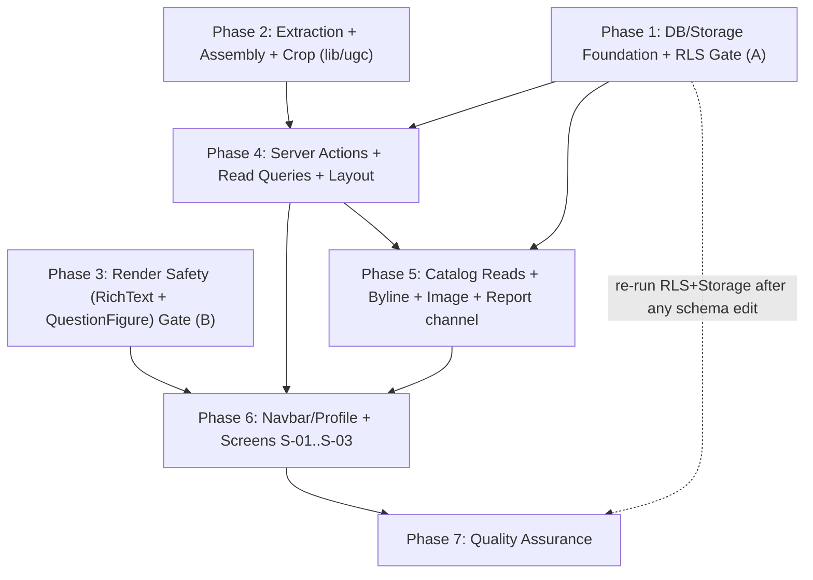
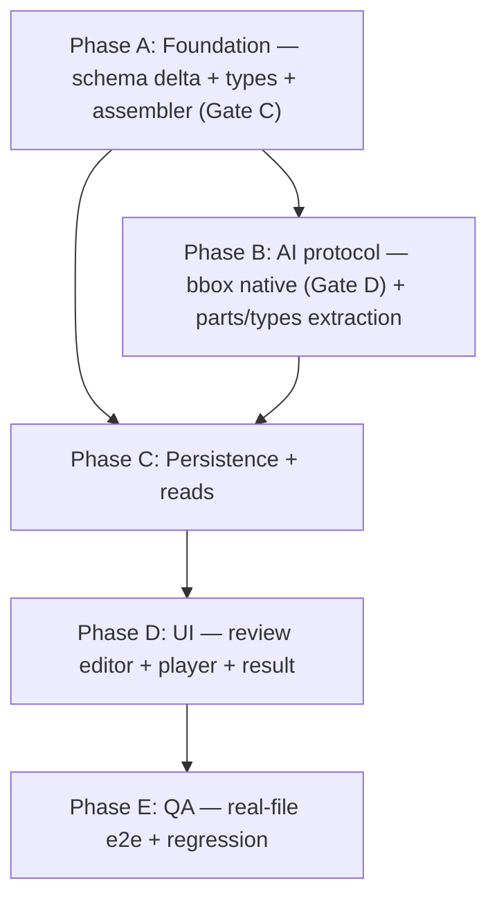
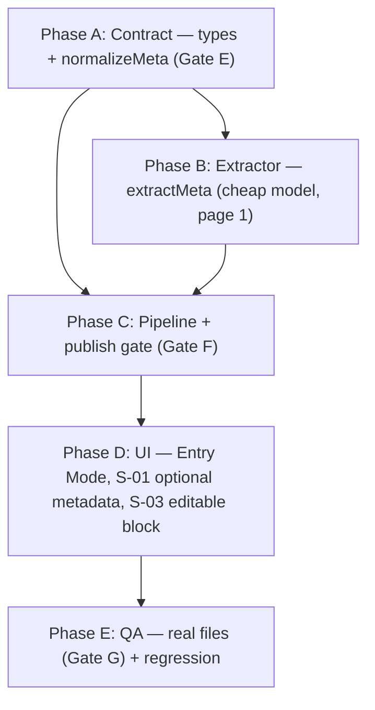

# Work Plan: UGC Exam Upload (AI-assisted) Implementation

Created Date: 2026-07-15
Version: 2.0 (major redesign — supersedes the v1.1 plan: paste + deterministic parser + single-admin moderation)
Type: feature
Estimated Impact: ~34 files (≈8 existing edited, ≈26 new)
Base branch: `main`

FIFTH and final document in the LARGE chain: PRD → UI Spec → ADR → Design Doc → **Work Plan**. Decomposes the Design Doc v2.0 §"What the Work Plan Must Decompose Into Tasks" into single-commit tasks with acceptance/verification.

## What changed from the v1.1 plan (for a reviewer holding the old plan)

- **Removed tasks/scope**: the deterministic parser (`parseExam`) and its fixtures; all admin surfaces (review queue, submission review, moderation, reject dialog, reports-to-admin); `is_admin()`, the pending-cap trigger, the role-preservation trigger, and the admin RLS branches.
- **New tasks/scope**: two Storage buckets + RLS; server-side AI extraction (question file + answer file) with a server-only key + no-client-bundle check; a pure-code assembly + image-crop step; the origin-allowlisted `QuestionFigure`; the review-&-edit screen (S-03); delete (replacing withdraw).
- **Reused from prior work**: the **vitest + jsdom tooling** (Phase 0 Task 0.1, already implemented in the v1.1 slice) carries over unchanged. The **hardened `RichText`** design carries over, extended with the image path.
- **Obsoleted prior work**: the already-implemented `lib/ugc/parseExam.ts` + `parseExam.test.ts` (v1.1 Phase 2) are **superseded** by AI extraction + code assembly. They should be removed (or kept only as dead reference) when the v2.0 `lib/ugc` modules land — see Task 2.1.

## Related Documents

- Design Doc: `docs/design/ugc-exam-upload-design.md` (v2.0) — PRIMARY
- ADRs (all revised for v2.0): ADR-0001 (lifecycle + RLS, admin removed, Storage), ADR-0002 (render + safe images), ADR-0003 (author name), ADR-0004 (AI extraction + assembly)
- PRD: `docs/prd/ugc-exam-upload-prd.md` (v2.0) — metrics 1–6, AC-001…029
- UI Spec: `docs/ui-spec/ugc-exam-upload-ui-spec.md` (v2.0) — screens S-01…S-05, components, states, a11y
- Environment/constraints: `docs/project-context/external-resources.md`

## Verification Strategy

### Correctness definition (Design Doc §Verification Strategy)

1. Zero rows/objects of non-published exam/question/**image**/upload data reach any non-author/anon client (PRD metric 1) — tables **and** Storage.
2. Assembly reproduces the answer file's answers exactly and attaches each image to the correct question number (metrics 2, 4).
3. The hardened render path produces no executable HTML/JS on the XSS fixtures, leaves seeded rendering unchanged on the regression fixtures, and renders figures only from the storage origin (image-origin fixtures).
4. The AI key is never in the client bundle (metric 6).
5. All AC-001…029 satisfied; catalog count unchanged post-backfill (metric 5).

### Verification method

- Extended **RLS + Storage** suite (`SOURCE/supabase/test-rls.ts`, `cd SOURCE && npx tsx supabase/test-rls.ts`) against the local DB.
- vitest: assembly fixtures (answer fidelity, image mapping, error codes) + RichText XSS/regression + QuestionFigure image-origin.
- Build-time check that the AI key is not client-bundled.
- axe + manual keyboard pass on new screens; before/after `count(*)` for backfill.

### Two verification gates

- **Gate A (DB/Storage foundation)**: RLS+Storage suite R-a…R-o green — the ADR-0001 kill criterion; blocks all UI.
- **Gate B (render safety)**: XSS + seeded-regression + image-origin fixtures green — the ADR-0002 gate; blocks the publish/render path.

## Quality Assurance Mechanisms

| Mechanism | Enforces | Covered Files |
|-----------|----------|---------------|
| ESLint (`eslint-config-next`) | lint/style | `app/**`, `lib/**`, `components/**` |
| Prettier (+ tailwind plugin) | formatting | project-wide |
| `tsc` (strict) | type correctness (extraction/assembly contracts, mappers, action signatures) | project-wide |
| RLS+Storage harness `test-rls.ts` (`npx tsx`) | DB/Storage isolation / zero non-published leak | `schema.sql` policies + `storage.objects` policies |
| Vitest + jsdom + @testing-library/react (installed in the v1.1 slice; reused) | assembly fixtures + RichText/QuestionFigure fixtures | `lib/ugc/**`, `components/shared/{RichText,QuestionFigure}.tsx` |
| AI-key no-bundle check | key never client-bundled (metric 6) | `lib/ugc/extract*.ts` import boundary |
| axe a11y (manual) | WCAG 2.1 AA | `app/(layer4)/**` + S-04/S-05 extensions |

## Risks and Countermeasures

- **R-1 — Missed read path leaks non-published content (table OR image/upload bucket)** — High/Medium. RLS+Storage suite R-a…R-o as the repeatable gate; re-run after every schema edit.
- **R-2 — AI misreads and the author doesn't catch it** — High/Medium. Mandatory author review (S-03); answer key from the author's file, not AI reasoning; assembly answer-fidelity fixtures.
- **R-3 — Image cropped/mapped to the wrong question** — Medium/Medium. Single question+image extraction call; prefer PDF-embedded image; review shows the image on its question; image-mapping fixtures.
- **R-4 — AI/API failure or rate limit** — Medium/Medium. `EXTRACTION_FAILED` + retry without data loss; per-user daily upload guard; scoped to stable conditions.
- **R-5 — API key leaked to client** — High/Low. Server-only extractor modules + build-time no-bundle check (metric 6).
- **R-6 — Sanitization regresses seeded rendering** — Medium/Medium. Seeded-regression snapshot fixtures (Gate B).
- **R-7 — Catalog shows a viewer's own non-published exams** — Medium/Medium. Catalog reads add explicit `.eq('status','published')` on top of RLS.
- **R-8 — Essay questions break the MCQ player/scoring** — Medium/Medium. Essay flagged; player/scoring interaction deferred (Open Item O-2); MVP may publish MCQ-only until the grading feature lands.
- **Schedule** — schema applied by hand in the SQL Editor; a manual mistake blocks everything. Idempotent DDL + the RLS suite as the immediate go/no-go gate.

## Implementation Phases

**Approach**: horizontal foundations first (DB/Storage, extraction/assembly, render safety), each with its own gate, then vertical value slices (upload → review → publish → attribute → report). QA last.

### Phase 0 (carried over from the v1.1 slice) — Tooling
- **Task 0.1 — vitest + jsdom + @testing-library/react** — **DONE** in the v1.1 slice. Reused unchanged. (`package.json` dev deps + `vitest.config.*`.)

### Phase 1: DB/Storage Foundation + Early Verification Gate (Gate A)
**Purpose**: land the entire DB+Storage enforcement (lifecycle columns, `questions` columns, `exam_reports`, replaced select policies, author write policies, `profiles_update_own with check`, two Storage buckets + policies, backfill) and PROVE it with the extended RLS+Storage suite. **No** `is_admin()`, cap trigger, or role trigger.
**Gate A**: `cd SOURCE && npx tsx supabase/test-rls.ts` → R-a…R-o all green. Failure = ADR-0001 kill criterion; fix before any UI phase.

- **Task 1.1 — [Schema + Storage DDL + apply by hand](tasks/task-1.1-schema-storage.md)** — append the Design Doc §Schema DDL (exams/questions columns, `exam_reports`, select+write policies, `with check`, Storage bucket policies, backfill LAST) to `schema.sql`; create the two buckets; apply manually. Idempotent.
- **Task 1.2 — [RLS + Storage suite (GATE A)](tasks/task-1.2-rls-suite.md)** — extend `test-rls.ts` with an author + a non-author (no admin user) and cases R-a…R-o (non-published table + image + upload confinement, published positive controls, author-only writes, report own-only + duplicate, backfill count). Run → all green.

### Phase 2: Extraction + Assembly + Crop (`lib/ugc`)
**Purpose**: the server-side AI extractors, the pure-code assembler (authoritative), and the image cropper. Answers come from the answer file; assembly joins by number; persist only the assembled result.
**Verification**: `npx vitest run lib/ugc` — assembly fixtures (answer fidelity, image mapping, every error code, boundaries) green; extractor mapping tests with a mocked SDK; the build-time no-bundle check for the AI key.

- **Task 2.1 — [Types, limits, errorCopy, assembler + fixtures](tasks/task-2.1-assemble.md)** — `lib/ugc/{types,limits,errorCopy,assembleExam}.ts` + `__tests__/assembleExam.test.ts`. **Remove the obsolete v1.1 `parseExam.ts`/`parseExam.test.ts`.**
- **Task 2.2 — [AI extractors + image crop (server-only)](tasks/task-2.2-extract.md)** — `lib/ugc/{extractQuestions,extractAnswers,cropImages}.ts` via `@anthropic-ai/sdk` (server-only, structured outputs); mapping unit tests with a mocked SDK; the build-time check asserting the key is not in the client bundle (metric 6).

### Phase 3: Render Safety Foundation (Gate B)
**Purpose**: harden the shared `RichText` for untrusted text and add the origin-allowlisted `QuestionFigure` image path, without regressing seeded rendering.
**Gate B**: XSS fixtures (no `<script>`/`on*`/`javascript:`/non-image `data:`, no throw) + seeded-regression snapshots (unchanged) + image-origin fixtures (storage-origin renders; other origin renders nothing; non-empty `alt`) all green.

- **Task 3.1 — [Harden RichText + XSS/regression fixtures (GATE B)](tasks/task-3.1-richtext-sanitize.md)** — add `rehype-sanitize` + `KATEX_SAFE_OPTIONS`; order `rehypeKatex` → `rehypeSanitize`; never `rehype-raw`/override `urlTransform`/`trust:true`. XSS + seeded-regression fixtures.
- **Task 3.2 — [QuestionFigure origin allowlist + image fixtures](tasks/task-3.2-question-figure.md)** — `components/shared/QuestionFigure.tsx` (renders `` only for storage-origin URLs, fail closed, non-empty `alt`) + `QuestionFigure.test.tsx`.

### Phase 4: Server Actions + Read Queries + Layout
**Purpose**: turn the DB/extraction foundations into server contracts. Depends on Phases 1–2.

- **Task 4.1 — [(layer4)/actions.ts](tasks/task-4.1-actions.md)** — `extractAndAssemble`, `saveExam`, `publishExam`, `deleteExam`, `reportExam` per Design Doc §Data Contracts. Persist only the assembled result; snapshot `author_display_name`; discriminated returns; never log tokens/raw AI payloads.
- **Task 4.2 — [(layer4)/queries.ts](tasks/task-4.2-queries.md)** — `listMyExams`, `getMyExam` (assembled exam for review/edit), `hasReported`. Explicit orderings; RLS floor.
- **Task 4.3 — [(layer4)/layout.tsx](tasks/task-4.3-layout.md)** — layout mirroring `(layer2)/layout.tsx` (SiteHeader). **No admin route gate** (admin removed); page guards only require auth.

### Phase 5: Catalog Reads + Byline + Image + Report Channel
- **Task 5.1 — [(layer2)/queries.ts published + byline + image](tasks/task-5.1-catalog-queries.md)** — `.eq('status','published')` (R-7 guard) + select `author_display_name` + question `question_type`/`image_url`/`essay_answer`.
- **Task 5.2 — [Byline + QuestionFigure in card/detail/player + Report channel](tasks/task-5.2-byline-image-report.md)** — AuthorByline (card + detail, omitted when no author); QuestionFigure in the player + exam detail for image-bearing questions; ReportButton/ReportDialog + `hasReported`.

### Phase 6: Navbar/Profile + Screens S-01…S-03
- **Task 6.1 — [Navbar/profile](tasks/task-6.1-navbar.md)** — Import→Upload (all users); **no admin item**; My exams in the profile dropdown.
- **Task 6.2 — [S-01 Upload (two files + extract)](tasks/task-6.2-upload-screen.md)** — UploadForm, MetadataFields, FileUploadFields, UploadGuide, ExtractBar, ExtractionProgress; triggers `extractAndAssemble`.
- **Task 6.3 — [S-02 My exams](tasks/task-6.3-my-exams.md)** — MyExamsList, ExamRow, StatusBadge, DeleteDialog; `?published=1` banner.
- **Task 6.4 — [S-03 Review & edit + Publish](tasks/task-6.4-review-screen.md)** — ReviewScreen, ExtractionErrorPanel, AssembledQuestionList, QuestionEditor, QuestionFigure (review), PublishBar; edit-published + delete.

### Phase 7: Quality Assurance
- **Task 7 — [QA — AC sweep, RLS+Storage re-run, e2e, a11y](tasks/task-7-qa.md)** — full AC-001…029; Gate A + Gate B green; assembly + XSS + regression + image fixtures green; AI-key no-bundle check; axe + keyboard; AC-027 count; end-to-end upload→review→publish→attempt→report.

## Phase Completion Criteria (summary)

- Phase 1: Gate A green; backfill count preserved; schema re-applies idempotently.
- Phase 2: assembly fixtures green (answer fidelity + image mapping + errors); extractor mapping tested; AI key not client-bundled.
- Phase 3: Gate B green.
- Phase 4: five actions + three queries + layout; discriminated returns; explicit orderings.
- Phase 5: catalog published-only + byline + image; report channel works incl. duplicate.
- Phase 6: three screens per UI Spec (states, a11y, dialog focus trap); upload→review→publish demonstrable.
- Phase 7: all ACs pass; both gates green; a11y clean.

## E2E Coverage Notes

The RLS+Storage suite (`test-rls.ts`, R-a…R-o) is the primary cross-service proof for the Next.js ↔ Supabase (+ Storage) boundary (non-published confinement, author-only writes, report rules, backfill). A browser-driven full-stack E2E of the author journey (upload → extract → review → publish → attempt → report) is optional ROI, flagged for an explicit decision rather than silent omission. The AI extraction path is exercised in the pilot integration check (real files, PRD metric 3), separate from the mocked-SDK unit tests.

## Completion Criteria
- [x] All phases completed — 2026-07-16/17 (17/17 tasks code-complete)
- [x] Gate A (RLS+Storage R-a…R-o) green (re-run PASS 2026-07-18 with v2.1 schema); Gate B (XSS + regression + image-origin) green (31 text + 8 image tests standing)
- [x] Assembly fixtures green (answer fidelity, image mapping, error codes); AI key not client-bundled (`check:bundle` PASS 2026-07-18)
- [ ] AC-001…029 satisfied; AC-027 before/after catalog count equal — *AC-027 count not yet measured*
- [x] `tsc`/ESLint/Prettier clean; build succeeds — 2026-07-18 (102 unit tests)
- [ ] axe 0 serious/critical + manual keyboard pass on all new/extended surfaces
- [ ] End-to-end upload→review→publish→attempt→report verified — *upload→extract→review + delete verified in-browser 2026-07-18 (multi-part fixture PDF, figure cropped, answers joined); publish→attempt→report outstanding*
- [ ] Open Items O-1/O-2 resolved with product (O-3…O-6 as engineering decisions)
- [ ] User review approval obtained

---

# v2.1 Extension — Multi-Part National Format + Gemini Protocol (2026-07-17)

v2.0 (tasks 1.1–7) is **code-complete** (all gates green; live-tested). v2.1 decomposes the Design Doc §v2.1 Amendment (ADR-0005 + ADR-0006) into small single-commit tasks. Task files: `tasks/task-v21-*.md`.

## v2.1 Verification gates

- **Gate A re-run** after the schema delta (`npx tsx supabase/test-rls.ts` all green) — standing convention.
- **Gate C (composite join)**: assembly fixtures prove zero cross-part overwrites on same-numbered questions + old single-part fixtures unchanged (AC-030/033). Blocks persistence/UI tasks.
- **Gate D (bbox protocol)**: real-file check detects **> 0** figures with usable crops on the 2025 Toán fixture (ADR-0006 kill criterion). Failure → escalate per ADR-0006 staged fallback, do NOT proceed to tune other layers.

## v2.1 Phases

### Phase A — Foundation (data model)
- **Task A1 — [Schema v2.1 delta + Gate A re-run](tasks/task-v21-a1-schema.md)** — `part_number`, `sub_answers`, widened type CHECK, `exams.parts`; apply by hand; Gate A green.
- **Task A2 — [Types/limits/errorCopy v2.1](tasks/task-v21-a2-types.md)** — `QuestionType`×4, `SubItemId`, part-qualified `ExtractedQuestion/Answer`, Gemini-native `BoundingBox`, `partNumber` on errors, new codes/limits.
- **Task A3 — [Assembler composite join (GATE C)](tasks/task-v21-a3-assemble.md)** — `${part}:${number}` join for answers AND images; validate new types; fixtures (cross-part no-overwrite + old-format regression).

### Phase B — AI protocol (ADR-0006)
- **Task B1 — [Native bbox protocol (GATE D)](tasks/task-v21-b1-bbox.md)** — `box2d: [ymin,xmin,ymax,xmax]/0–1000` in the question schema/prompt; `boxToPixels` conversion; mapper tests; real-file detection check.
- **Task B2 — [Parts + 4-type extraction](tasks/task-v21-b2-extract-parts.md)** — part-header detection, `true_false` clusters, `short_answer`; answer-grid reading (PHẦN II Đ/S matrix); mapper tests + real-file spot check.

### Phase C — Persistence + reads
- **Task C1 — [actions.ts + fromRows v2.1](tasks/task-v21-c1-actions.md)** — persist `part_number`/`sub_answers`/`parts`; id `p<part>q<n>` (parser accepts old form); save patches for new types.
- **Task C2 — [Queries + PublicQuestion confinement](tasks/task-v21-c2-queries.md)** — review + player reads carry new fields; player NEVER selects `sub_answers` (extend the `correct_answer` discipline).

### Phase D — UI
- **Task D1 — [S-03 review: part grouping + 2 new editors](tasks/task-v21-d1-review.md)** — part headings; `true_false` editor (4 statements × Đ/S toggle); `short_answer` editor.
- **Task D2 — [Player: TF + short-answer inputs](tasks/task-v21-d2-player.md)** — Đ/S segmented control per sub-item; short text input; "Not auto-scored yet" labeling; part headings.
- **Task D3 — [Result page: non-MCQ treatment](tasks/task-v21-d3-result.md)** — student input + stored answer displayed, excluded from score; verify `computeScore` degrades gracefully.

### Phase E — QA
- **Task E1 — [Real-file e2e + regression sweep](tasks/task-v21-e1-qa.md)** — official 2025 Toán (1 exam code + answer page) end-to-end; old-format regression (AC-033); Gates A/B/C/D all green; AC-030…033.

## v2.1 Completion Criteria
- [x] Gates A, B (standing), C, D green — A: schema §8c applied + suite PASS 2026-07-18; C: composite-join fixtures green; **D: 2026-07-18 — 1/1 figure detected & cropped on a real multi-part fixture PDF via native box2d (was 0/21 pre-ADR-0006)**
- [ ] AC-030…033 satisfied — *demonstrated end-to-end on 5-question 3-part fixture (mcq+TF grid+short answer all extracted, joined, rendered); full-size official file pending*
- [ ] Real 2025 exam: 22 questions land under correct (part, number); PHẦN II grids read; >0 figures detected & cropped — *figure detection proven on fixture; official 2025 file run pending*
- [ ] Old-format exams byte-identical behavior (fixtures + manual) — *unit fixtures green; manual old-format e2e pending*
- [x] `tsc`/ESLint/vitest/build clean; no-bundle check PASS — 2026-07-18 (102 tests)

# v2.2 Extension — AI Metadata Intake in the Upload Loop (2026-07-20)

Decomposes Design Doc §v2.2 Amendment (ADR-0007) into single-commit tasks. Scope: PRD R22–R25 / AC-034–AC-040.

**Estimated impact**: ~12 files (≈8 existing edited, ≈4 new). No schema change, no new screen, no new dependency.

**Precondition**: v2.1 Phases A–E complete. v2.2 touches the metadata path only and must leave the question/answer path byte-identical, so it can proceed once v2.1's assembly fixtures are green — it does not wait on v2.1's outstanding real-file QA items.

## v2.2 Verification gates

- **Gate A — not required on schema grounds.** v2.2 adds no DDL and no RLS change. Re-run `npx tsx supabase/test-rls.ts` once at QA by standing convention, but it does not gate any task.
- **Gate E (normalization is total)**: `normalizeMeta` unit fixtures prove every out-of-range input degrades to `null` **and is never clamped**, every semester spelling maps or nulls, and author-typed values always beat extracted ones. Blocks the persistence task — nothing may write AI-derived metadata to a column before this is green.
- **Gate F (publish gate holds server-side)**: `publishExam` refuses a metadata-incomplete exam **when called directly**, not merely when the button is disabled. Blocks the UI tasks — the guard must exist before the UI relies on it.
- **Gate G (no fabrication, ADR-0007 kill criterion)**: on the real-file set (2025 Toán + ≥2 school-format term papers), `subject`/`grade`/`durationMinutes` read correctly on a majority and **zero fabricated values** appear for fields absent from the page. A fabrication failure blocks launch of Automatic-as-default; tighten the prompt's null-discipline rather than expanding scope.

## v2.2 Phases

### Phase A — Contract (pure, no I/O)
- **Task M1 — Types + error codes + limits.** `ExtractedMeta` (all fields nullable), `Semester`, server-side `EntryMode`; `META_INCOMPLETE`/`META_INVALID`/`META_EXTRACTION_FAILED` on `UgcErrorCode`; optional `field` on `UgcError`; `errorCopy` entries for the three codes. No behaviour change yet — types and copy only.
- **Task M2 — `normalizeMeta.ts` + fixtures (GATE E).** The pure AI→DB boundary: per-field range rules degrading to `null`, semester spelling map, `"2024 – 2025"` → `2024`, TRƯỜNG-over-SỞ school preference, title composition + filename fallback, typed-beats-extracted precedence, truncation to every `limits.ts` bound. **Explicitly assert non-clamping** — a test that a duration of `900` becomes `null` and not `600`.

### Phase B — Extractor
- **Task M3 — `extractMeta.ts` + mapper tests.** `gemini-3.1-flash-lite`, question file **page 1 only** (reuse the existing `pdf.ts` slice helper), `responseJsonSchema` = `ExtractedMeta`, prompt anchored on the conventional Vietnamese header lines with explicit null-discipline. Mocked-SDK tests: mapped payload, all-null payload, malformed payload → `META_EXTRACTION_FAILED`. Add the module to the server-only import discipline and the no-bundle-check markers.

### Phase C — Pipeline + gate
- **Task M4 — `extractAndAssemble` branch + parallel call.** `entryMode` reaches the server; file validation always, `validateExamMeta` only in Manual; `Promise.all` of the three extractors; `normalizeMeta` → `UPDATE exams`; provisional filename title on insert; `extractMeta` failure logged and **swallowed** (non-fatal). One `pipelineLog` step marker added (8 → 9).
- **Task M5 — `publishExam` metadata precondition (GATE F).** Required-field validity as a precondition; `META_INCOMPLETE` with `field` in the failure payload. Tested by calling the action directly with an incomplete exam.

### Phase D — UI
- **Task M6 — EntryModeField becomes functional + S-01 metadata optional.** Mode drives required-ness, the `*`/`aria-required` markers, the disclosure collapse, and the ExtractBar disabled-reason; typed values survive a mode switch and are never overwritten; Manual note copy corrected.
- **Task M7 — S-03 editable metadata block + "from your file" marker.** `MetadataFields` reused on the review screen replacing the read-only summary; `muted` informational marker with `aria-describedby`, cleared on edit (session-derived provenance per O-7); metadata items in `ExtractionErrorPanel` sorted above per-question items and linking to the block; `ExtractionProgress` copy gains the metadata label.

### Phase E — QA
- **Task M8 — Real-file check (GATE G) + regression sweep.** Real-file metadata accuracy and the zero-fabrication assertion; AC-034…040 walked end-to-end; Manual-mode path re-verified unchanged (AC-036); all v2.1 assembly fixtures green byte-for-byte; `tsc`/ESLint/vitest/build clean; no-bundle check PASS; RLS suite re-run by convention; axe pass on the changed S-01/S-03 surfaces.

## v2.2 Completion Criteria

- [x] **Gate E** (normalization is total, non-clamping) — `normalizeMeta.test.ts` green 2026-07-20; asserts duration 900 → sentinel not 600, grade 13 → sentinel not 12
- [x] **Gate F** (publish gate holds server-side) — `publishExam` prepends `validateMetaForPublish`; `saveExam` refuses to leave a published exam incomplete
- [ ] **Gate G** (zero fabrication on real files) — **NOT RUN**: requires a live `GEMINI_API_KEY` and the real fixture files; unit suite mocks the SDK boundary by design
- [x] Tasks M1–M7 implemented
- [ ] AC-034…AC-041 satisfied — unit-level yes; **end-to-end unverified** (see build blocker below)
- [x] Manual mode path preserved (`entryMode !== "automatic"` keeps `validateExamMeta` before any AI call; missing `entryMode` defaults to manual so an older client cannot silently skip the gate)
- [ ] `extractMeta` failure still yields the full question list (AC-040) — **fault injection not run**; the non-fatal path is unit-covered in `extractMeta.test.ts` but not exercised through the real pipeline
- [x] v2.1 + v2.0 fixtures unchanged — full suite **137/137 green** (102 pre-existing + 35 new)
- [x] `tsc --noEmit` clean on all changed files; ESLint clean on all 18 changed files
- [ ] `next build` — **BLOCKED, unrelated to v2.2**: eight files under `SOURCE/app/(layer1)/` are NTFS-corrupted (`os error 1392`, "The file or directory is corrupted and unreadable"). Turbopack aborts on `HomeSidebar.tsx`. Git still has every blob, so recovery is `git checkout` after the corrupted entries are removed — but removal needs `chkdsk`/elevated intervention and is a decision for the engineer, not a build step.
- [ ] no-bundle check — **PASS is not trustworthy**: `scripts/check-ai-key-bundle.mjs` scanned the stale `.next-build/` from 2026-07-18 (a fresh build cannot run). Re-run after the build is unblocked; `extractMeta.ts` imports `gemini.ts`, which carries `import "server-only"`, so the compile-time guard does hold.

### Known blocker (filesystem, pre-existing)

`SOURCE/app/(layer1)/{actions.ts, login/page.tsx, reset-password/page.tsx, _components/{AuthForm,HomeSidebar,HomeStage,ResetPasswordForm,SidebarProfile}.tsx}` cannot be opened by any tool (Node, PowerShell, git, icacls, Turbopack) — the NTFS entries are damaged. They are listed by directory enumeration but every `open()` returns error 1392. This predates v2.2 and touches no file this work changed. Consequences: `next build`, full-project ESLint, and any end-to-end verification are unavailable until the volume is repaired.

## Update History

| Date | Version | Changes | Author |
|------|---------|---------|--------|
| 2026-07-14 | 1.1 | Initial plan from the v1.1 chain (paste + admin) — 7 phases, tasks 1.1…7 | plan agent (Claude Opus 4.8) |
| 2026-07-15 | 2.0 | **Major redesign to the v2.0 chain**: DB/Storage foundation without admin; AI extraction + assembly + crop; render safety + QuestionFigure; server actions (extract/save/publish/delete/report); screens S-01…S-03 (no admin screens); obsoleted the deterministic parser tasks; carried over the vitest tooling | Claude (Opus 4.8) |
| 2026-07-20 | 2.2 | **v2.2 Extension**: AI metadata intake (ADR-0007) — 8 tasks in 5 phases (contract/normalizeMeta, extractMeta, pipeline + publish gate, UI, QA); gates E (normalization is total, non-clamping), F (publish gate holds server-side), G (zero fabrication on real files); no schema change, no new screen | Claude (Opus 4.8) |
| 2026-07-17 | 2.1 | **v2.1 extension**: multi-part national format (ADR-0005) + Gemini native bbox protocol (ADR-0006) — phases A–E, tasks A1…E1, gates C/D | Claude (Fable 5) |
