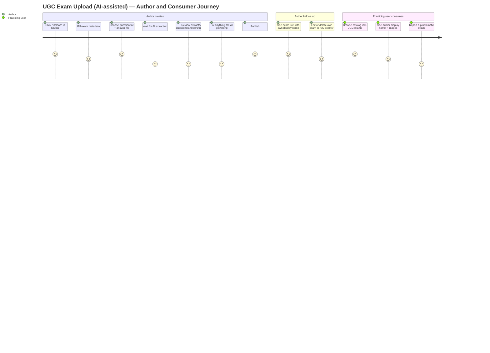
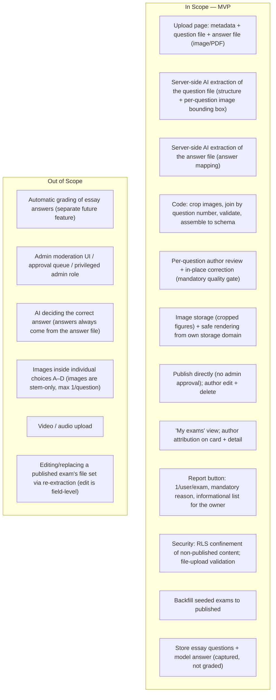
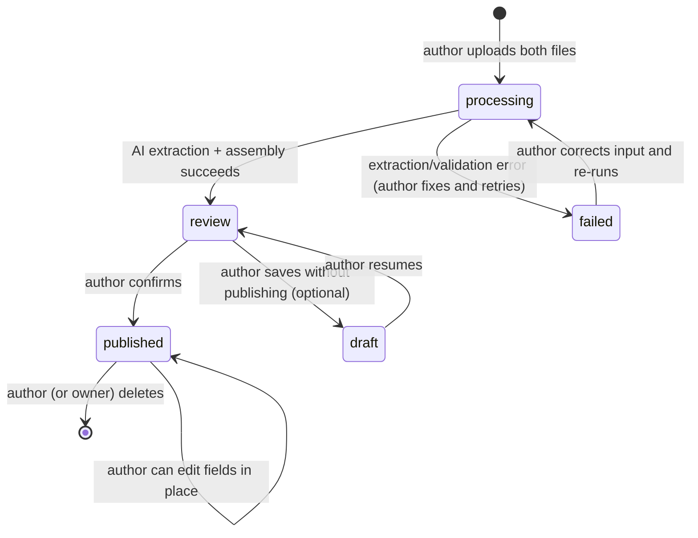

# PRD: UGC Exam Upload (AI-assisted)

| | |
|---|---|
| **Version** | 2.1 |
| **Date** | 2026-07-17 (v2.0: 2026-07-15) |
| **Status** | v2.0 implemented (17 tasks, code-complete). **v2.1 amendment in progress** — see §v2.1 Amendment below. Product decisions locked with product owner (2026-07-15; v2.1 scope decisions 2026-07-17). |
| **Scale** | LARGE — document chain: PRD → UI Spec → ADR → Design Doc → Work Plan |

## v2.1 Amendment — National 3-Part Exam Format (2026-07-17)

Live testing v2.0 with the official 2025 national graduation exam (đề thi tốt nghiệp THPT 2025 môn Toán) exposed a scope gap: since 2025 the Ministry of Education restructured multiple-choice subjects into **three parts** — PHẦN I (4-choice MCQ), PHẦN II (True/False clusters: 4 sub-items a–d per question, each independently Đúng/Sai), PHẦN III (short answer: a numeric/short value) — with **question numbering restarting per part**. Schools model their term/mock exams on this structure, so it is the mainstream format for the site's target users, not an edge case. v2.0's data model (flat question numbering; only `mcq`/`essay` types) deterministically loses answers on such files (same-numbered questions across parts overwrite each other at the assembly join).

**Scope added by v2.1** (product owner decisions, 2026-07-17):

- **R18 — Multi-part structure**: an exam may have parts; questions are identified by (part, number) end-to-end (extraction, assembly join, storage, review, display). Exams without part headers behave exactly as before (single part).
  - AC-030: Given a 3-part national-format exam file, when extraction+assembly run, then every question is captured under its own (part, number) identity with zero cross-part overwrites, and the review screen groups questions by part.
- **R19 — True/False question type** (PHẦN II): captured with its 4 sub-item statements and the per-sub-item Đúng/Sai answers from the answer file; rendered in review/player/result; **not auto-scored** (stored like essay — auto-scoring is a separate future feature).
  - AC-031: Given a PHẦN II question, when the author reviews it, then all 4 sub-items and their Đ/S answers from the answer file are shown and editable; the player collects Đ/S input per sub-item without scoring it.
- **R20 — Short-answer question type** (PHẦN III): captured with the expected value from the answer file; rendered with a short text input in the player; **not auto-scored**.
  - AC-032: Given a PHẦN III question, when the author reviews it, then the expected value from the answer file is shown and editable; the player collects a short answer without scoring it.
- **R21 — Old-format regression guarantee**: existing single-part exams (seeded and UGC) keep working unchanged through the same pipeline.
  - AC-033: Given the v2.1 changes are deployed, when a v2.0-style single-part exam is uploaded or an existing exam is played, then behavior is unchanged (verified by the existing test suites staying green).

**Also corrected in v2.1**: the AI provider is **Google Gemini** (free tier; swapped from Anthropic on 2026-07-17 for billing reasons — ADR-0006), and the figure bounding-box contract moves to Gemini's native trained format (fixing 0% figure detection observed live). Auto-scoring for R19/R20 types and per-part scoring weights are explicitly **out of scope** (future scoring feature).

Details: ADR-0005 (multi-part data model), ADR-0006 (Gemini protocol), Design Doc §v2.1 Amendment.

## Overview

### One-line Summary

Let any logged-in user create a complete exam by uploading two files — a **question file** and an **answer file** (image or PDF) — have AI extract and structure the content (including cropping any per-question images), let the author review and correct the result, and publish the exam to the catalog with author attribution. No admin approval step.

### Background

MS-MOLAR is an exam-practice website (browse exams, take timed attempts, see results). Today every exam in the catalog is developer-seeded: content growth requires engineering work, and the catalog cannot scale beyond what the team hand-writes.

**v1.1 (superseded)** pivoted the site to user-generated content (UGC) by having authors paste questions as plain text in a fixed grammar, parsed by a deterministic parser, then pre-moderated by a single admin before publication. That model put two things explicitly out of scope: *image/media upload* and *automated moderation*.

**This version (v2.0)** reopens both. The product owner wants the upload flow to be handled mostly by AI so that authors can submit real exam documents (photos of paper exams, or PDFs) rather than re-typing them:

- The author uploads a **question file** and a separate **answer file** that maps the correct answer to each question. The two files are the authoritative source — in particular, **the AI never decides the correct answer; it reads the answer from the author's answer file.**
- AI (called server-side via the Claude API) does the heavy lifting: one call reads the question file and returns a structured question list plus, for any question that has a figure, the bounding box (khung bao — the rectangular region containing the figure) of that figure; a second call reads the answer file and returns the answer mapping.
- Pure application code (not AI) then crops images, joins questions to answers by question number, validates the structure, and assembles the exam in the website's schema.
- The author reviews the assembled result, corrects anything the AI got wrong, and publishes. Because AI is non-deterministic and can misread, **the author-review step is mandatory** — it is the quality gate that replaces admin pre-moderation.

The feature is intentionally built at a small scale: simple, not over-engineered, and expected to work well under stable conditions (well-formed documents, working AI API). Robustness against adversarial or badly-degraded inputs is not a launch goal, but the flow must fail with a clear message rather than silently corrupt data.

### Primary content type and the essay carve-out

The catalog's core content type is the **4-choice single-answer multiple-choice question** (MCQ). This upload module fully supports MCQ end-to-end (extract → review → publish → attempt → score).

Exams may also contain **essay questions** (câu tự luận — questions answered with a free-text passage). This module **stores** essay questions and their model answer (from the answer file) so the data is captured, but **grading essay answers is a separate feature, out of scope here.** In MVP, only MCQ questions participate in automatic scoring; how essay questions surface in the player/result is a deferred concern (see Undetermined Items).

## User Stories

### Primary Users

- **Author** — any logged-in user who wants to contribute an exam by uploading their question and answer files. (Non-normative note: `user_profiles.role` remains a free-text column defaulting to `student`; this feature does not read `role` and introduces no privileged role.)
- **Practicing user** — any user browsing and attempting published exams (existing behavior, now consuming UGC too).
- **Site owner (operational, not a product role)** — the person running the site can remove a bad published exam directly (database / a simple owner action). There is **no admin moderation UI and no approval queue** in this feature.

### User Stories

```
As a logged-in user
I want to upload my exam as a question file and an answer file and have the system extract it for me
So that I can publish an exam without re-typing it, including questions that contain images
```

```
As an author
I want to review the AI-extracted exam and correct anything wrong before it goes live
So that the published exam is accurate — especially the answer key and the placement of images
```

```
As an author
I want to see my uploaded exams, edit them, and delete them
So that I stay in control of the content I contributed
```

```
As a practicing user
I want to see who authored an exam and report problematic content
So that I can trust the catalog and help keep it clean
```

### Use Cases

1. **Happy path (MCQ, no images)**: A teacher clicks "Upload", picks a subject/grade/duration and a title, selects a **question file** (PDF of 20 MCQs) and an **answer file** (a page listing `Câu 1: B`, `Câu 2: A`, …), and submits. The server validates the files, runs the two AI extractions, joins them by question number, assembles a 20-question exam, and shows the author a per-question review. The teacher confirms; the exam is published and appears in the catalog under their display name.
2. **Questions with images**: The question file contains figures (e.g., a graph in Câu 5). The extraction returns Câu 5 with the figure's bounding box; code crops that region, uploads it to storage, and the review screen shows the cropped image attached to Câu 5's stem. The author checks that the image is correctly cropped and attached, adjusts if needed, and publishes.
3. **Extraction problem / recovery**: The AI cannot extract a clean 4-choice structure for one question (e.g., only 3 choices detected), or the question file has 20 questions but the answer file only maps 19. The system reports exactly what is wrong (which `Câu N`, what the problem is) on the review screen. The author fixes the value in place (edit the stem/choices/answer, or re-upload a corrected file) and re-runs until the exam assembles cleanly, then publishes. No entered data is lost on a failed extraction.
4. **Essay question present**: The exam includes a `Câu N` that is answered by a paragraph. The module stores the question and the model answer (from the answer file) but marks it as an essay question. The author is told that essay questions are stored but not auto-scored yet.
5. **Report**: A logged-in user notices a published exam with a wrong answer key, clicks "Report", enters a short mandatory reason, and submits. The report is recorded for the site owner to see; the exam stays published (reporting triggers no automatic action).

### User Journey Diagram



### Scope Boundary Diagram



### Submission Lifecycle (supporting diagram)

The lifecycle is simplified from v1.1 — there is no admin decision and no pending-review queue.



Only `processing` consumes AI/compute; `review`/`draft` are held server-side. Seeded exams are `published` with no author.

## Functional Requirements

### Must Have (P1 — MVP)

- [ ] **R1 — Upload entry point**: The existing navbar item "Import" (currently a dead link to `/admin/import`) is renamed "Upload" and navigates to the exam upload page. There is no admin review link (admin is removed).
  - AC-001: Given a logged-in user, when they view the navbar, then the item reads "Upload" and clicking it opens the upload page.
  - AC-002: Given a logged-out visitor, when they try to open the upload page, then they are required to log in first and cannot upload content.

- [ ] **R2 — Exam metadata form**: The upload page collects exam metadata, mirroring the existing catalog schema: title, subject, grade, duration (minutes) — required; school, school year, semester — optional (nullable; render as "None" fallback in the catalog).
  - AC-003: Given the upload form, when the user leaves title, subject, grade, or duration empty, then upload is blocked with a field-level message identifying the missing value.
  - AC-004: Given the upload form, when school, school year, or semester are left empty, then the flow proceeds and the catalog renders its existing null fallback for those fields.

- [ ] **R3 — Two-file upload**: The author provides two files: a **question file** and an **answer file**. Each is an image (common formats) or a PDF. The server validates file type, size, and page count against fixed limits before any AI call.
  - AC-005: Given the upload form, when the author has not provided both a question file and an answer file, then the "Extract" action is unavailable with a clear message.
  - AC-006: Given a file that exceeds the type/size/page limits, when the author tries to upload it, then it is rejected with a message naming the limit, and no AI call is made.

- [ ] **R4 — AI extraction (server-side)**: On submission, the server runs two AI extractions. **AI calls happen only on the server; the API key is never exposed to the client.**
  - (a) The **question extractor** reads the question file and returns, per question: the stem, exactly 4 choices labeled A–D (for MCQ) or an essay flag, and — for any question that has a figure — the figure's bounding box in the source document.
  - (b) The **answer extractor** reads the answer file and returns, per question number, the correct answer (an A–D letter for MCQ; the model-answer text for essay).
  - The extraction never invents the correct answer; the answer always comes from the answer file (R4b).
  - AC-007: Given well-formed files, when extraction runs, then every question is returned with its structure and (where present) its image bounding box, and every question number in the question file has a matching answer from the answer file.
  - AC-008: Given a question the extractor cannot structure (e.g., not exactly 4 choices for an MCQ, or an empty stem), when extraction runs, then that `Câu N` is surfaced as an error identifying the question and the problem, and the exam does not assemble until it is resolved.
  - AC-009: Given the question file has N questions but the answer file maps a different count (or a different set of numbers), when assembly runs, then the mismatch is reported (naming the unmatched question numbers) and the exam does not assemble until it is resolved.

- [ ] **R5 — Image cropping and storage (code)**: For each question that has a figure, pure application code crops the figure from the source document and stores it, producing a URL attached to that question's stem. For PDFs, the embedded image is preferred (extracted directly from the file); for photos, the AI bounding box drives the crop. Images are **stem-only, at most one per question** (choices A–D never carry images in MVP).
  - AC-010: Given a question with a figure, when the exam is assembled, then the cropped figure is stored and its URL is attached to that question's stem, mapped to the correct question number.
  - AC-011: Given a published UGC exam with an image, when any catalog viewer opens it, then the image renders in the stem, served from the site's own storage; images from any other origin are not rendered (see R11).

- [ ] **R6 — Assembly (code, deterministic)**: After extraction and cropping, pure code assembles the exam into the website schema: it joins questions to answers by question number, sets each MCQ's correct answer from the answer file, attaches image URLs, and validates the whole exam (4 choices per MCQ, exactly one correct answer, non-empty stem, question count consistent). The assembled result — not the raw AI output — is what is persisted and reviewed.
  - AC-012: Given extraction and answers, when assembly succeeds, then the persisted questions match the assembled result exactly (the raw AI output is advisory only).
  - AC-013: Given assembly detects a validation failure, when it runs, then nothing is persisted as publishable and the author sees the specific failure.

- [ ] **R7 — Author review and correction (mandatory gate)**: Before publishing, the author sees a per-question review of the assembled exam — stem, image (if any), the 4 choices, and the marked correct answer — and can correct any field in place (fix a mis-read choice, change the marked answer, replace or remove an image, edit the stem). Publishing is only possible from a clean, reviewed exam.
  - AC-014: Given an assembled exam, when the author opens the review, then every question is shown with its stem, image, choices A–D, and correct answer.
  - AC-015: Given the review, when the author edits any field, then the change is applied to the exam being assembled and re-validated; publishing stays unavailable while any validation error remains.
  - AC-016: Given a clean, reviewed exam, when the author confirms, then the exam is published; publication never happens without an explicit author confirmation on a clean review.

- [ ] **R8 — Publish, edit, delete (no admin)**: On author confirmation, the exam is stored as `published`, owned by the author (`author_id`), and appears in the public catalog exactly like seeded exams. The author can edit its fields and delete it. There is no approval step and no privileged admin role.
  - AC-017: Given a confirmed exam, when it is saved, then its status is `published`, `author_id` is the author, and it is visible in the catalog and attemptable.
  - AC-018: Given a published exam the author owns, when they open "My exams", then they can edit its fields and delete it.
  - AC-019: Given a published exam, when a user who is neither the author nor the owner attempts to edit or delete it, then the action is refused at the database (RLS) layer.

- [ ] **R9 — "My exams" view (author self-service)**: Authors see all their exams with current status (`processing`/`review`/`draft`/`published`/`failed`), can open one to review/edit, and can delete.
  - AC-020: Given an author with exams, when they open "My exams", then each exam shows its status and the actions valid for that status.

- [ ] **R10 — Author attribution on published exams**: Published UGC exams display the author's `display_name` publicly on the exam card and detail page.
  - AC-021: Given a published UGC exam, when any catalog viewer views its card or detail page, then the author's `display_name` is shown.
  - Decision rule: backfilled seeded exams have no author; for them the author line is omitted (no placeholder is fabricated). Confirm rendering treatment at UI Spec stage.

- [ ] **R11 — Safe rendering of extracted content**: Extracted text is treated as untrusted and rendered safely (no raw HTML/script). Extracted images render only from the site's own storage domain.
  - AC-022: Given extracted stem/choice text, when it is rendered in review, catalog, or player, then it is never rendered as raw HTML/markup that could execute script.
  - AC-023: Given an image reference on a question, when it is rendered, then only URLs on the site's own storage domain are rendered; any other origin is stripped.

- [ ] **R12 — Security confinement of non-published content**: Content that is not `published` (a `processing`/`review`/`draft`/`failed` exam and its questions/images) is readable only by its author, enforced at the database (RLS) layer — not only in the UI. This fixes a pre-existing gap where `questions` used a `using(true)` select policy that would leak non-public content to all authenticated users.
  - AC-024: Given a non-published exam and its questions, when any authenticated user other than the author queries them directly (e.g., via the Supabase client), then zero rows are returned.

- [ ] **R13 — Report published exams**: Any logged-in user can report a published exam with a short mandatory reason. One report per user per exam, server-enforced. Reports are recorded for the site owner; no automatic unpublishing is triggered.
  - AC-025: Given a logged-in user on a published exam, when they submit a non-empty reason, then the report is recorded; an empty reason is blocked.
  - AC-026: Given a user who has already reported an exam, when they attempt to report it again, then the server refuses the duplicate and the UI communicates it.

- [ ] **R14 — Backfill of seeded exams**: All pre-existing seeded exams are backfilled to `published` when the publication lifecycle is introduced, so the browse page does not go empty.
  - AC-027: Given the schema change is applied, when the catalog is loaded, then every previously visible seeded exam is still visible and attemptable, and the catalog exam count is unchanged from before the deployment.

### Should Have (P2)

- [ ] **R15 — Extraction progress and guidance**: The upload page shows a clear "extracting…" state (the AI step is not instant) and inline guidance on what a good question file / answer file looks like (one worked example each), so first-time authors succeed without external documentation.
  - AC-028: Given a first-time author, when they view the upload page, then the expected shape of each file is visible or one click away, including one example.
  - AC-029: Given extraction is running, when the author waits, then a non-blocking progress indication is shown and the flow never appears frozen.

### Could Have (P3)

- [ ] **R16 — Report count indicator** for the site owner, to spot repeat offenders. Convenience only.
- [ ] **R17 — Early garbage rejection**: an optional cheap AI (or heuristic) pre-check that rejects clearly-invalid uploads (a random photo that is not an exam) before the expensive extraction, to save cost. Default MVP folds validity into R4; this is a cost optimization only.

### Won't Have (this release)

- **Automatic grading of essay answers** — a separate future feature; this module only stores essay questions + model answers.
- **Admin moderation UI / approval queue / privileged admin role** — removed. Publication is author-gated by mandatory review; the owner removes bad content manually.
- **AI deciding the correct answer** — answers are authoritative from the answer file only.
- **Images inside choices A–D** — images are stem-only, at most one per question.
- **Video/audio upload.**
- **Re-extraction as the edit mechanism for a published exam** — post-publish edits are field-level; re-uploading files creates a fresh extraction (a new draft), it does not re-key an existing published exam.

## Non-Functional Requirements

### Performance

- Extraction is an AI round-trip and is **not** sub-second; the indicative target is that a typical exam (≤ 50 questions) completes extraction + assembly within a small number of seconds under stable API conditions, with a visible progress state throughout (R15). Hard limits (max questions, max file size, max pages) are set in the Design Doc.
- Catalog browse performance is not degraded: published-only filtering happens at the query/policy layer, not client-side.

### Reliability

- No data loss in the authoring flow: a failed extraction, failed assembly, or failed publish never discards the author's entered metadata, uploaded files, or in-review corrections (AC-008, AC-015).
- AI is non-deterministic: the same file may extract slightly differently across runs, and the extractor can misread. The design must therefore make the **author-review step mandatory** and must persist only the assembled, author-confirmed result — never trust raw AI output as final (AC-012, AC-016).
- AI/API failures (timeout, rate limit, error) are surfaced clearly and the author can retry without re-entering data.

### Security

- **AI calls are server-side only**; the API key is never exposed to the client.
- Uploaded files are untrusted input: type, size, and page count are validated before any processing; files are stored in a controlled bucket with RLS.
- Non-published content is confined at the database (RLS) layer, not only in the UI (AC-024).
- Extracted text is never rendered as executable markup; extracted images render only from the site's own storage domain (AC-022, AC-023).
- Report rules (one per user per exam, mandatory reason) are server-enforced (AC-025, AC-026).

### Scalability

- Pre-launch scale. Cost of AI calls per upload is a real cost; a light per-user rate/volume guard on uploads is acceptable to prevent abuse (Design Doc scope), but no queue or worker infrastructure is built now.

### Accessibility

- Compliance standard: WCAG 2.1 AA (site default).
- The upload form, file pickers, extraction progress, error messages, per-question review, correction controls, and report dialog are fully keyboard-operable.
- Errors and status (extracting / failed / ready) are announced to screen readers and not conveyed by color alone.
- Question images carry meaningful `alt` text (at minimum a stable "Figure for Câu N"); a Design Doc decision covers whether the extractor proposes richer alt text.

## Success Criteria

The site is pre-launch with no traffic; metrics are mechanism-focused and verifiable at acceptance time rather than growth targets.

### Quantitative Metrics

1. **Zero non-published leaks**: 0 rows of non-published exam/question/image data returned to a non-author authenticated client and to anonymous clients — measured by an RLS verification script/test run against the deployed database at acceptance, and re-run after any schema change.
2. **Answer fidelity**: for a fixture set of exams, 100% of MCQ correct answers on the assembled exam equal the answers in the answer file (assembly joins by number, never invents) — measured by an assembly unit test on fixtures with known answer files.
3. **Extraction usefulness (pilot)**: for a set of ≥ 10 realistic exams uploaded by non-developers, a majority extract into a reviewable draft on first attempt (exact threshold set at pilot), and every remaining case produces an actionable error rather than a silent failure — measured by counting pilot outcomes before launch.
4. **Image mapping correctness**: for a fixture set of exams with figures, 100% of cropped images are attached to the correct question number on the assembled exam — measured by an assembly test on image fixtures.
5. **Backfill completeness**: catalog exam count after deployment equals the count before deployment, and 100% of seeded exams have `published` status — measured by a before/after count query.
6. **No key exposure**: no code path calls the AI provider from the client; the key exists only in server configuration — verified by code inspection and a build-time check that the key is not bundled client-side.

### Qualitative Metrics

1. A first-time author can go from clicking "Upload" to a published exam using only on-page guidance, without asking for help (validated in the internal pilot).
2. When the AI misreads something, the author can find and fix it in the review without re-typing the whole exam.
3. The site owner can remove a bad published exam without engineering help.

### UI Quality Metrics

1. Upload-flow completion: 100% of pilot participants who start either publish successfully or receive an actionable extraction/validation error (no dead ends, no silent failures).
2. Recovery: 100% of extraction-error cases in the pilot are recoverable in place — metadata, uploaded files, and any corrections intact after the error.
3. Accessibility audit: 0 serious/critical issues on the upload, review, My-exams, and report surfaces (automated audit, e.g. axe, plus a manual keyboard pass).

## Technical Considerations

Implementation detail belongs to the ADR and Design Doc; this section records dependencies and constraints the PRD must acknowledge.

### Dependencies

- **Gemini API (Google)** — the AI extractor for the question file and the answer file. Multimodal (reads images and PDFs). Called server-side only. *(v2.1 correction: originally Claude API; swapped 2026-07-17 — ADR-0006. Free-tier rate limits are per-project, an accepted risk.)* Model selection is Design Doc scope.
- **Supabase** (Postgres + RLS + Auth + **Storage**) — the moderation-free publication gate and all server-enforced rules rely on RLS/database-level enforcement; cropped images live in a Storage bucket with its own RLS.
- Existing tables `exams`, `questions`, `user_profiles` (`SOURCE/supabase/schema.sql`) — UGC extends this schema (publication status, authorship, image URL, question type, essay answer, reports).
- Existing catalog/browse, exam detail, and attempt flows — published UGC exams (MCQ) must be consumed by these flows; the render path is hardened to allow safe images (ADR-0002).
- Existing navbar component — "Import" → "Upload" rename; the old admin link is removed.
- `user_profiles.display_name` — always populated by the existing signup trigger fallback chain, so author attribution never renders empty.

### Constraints

- DDL is executed manually by the engineer in the Supabase SQL Editor as a single idempotent `schema.sql`; there is no migration framework. Backfill (R14) and the security fixes (R12) must be expressible in this idempotent file.
- No privileged admin account is introduced by this feature. (This removes the v1.1 need for a role-preservation trigger; see the ADR.)
- Existing schema facts the feature must fit: `questions.correct_answer` is constrained to A/B/C/D; `exams.semester` is constrained to `HK1`/`HK2`; `school`/`school_year`/`semester` are nullable; `questions.topic` is `not null` and feeds the result page's topic breakdown. New columns (image URL, question type, essay answer) must be added idempotently and must not break seeded content.
- MVP works well under stable conditions (well-formed files, working API); degraded-input robustness is not a launch gate but must fail loudly, not silently.

### Assumptions

- The question file and answer file both number questions consistently (`Câu N`), so assembly can join by question number. If they don't, assembly reports a mismatch (AC-009).
- The single owner can remove bad content directly; the mandatory author-review step plus reporting are sufficient quality controls at pre-launch scale (accepted trade-off of removing admin pre-moderation).
- Attempts already taken against an exam are unaffected by that exam's later lifecycle events (out of scope to change).

### Risks and Mitigation

| Risk | Impact | Probability | Mitigation |
|------|--------|-------------|------------|
| AI misreads a question/choice/answer and the author doesn't catch it | High | Medium | Mandatory per-question review (R7); answers come from the author's file, not AI guessing (R4b); fixture tests on answer fidelity (metric 2) |
| Image cropped wrong or attached to the wrong question | Medium | Medium | Prefer direct PDF image extraction; single AI produces question+image mapping together so numbering can't desync; author review shows the cropped image on its question; image-mapping fixtures (metric 4) |
| AI/API failure or rate limit blocks upload | Medium | Medium | Clear error + retry without data loss; light per-user volume guard; feature scoped to "works under stable conditions" |
| API key leaked to client | High | Low | AI called server-side only; build-time check that the key is not bundled (metric 6) |
| Non-published content leaks through a missed read path | High | Medium | RLS confinement (R12/AC-024); repeatable verification script (metric 1) |
| Uploaded file is malicious or oversized | Medium | Low | Type/size/page validation before processing; controlled Storage bucket with RLS |
| Author display_name is offensive/spam (public on publish) | Medium | Low | Owner can remove; profile-name moderation itself is out of scope |
| Backfill mistake empties the catalog | High | Low | AC-027 before/after count check; idempotent SQL reviewed before running |
| Essay questions break the MCQ player/scoring | Medium | Medium | Essay stored but flagged; player/scoring interaction is a deferred item (Undetermined Items) — MVP may restrict published exams to MCQ-only in the player until the grading feature lands |

## Undetermined Items

Downstream design questions the UI Spec / ADR / Design Doc must resolve. None reopens a locked product decision.

- [ ] **AI extraction contract** (owner: ADR/Design Doc): the exact prompt/response schema for the question extractor (structure + bounding box) and the answer extractor (answer mapping), the model choices, timeouts, and the structured error shape.
- [ ] **Image source strategy** (owner: ADR/Design Doc): PDF-embedded image extraction vs. bounding-box crop for photos; storage layout and URL scheme; `alt` text policy.
- [ ] **Lifecycle representation** (owner: Design Doc): the concrete `status` values and transitions (`processing`/`review`/`draft`/`published`/`failed`), and whether `draft` is built in MVP or deferred.
- [ ] **Per-question `topic` for UGC questions** (owner: ADR/Design Doc): `questions.topic` is `not null` and drives the result page's topic breakdown, but the upload flow collects no per-question topic. Carry over the v1.1 resolution (default `topic = exam.subject`) unless changed.
- [ ] **Essay question handling in the player/result** (owner: Design Doc + product): whether MVP publishes exams containing essay questions to the player at all, how `computeScore` and the result page treat non-MCQ questions, and how essay questions are visually distinguished. May restrict to MCQ-only playback until the grading feature lands.
- [ ] **Input limits** (owner: Design Doc): max questions per exam, max file size, max PDF pages, max lengths for stem/choice/title/report reason; per-user upload rate guard.
- [ ] **Seeded-exam attribution rendering** (owner: UI Spec): confirm the exact card/detail treatment when there is no author (omit the line).
- [ ] **Report list presentation** (owner: UI Spec): how the owner sees reports (there is no admin UI; decide whether reports surface in a minimal owner-only view or are read from the database).
- [ ] **Owner delete mechanism** (owner: Design Doc): whether the owner removes bad exams via a direct DB action, a simple owner-only route, or reuses the author delete path with an ownership exception.

## Appendix

### References

- `SOURCE/supabase/schema.sql` — current database schema, RLS policies, and the pre-existing `questions` `using(true)` gap addressed by R12.
- `docs/ui-spec/ugc-exam-upload-ui-spec.md` — UI Spec (to be updated for v2.0).
- `docs/adr/` — ADRs for lifecycle/RLS (ADR-0001), rendering/sanitization (ADR-0002), author name (ADR-0003), and AI extraction architecture (ADR-0004, replacing the v1.1 parser ADR).
- `docs/design/ugc-exam-upload-design.md` — Design Doc (to be updated for v2.0).

### Glossary

- **UGC**: User-generated content — exams authored by site users rather than seeded by developers.
- **Question file** (tệp câu hỏi): the uploaded image/PDF containing the exam's questions and choices.
- **Answer file** (tệp đáp án): the uploaded image/PDF mapping the correct answer to each question. Authoritative source for correct answers — the AI never invents answers.
- **Extraction**: the server-side AI step that reads an uploaded file and returns structured data (questions + image bounding boxes; or the answer mapping).
- **Bounding box** (khung bao): the rectangular region in the source document that contains a question's figure; used by code to crop the image.
- **Assembly**: the deterministic, code-only step that joins questions to answers by number, crops/attaches images, validates, and produces the persisted exam.
- **Author review**: the mandatory step where the author checks and corrects the assembled exam before publishing. Replaces admin pre-moderation as the quality gate.
- **MCQ**: 4-choice single-answer multiple-choice question — the fully-supported content type.
- **Essay question** (câu tự luận): a question answered by a free-text passage; stored with a model answer but not auto-graded in this module.
- **`published`**: state of an exam visible in the public catalog and attemptable; the author can edit its fields or delete it.
- **Report**: a logged-in user's flag on a published exam (one per user per exam, mandatory reason); informational only — no automatic action.
