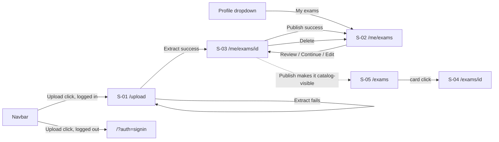

# UGC Exam Upload — UI Specification (AI-assisted)

| | |
|---|---|
| **Version** | 2.2 (base v2.0; v2.2 delta in §v2.2 Amendment) |
| **Date** | 2026-07-20 (v2.0: 2026-07-15) |
| **Status** | Draft — major redesign. Supersedes v1.1 (plain-text paste + single-admin moderation). Aligns to PRD v2.0: authors **upload two files** (question file + answer file, image/PDF), **AI extracts** server-side, code assembles, the **author reviews and corrects** the assembled exam, and publishes. **No admin screens.** **§v2.2 Amendment** adds AI metadata intake and makes Entry Mode functional. |
| **PRD** | `docs/prd/ugc-exam-upload-prd.md` (v2.2) |
| **Note** | The v2.1 multi-part changes (ADR-0005) landed in the Design Doc and code without a UI Spec revision; the S-03 part-grouping and `true_false`/`short_answer` editors are specified in Design Doc §v2.1 Amendment §UI delta. This spec's component definitions are otherwise current. |

## Overview

This UI Specification defines the screens, components, states, and interactions for the AI-assisted UGC exam upload feature. It covers the UI surfaces of PRD requirements R1–R11 and R13, R15. R12 (RLS confinement) and R14 (backfill) have no UI surface and are owned by ADR-0001 / Design Doc. R11's image-render safety and R10's author-attribution rendering are included here; their data mechanisms (Storage bucket, denormalized name) are ADR/Design Doc scope.

All new screens use the site-wide "Ink & Lacquer" theme (`DESIGN.md`) and the existing layer-2 component conventions — no new design language is introduced.

### What changed from v1.1 (for reviewers migrating from the old spec)

- **Removed**: the paste textarea and its format grammar (FormatGuide, PasteArea, ParseErrorPanel, QuestionPreviewList as a *paste* preview), and **all admin surfaces** (review queue, submission review, moderation action bar, reject dialog, reports-to-admin panel).
- **Added**: two-file upload (question file + answer file), a server-side AI **extraction step** with a visible processing state, an author **review & edit** screen that shows the assembled exam (including cropped **images**) with per-question in-place correction, a **Publish** action (author-gated, no admin), and **Delete** (replacing Withdraw).
- **Kept**: metadata form, author attribution (byline), report button, catalog/detail extensions, the theme/token/accessibility framework.

### Target PRD

- PRD path: `docs/prd/ugc-exam-upload-prd.md` (v2.0)
- Feature scope covered here: R1 (entry point), R2 (metadata), R3 (two-file upload), R4/R5/R6 UI surfaces (extraction progress + assembled result + errors), R7 (author review + correction, mandatory gate), R8 (publish/edit/delete), R9 (My exams), R10 (author attribution), R11 (safe image render), R13 (report), R15 (progress + guidance).

### Design Source

| Source | Path | Version |
|--------|------|---------|
| Theme definition | `E:\StemWeb_project\MS-MOLAR\DESIGN.md` | repo `main` (alpha) |
| Existing component conventions | `SOURCE/app/(layer2)/_components/`, `SOURCE/app/(layer1)/_components/AuthForm.tsx` | repo `main` |
| Prototype code | None provided | — |

## Prototype Management

No prototype was provided. The canonical specification is this document plus the Design Doc. Existing production screens (`/exams`, `/exams/[id]`, the auth card) are the visual/behavioral reference; where this document and those screens disagree on *new* surfaces, this document wins.

## Decisions Record (items delegated to the UI Spec)

Downstream documents treat these as fixed unless a listed escalation triggers.

| ID | Decision | Rationale |
|----|----------|-----------|
| D1 | **Routes**: `/upload` (metadata + two-file upload + trigger extraction), `/me/exams` (author self-service list), `/me/exams/[id]` (review & edit of one exam — the assembled result, correction, and Publish; also used to edit a published exam's fields and to view a failed/draft exam). All live in a new `(layer4)` route group under the existing `SiteHeader`. **No `/admin/*` routes.** | `/me/*` matches existing `/me/dashboard`; the old `/admin/import` dead link and all admin routes are removed with admin moderation |
| D2 | **Two-file upload, not paste**: the author supplies a **question file** and an **answer file** (each image or PDF) via two labeled file pickers. There is no text-paste path. Extraction runs **server-side** after the author triggers it; there is no client-side live preview (the API key is server-only). | PRD R3/R4; matches how teachers keep exams (a question sheet + an answer key) and lets authors submit real documents |
| D3 | **Extraction is an explicit, visible server step**: after "Extract", the UI shows a non-blocking processing state (not instant); on success it lands on the review screen; on failure it shows a structured, `Câu N`-identifying error and the author fixes input and retries. Metadata and file selections survive every failure. | PRD R15/AC-029, reliability NFR (no data loss); AI round-trip is seconds, not sub-second |
| D4 | **Author review is the quality gate**: the review screen (S-03) shows the assembled exam per question — plain-text stem, the cropped **image if any**, the four choices A–D, and the **correct answer taken from the answer file** — and lets the author correct any field in place. Publishing is a distinct action, disabled until the exam validates cleanly. There is no admin approval. | PRD R7/R8; AI is non-deterministic and can misread, so a human confirmation replaces admin pre-moderation |
| D5 | **Answers are shown as read from the answer file, never AI-guessed**: the correct-answer marker on each MCQ reflects the answer extractor's reading of the author's answer file. The author can change it, but the default is the file's answer, and the UI labels it as "from your answer file". | PRD R4b; a wrong answer key is the worst failure — keep its provenance visible |
| D6 | **Images render in review and are the point of the review**: the cropped figure for a question renders as a real `` (origin-allowlisted to the site's Storage, ADR-0002) on the review card, the player, and the detail page, so the author can verify the crop and its mapping to the right question. Stem/choice **text** stays plain text in review (safe, sufficient to confirm structure). | PRD R5/R11; the whole reason for the review is to catch a mis-cropped or mis-mapped image |
| D7 | **Navigation**: in `SiteHeader` (L2/3/4) and `HomeSidebar` (L1), `{ label: "Import", href: "/admin/import" }` becomes `{ label: "Upload", href: "/upload" }` for all users. **No admin "Review" item is added** (admin removed). A "My exams" entry is added to `HeaderProfile` / `SidebarProfile` (between "Edit" and "Sign out") linking to `/me/exams`. | PRD R1/AC-001; admin nav is gone |
| D8 | **Delete replaces Withdraw**: an author can **delete** any exam they own (any status), with a confirm dialog. There is no admin queue to withdraw from; the author simply removes content they no longer want. Published exams are **editable in place** (field-level, on S-03) and deletable — no publication lock. | PRD R8; simpler than the v1.1 pending/withdraw/lock model without an admin |
| D9 | **Status badge treatment**: text-label badge, `rounded-sm` (4px), 1px colored border, transparent background, foreground text `#1B1512` with a leading glyph — status is never color-only (a11y). Values: Processing = border `#6B655C` glyph `◌`; Review = border `#B8863B` glyph `…`; Draft = border `#D8C9A8` glyph `–`; Published = border `#B8863B` glyph `✓`; Failed = border `#A62C2B` glyph `✕`. | Bronze gold `#B8863B` as *text* fails AA; use it only for borders (D9 in v1.1, unchanged principle) |
| D10 | **Metadata input controls** (unchanged from v1.1): Title = required text; Subject = text with `datalist` from existing catalog subjects (new subjects allowed); Grade = required select 6–12 (business assumption, not a DB contract — Design Doc confirms); Duration = required number, minutes, min 1; School = optional text; School year = optional 4-digit number; Semester = optional select `HK1`/`HK2`/None (mirrors `exams_semester_check`). | Mirrors browse-filter vocabularies while allowing catalog growth |
| D11 | **No per-question topic input**: authors provide no topic; `topic` defaults to the exam **subject** at assembly (ADR-0004). The result-page consequence (a single topic bucket for UGC exams) was previously accepted. | PRD (avoid author burden); carried over from v1.1 D11 |
| D12 | **Essay questions are shown but flagged**: a question the extractor marks as essay (`question_type='essay'`) renders in review with its stem, image (if any), and the model answer (from the answer file) shown read-only, plus a caption "Essay — stored, not auto-scored yet." It has no A–D choices. Whether an exam containing essay questions can be published/played in MVP is a Design Doc + product decision (may restrict to MCQ-only playback). | PRD essay carve-out; the module stores essay content but grading is a separate feature |
| D13 | **Post-publish feedback**: publishing redirects to `/me/exams?published=1`, which renders a dismissible `role="status"` banner "Your exam is published." above the list. Every failure (file too large, extraction failed, mismatch, publish error) stays on the current screen with all data intact. | Lands the author where they track their exams |

## AC Coverage Map

No prototype exists; this maps PRD v2.0 ACs to screens/components. "No UI surface" ACs are owned by ADR/Design Doc.

| AC ID | Summary | Screen | Component(s) |
|-------|---------|--------|--------------|
| AC-001 | Navbar reads "Upload" → upload page | All (navbar) | SiteHeader (nav extension) |
| AC-002 | Logged-out visitor must log in | S-01 guard | Route guard (redirect to `/?auth=signin`) |
| AC-003 | Required-field blocking with field-level message | S-01 | MetadataFields |
| AC-004 | Optional fields proceed, "None" fallback | S-01 | MetadataFields |
| AC-005 | Both files required before Extract | S-01 | FileUploadFields, ExtractBar |
| AC-006 | File type/size/page limit rejection before any AI call | S-01 | FileUploadFields (client hint) + server (Design Doc) |
| AC-007 | Clean extraction → assembled exam with structure + images + matched answers | S-01 → S-03 | ExtractBar → server → ReviewScreen |
| AC-008 | Unstructurable question surfaced as `Câu N` error | S-03 | ExtractionErrorPanel |
| AC-009 | Question/answer count mismatch reported | S-03 | ExtractionErrorPanel |
| AC-010 | Cropped image attached to the correct question | S-03 | AssembledQuestionList, QuestionFigure |
| AC-011 | Image renders from own storage only | S-03, S-04, player | QuestionFigure (origin allowlist) |
| AC-012 | Persisted = assembled result (raw AI advisory) | — | No UI surface (ADR-0004 / Design Doc) |
| AC-013 | Assembly validation failure surfaced; nothing published | S-03 | ExtractionErrorPanel, PublishBar |
| AC-014 | Review shows stem, image, A–D, correct answer | S-03 | AssembledQuestionList |
| AC-015 | In-place edit re-validates; publish stays blocked on error | S-03 | QuestionEditor, PublishBar |
| AC-016 | Publish only on explicit author confirm of a clean exam | S-03 | PublishBar |
| AC-017 | Confirmed exam saved published + author_id + catalog-visible | S-03 → catalog | PublishBar → server |
| AC-018 | Author can edit fields + delete own published exam | S-02, S-03 | ExamRow, S-03 edit, DeleteDialog |
| AC-019 | Non-author/owner edit/delete refused | — | No UI surface (RLS, ADR-0001) |
| AC-020 | My exams shows status + valid actions | S-02 | ExamRow, StatusBadge |
| AC-021 | Author display_name on card + detail | S-04, S-05 | AuthorByline |
| AC-022 | Extracted text never rendered as executable markup | S-03, S-04, player | Plain-text render / hardened RichText (ADR-0002) |
| AC-023 | Image only from own storage domain | S-03, S-04, player | QuestionFigure |
| AC-024 | Non-published content not readable by others | — | No UI surface (RLS, ADR-0001) |
| AC-025 | Report with mandatory reason | S-04 | ReportButton, ReportDialog |
| AC-026 | Duplicate report refused + communicated | S-04 | ReportButton (already-reported), ReportDialog (error) |
| AC-027 | Backfill keeps catalog intact | S-05 | No new UI; catalog unchanged |
| AC-028 | Inline guidance + one example per file | S-01 | UploadGuide |
| AC-029 | Non-blocking extraction progress | S-01 | ExtractionProgress |

## Screen List and Transitions

### Screen List

| Screen ID | Screen Name | Route | Description | Entry Condition |
|-----------|-------------|-------|-------------|-----------------|
| S-01 | Upload | `/upload` | Metadata + question-file + answer-file pickers + guidance + Extract; shows processing state | Logged-in user clicks "Upload". Logged-out → redirect `/?auth=signin` (AC-002) |
| S-02 | My exams | `/me/exams` | Author's exams with status + actions (Review/Continue, Edit, Delete) | Logged-in via profile dropdown "My exams", or redirect after publish. Logged-out → redirect `/?auth=signin` |
| S-03 | Review & edit | `/me/exams/[id]` | Assembled exam: per-question review (stem, image, A–D, correct answer), in-place correction, Publish; also field-edit a published exam and view a failed/draft exam | Author opens their own exam. Non-owner or missing → redirect `/me/exams` (server-verified) |
| S-04 | Exam detail (extended) | `/exams/[id]` | Existing screen + author byline + question images + report button/dialog | Existing entry conditions unchanged |
| S-05 | Exam browser (extended) | `/exams` | Existing catalog; ExamCard gains author byline | Existing entry conditions unchanged |

### Screen Transition Diagram



### Transition Conditions

| Source | Destination | Trigger | Guard Condition |
|--------|------------|---------|-----------------|
| Any | S-01 | Navbar "Upload" click | Authenticated; else redirect `/?auth=signin` |
| Profile dropdown | S-02 | "My exams" click | Authenticated |
| S-01 | S-03 | Extract succeeds (server extracts + assembles) | Metadata valid + both files present + extraction+assembly clean |
| S-01 | S-01 | Extract fails (file limit / AI error / assembly error) | Stay in place; metadata + file selections intact (AC-008/009) |
| S-02 | S-03 | "Review"/"Continue"/"Edit" on an owned exam | Current user is the author |
| S-03 | S-02 | Publish succeeds | Exam validates clean + author confirms |
| S-03 | S-02 | Delete confirmed | Owned exam; DeleteDialog confirmed |
| S-04 | S-04 | Report dialog submitted | Reason non-empty; server accepts (not duplicate) |
| S-05 | S-04 | ExamCard click | Existing conditions (published exams only) |

## Component Decomposition

### Component Tree

```
S-01 /upload
  +-- SiteHeader (existing, nav extension)
  +-- UploadForm (new, client container)
      +-- MetadataFields (new)
      +-- FileUploadFields (new)          # question file + answer file
      +-- UploadGuide (new)               # what a good file looks like + example
      +-- ExtractBar (new)                # Extract action + processing + error states
          +-- ExtractionProgress (new)

S-03 /me/exams/[id]
  +-- SiteHeader (existing)
  +-- ReviewScreen (new, client container)
      +-- ExtractionErrorPanel (new)      # shown when assembly/extraction has errors
      +-- AssembledQuestionList (new)
      |   +-- QuestionFigure (new)        # origin-allowlisted 
      |   +-- QuestionEditor (new)        # inline edit of one question
      +-- PublishBar (new)                # Publish (+ optional Save draft) + Delete
      +-- DeleteDialog (new, client)

S-02 /me/exams
  +-- SiteHeader (existing)
  +-- MyExamsList (new, server)
      +-- ExamRow (new)
      |   +-- StatusBadge (new)
      +-- DeleteDialog (new, client)

S-04 /exams/[id] (existing page, extended)
  +-- AuthorByline (Exam detail) (new)
  +-- QuestionFigure (new)                # image in the player/detail
  +-- ReportButton (new, client)
      +-- ReportDialog (new, client)

S-05 /exams (existing page, extended)
  +-- ExamCard (existing, extended)
      +-- AuthorByline (ExamCard) (new)
```

---

### Component: SiteHeader (nav extension)

Existing `SiteHeader.tsx` / `HomeSidebar.tsx`. Change: rename `Import`→`Upload` for all users; **do not** add any admin item; add "My exams" to the profile dropdown (D7). Tag visual style unchanged.

#### Interaction Definition

| AC ID | EARS Condition | User Action | System Response | Error Handling |
|-------|---------------|-------------|-----------------|----------------|
| AC-001 | When a logged-in user clicks "Upload" | Click/Enter | Navigate to `/upload` | — |
| AC-002 | When a logged-out visitor clicks "Upload" | Click/Enter | Navigate to `/?auth=signin` | After sign-in the user re-clicks Upload |

---

### Component: UploadForm

New client container for S-01. Holds all state (metadata + both file selections) in one place so no failure path drops it (AC-008). Layout: single column `max-w-2xl mx-auto px-6 py-10`, serif heading "Upload an exam", one `rule-divider`.

#### State x Display Matrix

| State | Default | Loading | Empty | Error | Partial |
|-------|---------|---------|-------|-------|---------|
| Display | MetadataFields → FileUploadFields → UploadGuide → ExtractBar | Extracting: ExtractionProgress replaces the ExtractBar button; form fields become read-only, not cleared | Initial: fields empty, no files chosen, Extract disabled with hint "Add both files to continue" | Any extract failure: error surfaced in ExtractBar/ExtractionErrorPanel; **all metadata + file selections intact** | Metadata valid but a file missing (or vice-versa): Extract disabled with the specific hint |

#### Interaction Definition

| AC ID | EARS Condition | User Action | System Response | Error Handling |
|-------|---------------|-------------|-----------------|----------------|
| AC-008 | If extraction/assembly fails | (server responds) | Values and file selections remain exactly as entered | Never clear on any error path |

---

### Component: MetadataFields

Unchanged from v1.1 in substance (D10). Field group following the `AuthForm` `Field` convention with visible `.eyebrow` labels; 2-column grid on `sm+` (Title spans both), single column on mobile; required fields marked `*` + `aria-required`.

#### Interaction Definition

| AC ID | EARS Condition | User Action | System Response | Error Handling |
|-------|---------------|-------------|-----------------|----------------|
| AC-003 | When the user triggers Extract with title/subject/grade/duration empty/invalid | Click "Extract" | Blocked client-side; each missing field shows its message; focus to first invalid field | Messages clear per-field on correction |
| AC-004 | When school/year/semester are empty | Extract | Stored null; no error | Catalog "None" fallback (unchanged) |

---

### Component: FileUploadFields

New. Two labeled file inputs, stacked: **"Question file"** (required) and **"Answer file"** (required). Each: `.eyebrow` label, a themed file-picker button (`button-secondary` outline, label-caps) + selected-file chip (filename, size, page count for PDF) + a "Remove" text button. Accept attribute limits to allowed image types + `application/pdf`. Client shows the limit hints (max size, max pages) from `UploadGuide`; the **authoritative** validation is server-side (Design Doc), which rejects before any AI call (AC-006).

#### State x Display Matrix

| State | Default | Loading | Empty | Error | Partial |
|-------|---------|---------|-------|-------|---------|
| Display | Two pickers; chosen files shown as chips | While reading a file for preview: chip shows "Reading…" | No file chosen: picker shows "Choose a file" + accepted-types caption | File rejected (type/size/pages): chip turns to a vermillion `role="alert"` line naming the limit ("PDF has 40 pages; max is {N}."); no AI call | One file chosen, one missing: Extract disabled with "Add the {question/answer} file" |

#### Interaction Definition

| AC ID | EARS Condition | User Action | System Response | Error Handling |
|-------|---------------|-------------|-----------------|----------------|
| AC-005 | While either file is missing | View | Extract unavailable with a clear reason | — |
| AC-006 | When a file exceeds a limit | Choose file | File rejected with a message naming the limit; no extraction attempted | Author picks a smaller/valid file |

---

### Component: UploadGuide

New (R15/AC-028), replacing FormatGuide. A `<details>` disclosure above the pickers, default open on `lg+`. Content: what a good **question file** looks like (clear photo or PDF; each question numbered "Câu N"; four choices per MCQ; figures visible) and what a good **answer file** looks like (each question number with its answer, e.g. `Câu 1: B`), plus **one small example image/description of each** and the file limits (max size, max pages, accepted types).

#### Interaction Definition

| AC ID | EARS Condition | User Action | System Response |
|-------|---------------|-------------|-----------------|
| AC-028 | When a first-time author views the upload page | (none) | Guidance visible (desktop) or one click away (mobile), including one example of each file |

---

### Component: ExtractBar

New (replaces SubmitBar). Static block on mobile, sticky-bottom on desktop. Left: caption ("Question file + answer file ready"). Right: primary button **"Extract"** (vermillion `button-primary`), disabled until metadata valid AND both files present. On click, it triggers the server extraction and enters the processing state (ExtractionProgress). On failure it shows the error inline (or routes to ExtractionErrorPanel if the failure is per-question assembly). Disabled state carries `aria-disabled` + a visible reason hint.

#### State x Display Matrix

| State | Default | Loading | Empty | Error | Partial |
|-------|---------|---------|-------|-------|---------|
| Display | Enabled "Extract" + caption | ExtractionProgress: "Extracting your exam… this can take a few seconds", `aria-busy`, cancel not offered in MVP | Disabled with reason hint | **AI/API failure**: `role="alert"` panel "Couldn't read your files right now — please try again." + Retry (form intact). **File limit**: handled in FileUploadFields. **Per-question/assembly errors**: navigate to S-03 with ExtractionErrorPanel (the exam is a `failed`/`review`-with-errors draft) so the author can fix in context | — |

#### Interaction Definition

| AC ID | EARS Condition | User Action | System Response | Error Handling |
|-------|---------------|-------------|-----------------|----------------|
| AC-007 | When the user clicks "Extract" with valid metadata + both files | Click/Enter | Server extracts (question file + answer file), assembles; on clean assembly, redirect to `/me/exams/[id]` (S-03) | — |
| AC-029 | While extraction runs | (waiting) | Non-blocking progress shown; never appears frozen | On timeout: error panel + Retry |

---

### Component: ExtractionProgress

New. The in-flight visual for the AI step: a bordered card (no shadow), `role="status"` `aria-live="polite"`, text "Extracting your exam…", and a subtle indeterminate progress treatment consistent with the flat theme (a pulsing hairline bar, no spinner). Because the step is a server round-trip, the page must not appear frozen (AC-029).

---

### Component: ReviewScreen

New client container for S-03. Layout mirrors the exam-detail rhythm (`max-w-2xl mx-auto px-6 py-10`): "← My exams" link, metadata summary (title serif + subject/grade/duration/school/year/semester with "None" fallback), a StatusBadge, then either the ExtractionErrorPanel (if the assembly has errors) and/or the AssembledQuestionList, then the PublishBar. Holds the working copy of the assembled exam so in-place edits re-validate before publish.

#### State x Display Matrix

| State | Default | Loading | Empty | Error | Partial |
|-------|---------|---------|-------|-------|---------|
| Display | Metadata + AssembledQuestionList + PublishBar | Route `loading.tsx` skeleton while fetching the exam | N/A (an exam always has ≥ 1 question or an error) | Fetch failure: bordered notice "Couldn't load this exam." + "Back to My exams" | Assembly has per-question errors: ExtractionErrorPanel above the list; affected questions flagged; Publish disabled |

---

### Component: ExtractionErrorPanel

New (replaces ParseErrorPanel). Bordered vermillion panel headed "Fix these before publishing". Each item names the offending `Câu N` (or a whole-file issue) + a one-sentence cause + a fix hint, matching ADR-0004 error codes, e.g.:
- "Câu 3 — only 3 choices were read; an MCQ needs exactly 4 (A–D). Edit the choices below, or re-upload a clearer question file."
- "Câu 7 — no answer found in your answer file. Add its answer to the file, or set it below."
- "Answer file lists 19 answers but the question file has 20 questions (Câu 20 unmatched)." (whole-file)
- "Câu 5 — the image couldn't be cropped. Re-upload the question file or remove the image."

Content is plain text. `role="alert"` on first render. Each item links to (scrolls/focuses) the affected question card where the author can correct it.

#### Interaction Definition

| AC ID | EARS Condition | User Action | System Response | Error Handling |
|-------|---------------|-------------|-----------------|----------------|
| AC-008 | When a question cannot be structured | (render) | Item names `Câu N` + cause; links to its card | Item disappears when the field is corrected and re-validates |
| AC-009 | When question/answer counts mismatch | (render) | Whole-file item names the unmatched numbers | — |
| AC-013 | While any error remains | — | Publish stays disabled (PublishBar) | — |

---

### Component: AssembledQuestionList

New (replaces the paste QuestionPreviewList). Header: "Review — N questions" + hint "Check each question, its image, the choices, and the correct answer, then publish." Each question is a `card` (`bg-card`, hairline border, `rounded-md`, `p-5`, no shadow):
- eyebrow "Câu {n}";
- **image** (if any): rendered via QuestionFigure directly under the eyebrow;
- **stem**: plain pre-wrap text (D6);
- for **MCQ**: the four choices as a list, each prefixed by its letter (`.eyebrow`); the correct choice shows a `✓` + "Correct" tag (vermillion) + vermillion hairline left rule, with a small caption "from your answer file" (D5);
- for **essay** (D12): no A–D choices; the model answer shown read-only with an "Essay — stored, not auto-scored yet" caption;
- an **"Edit"** affordance opening QuestionEditor for that card.

#### Interaction Definition

| AC ID | EARS Condition | User Action | System Response |
|-------|---------------|-------------|-----------------|
| AC-014 | When the review renders | (render) | Every question shows stem, image (if any), A–D, and the marked correct answer |
| AC-010 | When a question had a figure | (render) | The cropped figure is attached to that question's card (correct number) |

---

### Component: QuestionFigure

New. Renders a question's `image_url` as an `` **only if** the URL passes the Storage-origin allowlist (ADR-0002 / AC-023); otherwise renders nothing (fail closed). Always sets non-empty `alt` (at minimum "Figure for Câu N"). Constrained to the content width, `max-w-full h-auto`, hairline border. Used in review (S-03), the player, and detail (S-04).

#### State x Display Matrix

| State | Default | Loading | Empty | Error | Partial |
|-------|---------|---------|-------|-------|---------|
| Display | `` from storage, `alt` set | native lazy-load | No `image_url`: nothing rendered | URL not on the storage allowlist, or load error: no image element (fail closed); in review, a small caption "Image unavailable" | Very wide image: scales to content width |

---

### Component: QuestionEditor

New. In-place editor for one question, opened from its card. Fields: stem (textarea, plain text); for MCQ, four choice inputs A–D and a correct-answer selector (radio A–D, defaulting to the answer-file value, labeled "from your answer file"); an **image control** — if a figure exists, show it with "Replace image" (file picker) and "Remove image"; if none, "Add image" (file picker). For essay, an editable model-answer textarea. Saving applies changes to the working exam and **re-validates** (updates ExtractionErrorPanel and PublishBar). No separate server round-trip is required per edit until publish (edits are client-side on the working copy; Design Doc decides the persistence granularity).

#### Interaction Definition

| AC ID | EARS Condition | User Action | System Response | Error Handling |
|-------|---------------|-------------|-----------------|----------------|
| AC-015 | When the author edits a field | Edit + save | Change applied to the working exam and re-validated; Publish stays disabled while any error remains | Invalid edit (e.g., blank stem) surfaces its own field message |

---

### Component: PublishBar

New (replaces SubmitBar/ModerationActionBar). Sticky-bottom bar. Left: caption "N questions · {duration} min". Right: **"Publish"** (primary vermillion), disabled until the working exam validates clean and has been reviewed; an optional **"Save draft"** (outline) if `draft` is built (D-lifecycle); and, for an already-published exam being edited, **"Save changes"** replaces "Publish". A quiet **"Delete"** text button (opens DeleteDialog) sits at the far left or in an overflow. Disabled Publish carries `aria-disabled` + a reason hint ("Fix the errors above to publish").

#### State x Display Matrix

| State | Default | Loading | Empty | Error | Partial |
|-------|---------|---------|-------|-------|---------|
| Display | Enabled Publish + caption (+ Save draft/Delete) | Publishing: "Publish"→"Publishing…", disabled, `aria-busy` | Disabled with reason hint while errors remain | Server failure: `role="alert"` "Couldn't publish — your exam is unchanged. Try again."; working copy intact | — |

#### Interaction Definition

| AC ID | EARS Condition | User Action | System Response | Error Handling |
|-------|---------------|-------------|-----------------|----------------|
| AC-016 | When the author clicks Publish on a clean, reviewed exam | Click/Enter | Exam persisted `published`, `author_id` set; redirect `/me/exams?published=1` (D13) | — |
| AC-013 | While any validation error remains | — | Publish disabled | — |
| AC-018 | When editing a published exam and clicking Save changes | Click/Enter | Field changes persisted; exam stays published | Error `role="alert"`; unchanged on failure |

---

### Component: MyExamsList

New server component for S-02. Layout mirrors `/exams`: heading "My exams" (serif) + `rule-divider`. Exams newest-first as ExamRows in a single column (`max-w-2xl`). Optional `?published=1` banner (D13): `role="status"`, hairline border, bronze-gold left rule, "Your exam is published.", dismiss.

#### State x Display Matrix

| State | Default | Loading | Empty | Error | Partial |
|-------|---------|---------|-------|-------|---------|
| Display | ExamRows newest-first | Route `loading.tsx`: 3 pulsing skeletons | Dashed-border block: serif "No exams yet" + "Upload your first exam." + primary "Upload an exam" → `/upload` | Bordered notice "Couldn't load your exams." + Reload | — |

#### Interaction Definition

| AC ID | EARS Condition | User Action | System Response |
|-------|---------------|-------------|-----------------|
| AC-020 | When an author opens My exams | Navigate | Every own exam listed with StatusBadge and the actions valid for its status |

---

### Component: ExamRow

New (replaces SubmissionCard). One card per exam (`bg-card`, hairline border, `rounded-md`, `p-5`, no shadow). Rows: (1) title (serif; links to `/exams/[id]` only when published) + StatusBadge; (2) caption "{subject} · Grade {grade} · {N} questions · {relative date}"; (3) status-dependent action row:

- **processing**: caption "Extracting…"; no actions (auto-updates to review/failed — MVP may require a manual refresh, Design Doc).
- **failed**: caption "Extraction had problems." Actions: `Review & fix` (primary) → S-03 (shows ExtractionErrorPanel); `Delete` (quiet).
- **review** (assembled, not yet published): Actions: `Continue review` (primary) → S-03; `Delete` (quiet).
- **draft** (optional): Actions: `Continue` → S-03; `Delete`.
- **published**: title links to the live exam; Actions: `Edit` (outline) → S-03 field-edit; `Delete` (quiet).

#### Interaction Definition

| AC ID | EARS Condition | User Action | System Response |
|-------|---------------|-------------|-----------------|
| AC-020 | View a row | — | Status + valid actions shown |
| AC-018 | Click Edit/Delete on a published exam | Click/Enter | Navigate to S-03 (edit) / open DeleteDialog |

---

### Component: StatusBadge

New shared atom (D9). Inline badge, `label-caps`, `rounded-sm`, 1px status-colored border, transparent bg, glyph + English word in foreground.

| Status | Glyph | Border | Label |
|--------|-------|--------|-------|
| processing | ◌ | `#6B655C` | Processing |
| review | … | `#B8863B` | In review |
| draft | – | `#D8C9A8` | Draft |
| published | ✓ | `#B8863B` | Published |
| failed | ✕ | `#A62C2B` | Failed |

Non-interactive; screen readers read the visible label; the glyph is `aria-hidden`. Unknown status → render the raw string with a muted border (fail visible).

---

### Component: DeleteDialog

New client dialog (replaces WithdrawDialog). LeaveExamDialog pattern **+ focus trap + focus return** (applies to all new dialogs). Title (serif): "Delete this exam?" Body: "This removes it permanently. If it's published, it will disappear from the catalog." Buttons: `Cancel` (outline) / `Delete` (primary vermillion).

#### State x Display Matrix

| State | Default | Loading | Error |
|-------|---------|---------|-------|
| Display | Title + body + Cancel/Delete | Deleting: "Delete"→"Deleting…", disabled | Server failure: `role="alert"` "Couldn't delete — try again."; dialog stays open |

#### Interaction Definition

| AC ID | EARS Condition | User Action | System Response | Error Handling |
|-------|---------------|-------------|-----------------|----------------|
| AC-018 | When the author confirms Delete | Click/Enter | Exam (and its questions/images) deleted; return to S-02 with `role="status"` "Exam deleted." | Error above; dialog stays open |
| — | Cancel (button/Esc/scrim) | Cancel | Dialog closes, nothing changes, focus returns | — |

---

### Component: ReportButton + ReportDialog

On S-04 (`/exams/[id]`), below the Start block: a quiet "Report this exam" text button (muted → foreground), rendered only for logged-in users on a **published** exam. If the user already reported it (server-side query at render), it renders as static "✓ You reported this exam". ReportDialog (LeaveExamDialog + focus trap): title "Report this exam", caption "Tell the site owner what's wrong (e.g., a wrong answer key). Reports don't unpublish the exam.", required "Reason*" textarea, `Cancel` / `Send report` (disabled while empty). Duplicate → `role="alert"` "You've already reported this exam." + Close (terminal).

> **Change from v1.1:** reports are read by the **site owner** out-of-band (no admin UI); there is no ReportsPanel screen. The reporter-facing behavior (mandatory reason, one-per-exam, already-reported state) is unchanged.

#### Interaction Definition

| AC ID | EARS Condition | User Action | System Response |
|-------|---------------|-------------|-----------------|
| AC-025 | When a logged-in user submits a non-empty reason | Click/Enter | Report recorded; dialog closes; button → "✓ You reported this exam"; `role="status"` "Report sent." |
| AC-025 | Empty reason | Click (disabled) | Blocked with caption |
| AC-026 | Server refuses a duplicate | Submit | Duplicate message; on Close, already-reported state |

---

### Component: AuthorByline (ExamCard) and (Exam detail)

Unchanged from v1.1. ExamCard: a "by {display_name}" row between title and the School/Level `<dl>`, `text-sm` muted, `truncate`, rendered only when an author display_name exists (seeded → omitted, no reserved space). Exam detail: "by {display_name}" under the `<h1>`, `body-sm` muted centered, rendered only when an author exists.

#### Interaction Definition

| AC ID | EARS Condition | User Action | System Response |
|-------|---------------|-------------|-----------------|
| AC-021 | When a viewer sees a published UGC exam card/detail | View | Author display_name visible |

---

## Design Tokens and Component Map

### Environment Constraints

- Target browsers: Chrome / Firefox / Safari / Edge, latest 2 versions.
- Theme: single light theme ("Ink & Lacquer"); no dark mode. Navbar uses the dark `--nav-*` surface by design.
- UI chrome language: English. User content (titles, stems, choices, reasons) may be Vietnamese — all text containers render Vietnamese diacritics (Be Vietnam Pro).

#### Responsive Behavior

| Breakpoint | Width | Key Changes |
|-----------|-------|-------------|
| Mobile | < 640px | S-01: single-column metadata; UploadGuide collapsed; file pickers full-width; ExtractBar static. S-02/S-03: full-width cards; PublishBar static. Dialogs `max-w-sm`, `px-6` gutter |
| Tablet | 640–1023px | S-01: 2-column metadata; UploadGuide collapsed below `lg` |
| Desktop | ≥ 1024px | UploadGuide open by default; ExtractBar / PublishBar sticky-bottom |

### Existing Component Reuse Map

| UI Element | Decision | Existing Component | Notes |
|-----------|----------|-------------------|-------|
| Navbar | Extend | `SiteHeader.tsx`, `HomeSidebar.tsx` | Rename Import→Upload; **no admin item** (D7) |
| Profile dropdown | Extend | `HeaderProfile.tsx`, `SidebarProfile.tsx` | Add "My exams" (D7) |
| Catalog card | Extend | `ExamCard.tsx` | Insert AuthorByline row |
| Exam detail page | Extend | `exams/[id]/page.tsx` | AuthorByline + QuestionFigure + ReportButton/Dialog |
| Modal dialog | Extend (pattern) | `LeaveExamDialog.tsx` | Reuse scrim/card; MUST add focus trap + focus return for DeleteDialog, ReportDialog |
| Form field styling | Reuse (pattern) | `AuthForm.tsx` `Field` | Underline inputs, `#B8863B` focus, vermillion error; MetadataFields adds visible labels |
| Empty state block | Reuse (pattern) | `ExamBrowser.tsx` empty state | Dashed border + serif + caption for S-02 empty |
| Primary/secondary buttons | Reuse (pattern) | Inline theme classes (`button-primary`/`button-secondary`) as in AuthForm/LeaveExamDialog | Do NOT use `components/ui/button.tsx` (base-ui/cva) — off-theme |
| Question card | New | — | AssembledQuestionList card (visually informed by ExamPlayer blocks; plain-text text per D6, real image via QuestionFigure) |
| Status badge | New | — | StatusBadge (D9) |
| Everything else | New | — | UploadForm, MetadataFields, FileUploadFields, UploadGuide, ExtractBar, ExtractionProgress, ReviewScreen, ExtractionErrorPanel, AssembledQuestionList, QuestionFigure, QuestionEditor, PublishBar, MyExamsList, ExamRow, DeleteDialog, ReportButton, ReportDialog |

### Design Tokens

All tokens come from `DESIGN.md` and `SOURCE/app/globals.css`; this feature introduces **no new token values**. (Color roles, typography, spacing, elevation, radius are identical to v1.1 — see below; the only change is that the monospace role now applies to the UploadGuide example only, and there is no paste textarea.)

#### Color Roles

| Role | Token | Value | Usage |
|------|-------|-------|-------|
| Page background | `background` | `#EDE1C8` | All new pages (ivory) |
| Text | `foreground` | `#1B1512` | Headings, body, badge labels |
| Card surface | `--block-bg` / `bg-card` | ivory card variant | ExamRow, question cards, panels |
| Primary action | `--brand` | `#A62C2B` | Extract/Publish/Delete/Send buttons, error text, correct-answer tag |
| On primary | `--brand-foreground` | `#EDE1C8` | Text on vermillion buttons |
| Accent (gold rule/underline) | DESIGN.md gold hex | `#B8863B` | `rule-divider`, focus underline, Published/Review badge border, success-banner left rule — never small text. NOT the Tailwind `--accent` (`#e3d5b6`); the inherited Cancel-hover `hover:bg-accent` uses `#e3d5b6`, not the gold hex |
| Muted text | `muted-foreground` | `#6B655C` | Captions, bylines, timestamps, disabled hints |
| Border | `border` | `#D8C9A8` | Hairlines, card borders, Draft badge |
| Nav surface | `--nav-bg` | `rgb(27 21 18 / 0.97)` | SiteHeader (unchanged) |

#### Typography, Spacing, Elevation, Radius

Unchanged from v1.1: H1 Source Serif 4 2.25rem/600; H2 1.5rem/500; Body Be Vietnam Pro 1rem; Body-sm 0.875rem; Label-caps `.eyebrow` 0.75rem/500; monospace only in the UploadGuide example. Spacing xs4/sm8/md16/lg24/xl40. Elevation: level 0 (flat) everywhere; dialog scrim `#1B1512` @ 40% + hairline card; ExamCard hover shadow is the only exception (not extended). Radius: sm4 (buttons/inputs/badges), md8 (cards/panels/dialogs); no pills.

## Visual Acceptance

### Golden States

1. **Upload — ready**: metadata filled, both file chips present (one PDF with page count), UploadGuide open (desktop), Extract enabled. No shadows, one `rule-divider`.
2. **Upload — extracting**: ExtractionProgress card, `aria-busy`, form read-only but populated.
3. **Review — clean MCQ with image**: ≥ 3 Vietnamese questions, one bearing a rendered figure, each with a ✓ Correct tag captioned "from your answer file"; PublishBar enabled. Correct answer readable without color (glyph + word).
4. **Review — errors**: ExtractionErrorPanel listing 2+ items naming "Câu N" and a whole-file answer-count mismatch; affected cards flagged; Publish disabled.
5. **Review — essay question**: an essay card with model answer read-only + "Essay — stored, not auto-scored yet".
6. **My exams — statuses**: one ExamRow each of Processing / In review / Published / Failed with the right actions; badges distinguishable in grayscale.
7. **Exam detail — UGC vs seeded**: one with "by {name}" byline + a question image + report control; one seeded with neither byline nor gap.
8. **Report dialog — duplicate**: "You've already reported this exam." terminal state.

### Layout Constraints

- Form/reading surfaces (S-01, S-02 list, S-03): `max-w-2xl` centered.
- Sticky bars (ExtractBar, PublishBar) must not obscure the last block: container bottom padding ≥ bar height + `lg`.
- Dialogs: `max-w-sm` (Delete) / `max-w-md` (Report — has a textarea); `px-6` gutter.
- Question images: `max-w-full h-auto`, never cause horizontal page overflow.
- All user text renders pre-wrap/wraps; horizontal overflow never allowed except the UploadGuide example (scrollable).
- At most one `rule-divider` per viewport section.

## Accessibility Requirements

Compliance target: WCAG 2.1 AA on all new/extended surfaces. Audit gate: 0 serious/critical axe issues + manual keyboard pass.

### Keyboard Navigation

| Component | Tab Order | Key Binding | Behavior |
|-----------|-----------|-------------|----------|
| SiteHeader | Existing; Upload replaces Import; no admin item | Enter | Navigate |
| MetadataFields | Top-to-bottom, left-to-right | Native | Native controls |
| FileUploadFields | Question picker → Remove → Answer picker → Remove | Enter/Space on picker | Open native file dialog |
| UploadGuide | Before pickers or after metadata | Enter/Space on `<summary>` | Toggle |
| ExtractBar | Last in form | Enter/Space | Extract when enabled; disabled focusable via `aria-disabled` so the reason hint is discoverable |
| AssembledQuestionList / QuestionEditor | Card → Edit → editor fields in order | Standard input keys | Edit; textarea Enter inserts newline |
| PublishBar | After the list | Enter/Space | Publish/Save when enabled; Delete opens dialog |
| ExamRow | Title link → action buttons | Enter/Space | Activate |
| All new dialogs (Delete/Report) | Focus to dialog title on open; Tab cycles inside (trap); initial focus on first input or Cancel | Esc = cancel; Enter in textarea = newline | On close, focus returns to the invoking control |
| ReportButton | After Start block | Enter/Space | Open dialog |

### Screen Reader

| Component | Role | Accessible Name | Live Region |
|-----------|------|-----------------|-------------|
| ExtractionProgress | `status` | "Extracting your exam…" | polite |
| ExtractBar error / PublishBar error | `alert` | message text | assertive; receives focus on render |
| ExtractionErrorPanel | `alert` (container) | "Fix these before publishing" | assertive on render |
| FileUploadFields rejection | `alert` | limit message | assertive |
| Field errors (MetadataFields) | text | linked via `aria-describedby` | announced on focus; submit failure moves focus to first invalid |
| QuestionFigure | img | `alt` ("Figure for Câu N" or richer) | none |
| Correct-answer tag | text | "Correct — from your answer file" | none |
| Published banner (S-02) | `status` | message text | polite |
| StatusBadge | text | visible label; glyph `aria-hidden` | none |
| Dialogs (Delete/Report) | `dialog`, `aria-modal="true"` | `aria-labelledby` → serif title | none |
| Report textarea | textbox | "Reason, required" | `aria-describedby` → requirement/error |
| AuthorByline | text | "by {name}" | none |

### Contrast Requirements

Same ivory-background ratios as v1.1: body/badge text `#1B1512` (~12.9:1 ✓); vermillion `#A62C2B` text/buttons (~5.4:1 ✓); muted `#6B655C` (~4.5:1, never the only carrier of essential info — statuses/errors use foreground/vermillion); bronze gold `#B8863B` **prohibited as text** (~2.5:1), used only for borders/rules/underlines; non-text UI (badge borders, focus, error indicators) ≥ 3:1; the `#D8C9A8` hairline is decorative only.

## v2.2 Amendment — AI Metadata Intake and a Functional Entry Mode (2026-07-20)

Specifies the UI delta for PRD R22–R25 / AC-034–AC-040 per ADR-0007. Only what changes is listed; every component not named here is unchanged.

### Principle

The author submits two files and presses Extract **once**. There is no new screen and no new stop. Metadata arrives with the extracted questions and is corrected in the same mandatory review that already exists for questions — so the delta is concentrated in two places: the metadata block on S-01 becomes optional-and-explained, and the review screen gains an editable metadata block.

### Component: EntryModeField (existing, becomes functional)

Currently ships as pure UI (both values call the same action). It becomes the real switch between two documented behaviours.

| Value | S-01 metadata block | Extract enabled when |
|-------|--------------------|----------------------|
| `Automatic` (default) | Collapsed by default into a disclosure headed "Exam details — filled in automatically"; fields present, empty, and optional; no `*` markers, no `aria-required` | Both files present and valid |
| `Manual` | Expanded; fields required exactly as v2.0 (`*` + `aria-required`) | Both files present **and** title/subject/grade/duration valid |

Switching mode never clears typed values. If the author typed values and then switches to Automatic, those values are kept and **take precedence over extraction** — the author's own input is never overwritten by the model. The mode note text stays as shipped for `Automatic` and is corrected for `Manual` to "Fill in every exam detail yourself; AI will still extract the questions and answers."

#### Interaction Definition

| AC ID | EARS Condition | User Action | System Response | Error Handling |
|-------|---------------|-------------|-----------------|----------------|
| AC-036 | When mode is `Manual` and a required field is empty | Click "Extract" | Blocked client-side; per-field messages; focus to first invalid field | v2.0 behaviour, unchanged |
| AC-037 | When mode is `Automatic` and metadata is empty but both files are valid | Click "Extract" | Extraction proceeds; no metadata blocking | — |

---

### Component: MetadataFields (extended)

Gains an `optional` presentation mode (drives the `*`/`aria-required` and the empty-state hint) and an `aiFilled` marker set.

- **On S-01** in Automatic mode: rendered inside the disclosure with the caption "Leave these empty — we'll read them from your file. You can edit everything before publishing."
- **On S-03** (new usage): the same component renders the exam's metadata as an editable block above the question list, replacing the read-only metadata summary described in §ReviewScreen.
- **AI-proposed marker**: a field populated by extraction and not yet touched by the author carries a small `.eyebrow`-styled caption "from your file" beneath it, in `muted`, plus `aria-describedby` pointing at that caption. The marker is **informational only** — it never blocks, never colours the field, and disappears once the author edits the field. Per DESIGN.md the marker uses `muted`, not `accent` or `primary`; it is not a status and must not read as one.
- **Missing required field**: rendered with the standard error treatment already used for `fieldErrors`, driven by the `META_INCOMPLETE` items in the error panel — no new visual language.

#### State x Display Matrix

| State | Default | Loading | Empty | Error | Partial |
|-------|---------|---------|-------|-------|---------|
| Display (S-01, Automatic) | Disclosure collapsed, fields empty and optional | Read-only during extraction, not cleared | Collapsed with the "we'll read them from your file" caption | n/a (no metadata errors at upload in this mode) | Author typed some fields: disclosure auto-expands so typed values stay visible |
| Display (S-01, Manual) | Expanded, required markers | Read-only during extraction | Required-field hints | Per-field messages (AC-036) | Some fields valid, some not |
| Display (S-03) | Editable block; AI-filled fields carry "from your file" | Saving indicator on the block | n/a | Missing/invalid required field: field-level message + matching error-panel item; Publish disabled (AC-038) | Some fields AI-filled, some author-typed — markers only on the untouched AI-filled ones |

#### Interaction Definition

| AC ID | EARS Condition | User Action | System Response | Error Handling |
|-------|---------------|-------------|-----------------|----------------|
| AC-034 | When extraction filled the metadata | Open S-03 | Every field shows its extracted value, editable, marked "from your file" | — |
| AC-035 | When a field was not printed on the page | Open S-03 | That field is empty — never a guessed value | Author fills it |
| AC-038 | While a required field is missing/invalid | View S-03 | Error-panel item names the field; Publish unavailable | Resolves on correction |
| AC-039 | When the author supplies the missing fields | Edit + Publish | Publishes normally | — |

---

### Component: ExtractBar (extended)

The disabled-reason hint becomes mode-aware: in `Automatic` the only reason is a missing/invalid file ("Add both files to continue"); in `Manual` the existing metadata reasons remain. The button label and the processing hand-off are unchanged.

---

### Component: ExtractionProgress (extended)

The progress copy names the metadata step so the flow is legible: "Reading your exam details…" appears alongside the existing extraction messaging. Metadata extraction runs in parallel with question and answer extraction, so it is a **label within the existing single progress state**, not a new sequential stage with its own bar.

---

### Component: ExtractionErrorPanel (extended)

Gains metadata items alongside the existing per-question items, using the same bordered-vermillion treatment and the same "Fix these before publishing" heading:

- "Exam details — the title is missing. Add it above before publishing." (`META_INCOMPLETE`)
- "Exam details — we couldn't read the exam details from your file. Fill them in above." (`META_EXTRACTION_FAILED`)
- "Exam details — the duration read as 900 minutes, outside the allowed range. Correct it above." (`META_INVALID`)

Metadata items sort **above** per-question items (they gate publishing for the whole exam) and link to (scroll/focus) the metadata block rather than a question card.

---

### Component: ReviewScreen (extended)

The read-only "metadata summary" described in the v2.0 definition becomes the **editable MetadataFields block** described above. Layout position is unchanged (between the "← My exams" link/StatusBadge and the error panel/question list), so the screen's rhythm and `max-w-2xl` column are untouched.

---

### Screen List and Transitions (delta)

`S-01 → S-03` gains one transition condition; no screen is added or removed.

| Source | Destination | Trigger | Guard Condition |
|--------|------------|---------|-----------------|
| S-01 | S-03 | Extract succeeds, `Automatic` mode | Both files valid + question/answer extraction and assembly clean. **Metadata validity is not a guard here** (AC-037) |
| S-01 | S-03 | Extract succeeds, `Manual` mode | v2.0 guard unchanged: metadata valid + both files present + extraction/assembly clean |
| S-03 | S-02 | Publish succeeds | Assembly clean **and required metadata valid** (AC-038) — the metadata half is new |

### Accessibility (delta)

- The "from your file" marker is exposed via `aria-describedby`, not by colour or icon alone (it has no colour of its own).
- The S-01 metadata disclosure is a native `<details>`/button-controlled region with `aria-expanded`; collapsing it must never hide a field that currently holds an error or an author-typed value — the block auto-expands in both cases.
- Metadata error-panel items are part of the existing `role="alert"` panel and are announced with it; they are not a separate live region.
- Switching Entry Mode announces the resulting requirement change via the mode note (`aria-live="polite"`, already present on the note element).

### Subject becomes a `<select>` (v2.2, O-9)

`subject` is no longer a free-text input on either screen. It renders as a `<select>` over the canonical `SUBJECTS` list with Vietnamese option labels and canonical values (`Toán (Math)`, `Vật lý (Physics)`, …). The empty option reads **"From file"** in Automatic mode on S-01 and **"Select a subject"** everywhere else. On S-03 the control is disabled-in-effect for published exams (the server refuses the change and returns a field error explaining that subject and grade are fixed after publishing).

### Open Items (v2.2)

| ID | Description | Owner |
|----|-------------|-------|
| TBD-07 | Whether the "from your file" marker persists across a save/reload or is session-only. | Design Doc | **RESOLVED (2026-07-20): session-only.** Carried by `?src=auto` on the post-extraction redirect; seeded from the non-empty metadata fields on first render, cleared per-field on edit, gone after a reload. See Design Doc O-7. |
| TBD-08 | Exact copy and placement of the S-01 disclosure heading in Vietnamese vs. English — the rest of the S-01 surface is currently English. | Product | Shipped in English ("Exam details — filled in automatically") to match the surrounding surface; revisit if S-01 is localized as a whole. |

## Open Items

| ID | Description | Owner |
|----|-------------|-------|
| TBD-01 | AI extraction contract (question-file structure + bounding box; answer-file mapping), model choices, timeouts, structured error shape → shapes ExtractBar/ExtractionErrorPanel states | ADR-0004 / Design Doc |
| TBD-02 | Image source strategy (PDF-embedded vs. bounding-box crop), Storage layout/URL scheme, `alt` policy → QuestionFigure allowlist + review states | ADR/Design Doc |
| TBD-03 | Lifecycle representation (`processing`/`review`/`draft`/`published`/`failed`); whether `draft` and "Save draft" ship in MVP; how a `processing` row updates to `review`/`failed` (poll vs. refresh) | Design Doc |
| TBD-04 | Essay in the player/result (publish MCQ-only vs. allow essay; how the review distinguishes essay) → D12 | Design Doc + product |
| TBD-05 | Input limits (max questions, file size, PDF pages, field lengths, per-user upload rate) → FileUploadFields + UploadGuide copy | Design Doc |
| TBD-06 | Owner report-reading + owner delete mechanism (no admin UI) → confirms there is no report/admin screen | Design Doc |

## Update History

| Date | Version | Changes | Author |
|------|---------|---------|--------|
| 2026-07-13 | 1.0 | Initial version from PRD v1.1 (paste + admin moderation) | ui-spec agent (Claude) |
| 2026-07-14 | 1.1 | Reviewer conditions I001–I005; product decisions TBD-01/TBD-02 | Claude (Opus 4.8) |
| 2026-07-15 | 2.0 | **Major redesign to PRD v2.0**: two-file upload + server-side AI extraction + author review/edit of the assembled exam (with images) + author-gated publish; removed the paste flow and all admin screens; Delete replaces Withdraw; reports read by the owner out-of-band | Claude (Opus 4.8) |
| 2026-07-20 | 2.2 | **§v2.2 Amendment**: AI metadata intake (ADR-0007) — EntryModeField becomes functional (Automatic/Manual with documented behaviours); MetadataFields gains an optional presentation and an "from your file" AI-proposed marker, and is reused as an editable block on S-03; ExtractionErrorPanel gains metadata items that gate publishing; ExtractBar disabled-reasons become mode-aware. No new screen; no confirmation stop | Claude (Opus 4.8) |
